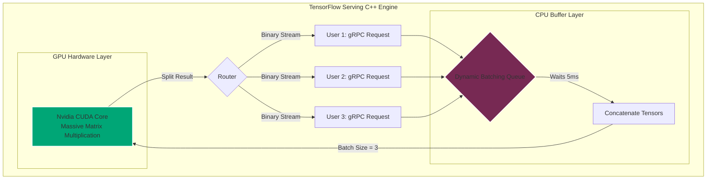

import { ConceptTemplate } from '@/features/kb/components/templates/ConceptTemplate'
import { Callout } from '@/features/kb/components/mdx/Callout'

export default function Layout({ children }) {
  return (
    <ConceptTemplate title="TensorFlow Serving">
      {children}
    </ConceptTemplate>
  )
}

Training a Neural Network is an exercise in data science. Deploying a Neural Network to handle 10,000 requests per second is an exercise in hardcore systems engineering. 

If you attempt to serve a TensorFlow model using a standard Python web server (like Flask or Django), you will instantly hit mathematical and architectural bottlenecks. Python's Global Interpreter Lock (GIL) destroys true multi-threading, and the overhead of interpreting Python code before executing the matrix math cripples the GPU.

**TensorFlow Serving** is Google's solution. It bypasses Python entirely. It is a hyper-optimized, standalone C++ binary designed exclusively to load mathematical models directly into memory, accept highly compressed network requests (gRPC), and execute massive tensor multiplications at the absolute physical limit of the underlying hardware.

## 1. Deep Dive & Mechanics

### The SavedModel Architecture
TensorFlow Serving does not execute `.py` scripts. It explicitly requires a mathematically frozen **SavedModel**.
A SavedModel is a protocol buffer (`.pb`) that contains two things:
1. **The Graph**: The strict mathematical nodes and edges (e.g., Matrix Multiply $\rightarrow$ Add Bias $\rightarrow$ ReLU Activation).
2. **The Weights**: The massive, static binary files containing the learned numbers.

Because there is absolutely no Python code involved, TF Serving can deserialize this graph directly into C++, map it straight to the GPU VRAM via CUDA, and execute the tensor math with zero interpretation overhead.

### gRPC vs REST
Standard web applications use REST APIs (JSON over HTTP). JSON is terrible for Machine Learning. Converting a 3D Tensor of floats into a massive string of text, transmitting it, and parsing it back into floats is mathematically devastating to latency.
TF Serving natively supports **gRPC (gRPC Remote Procedure Calls)**. gRPC transmits data as highly compressed, strongly-typed binary Protocol Buffers over HTTP/2. Transmitting a 1MB tensor via gRPC is orders of magnitude faster and computationally cheaper than transmitting it via REST JSON.

## 2. Mathematical / Theoretical Foundation

### Dynamic Request Batching
The most critical architectural feature of TF Serving is **Dynamic Batching**.
GPUs are mathematically designed for massive parallel matrix multiplication, not sequential execution. If a GPU processes 1 image, it takes 10ms. If it processes a Batch of 32 images simultaneously, it takes 12ms. 

If 32 independent users hit your API at the same time, TF Serving intercepts the requests. It holds the first request in memory for a few milliseconds, waiting for the others. It mathematically concatenates the 32 independent `[1, 224, 224, 3]` tensors into a single massive `[32, 224, 224, 3]` tensor. It sends one single instruction to the GPU, splits the output matrix, and returns 32 independent responses. This mathematically increases the throughput of the server by up to 30x.

### Hot-Swapping and Version Management
In enterprise environments, models are updated constantly. If you must shut down the server to load new weights, you cause downtime.
TF Serving supports mathematical **Hot Swapping**. It constantly polls the filesystem. If it detects a new directory (e.g., `model/v2`), it begins deserializing the massive new weights into VRAM in a background C++ thread. Once `v2` is fully loaded and warmed up, TF Serving mathematically redirects all new incoming network traffic to `v2`, and gracefully unloads `v1` from memory without dropping a single active request.

## 3. Real-World Implementation

Here is how you export a TensorFlow model to the correct mathematical format, and the command-line implementation to launch the C++ TensorFlow Serving engine via Docker.

```python
# 1. Exporting the Model (Done by the Data Scientist)
import tensorflow as tf

# Build a simple mathematical model
model = tf.keras.Sequential([
    tf.keras.layers.Dense(128, activation='relu', input_shape=(10,)),
    tf.keras.layers.Dense(1, activation='sigmoid')
])

# Mathematically freeze and export the model to the specific SavedModel format
# Notice the version folder "1"
export_path = "./my_model/1"
tf.saved_model.save(model, export_path)

print(f"Model successfully serialized to {export_path}")
```

To serve this model in production, the DevOps engineer does not write any Python. They use the official Google C++ Docker image:

```bash
# 2. Deploying the Model (Done by DevOps)
# Run the hyper-optimized TF Serving C++ binary
# Exposes port 8501 for REST and 8500 for high-speed gRPC
docker run -p 8501:8501 -p 8500:8500 \
  --mount type=bind,source=$(pwd)/my_model,target=/models/my_model \
  -e MODEL_NAME=my_model \
  -t tensorflow/serving
```

To interact with the ultra-fast gRPC endpoint in Python, a client sends a serialized Tensor:

```python
# 3. Client interacting via gRPC
import grpc
import tensorflow as tf
from tensorflow_serving.apis import predict_pb2
from tensorflow_serving.apis import prediction_service_pb2_grpc

# Open a persistent HTTP/2 connection
channel = grpc.insecure_channel('localhost:8500')
stub = prediction_service_pb2_grpc.PredictionServiceStub(channel)

# Construct the mathematical Protocol Buffer payload
request = predict_pb2.PredictRequest()
request.model_spec.name = 'my_model'
request.model_spec.signature_name = 'serving_default'

# Inject a random tensor
tensor = tf.make_tensor_proto([[0.1]*10], dtype=tf.float32)
request.inputs['dense_input'].CopyFrom(tensor)

# Send the binary payload and receive the binary response in milliseconds
result = stub.Predict(request, 10.0)
print("Mathematical Output:", result)
```

## 4. Visualizations



<Callout icon="tip" title="Model Warmup">
  When a TensorFlow model executes its first forward pass, it undergoes a mathematical "Lazy Initialization" where it compiles the optimal CUDA instructions for the GPU. This causes the very first user request to experience massive latency (e.g., 2 seconds). TF Serving solves this using **SavedModel Warmup**. You include a `tf_serving_warmup_requests` file in the directory. When TF Serving loads the model, it mathematically runs these dummy requests through the GPU *before* opening the network port to real users, ensuring the first real user gets a 20ms response.
</Callout>

## 5. Interview Prep

**Q: Explain the architectural difference between BentoML and TensorFlow Serving.**
**Answer:** TensorFlow Serving is highly specialized, hyper-optimized, and extremely rigid. It is written in C++ and fundamentally only understands TensorFlow SavedModels. It cannot execute custom Python preprocessing logic (like connecting to a database to fetch a user profile before running inference). BentoML is a flexible Python orchestration layer. It trades a tiny amount of raw C++ speed for the ability to package Python preprocessing code, dependencies, and multiple model frameworks (PyTorch, Scikit-Learn) into a single Microservice architecture.

**Q: Why does JSON/REST destroy performance in Deep Learning APIs?**
**Answer:** An image converted to a numerical Tensor contains millions of floating-point numbers. Converting `0.345621` into a JSON UTF-8 string vastly inflates the byte size of the payload. Furthermore, the CPU must mathematically parse the string character-by-character back into a 32-bit float in memory. By using gRPC and Protocol Buffers, the client mathematically serializes the float into raw binary. The server reads the raw binary directly into RAM, bypassing parsing entirely and reducing latency by orders of magnitude.

**Q: How does TF Serving handle multiple versions of the same model concurrently?**
**Answer:** You can define a Model Configuration file that instructs TF Serving to hold multiple versions in GPU memory simultaneously. You can configure labels so that `v1` is assigned the alias `stable` and `v2` is assigned `canary`. Clients can mathematically specify which version they want to hit in their gRPC payload. This enables rigorous A/B testing, where the engineering team routes 5% of traffic to the `canary` model to validate accuracy before promoting it to `stable`.

## 6. Production Use Cases

- **Google Search and Ads:** TF Serving was built by Google to solve their own internal deployment nightmares. When you execute a Google Search, dozens of TensorFlow models are executed instantly (for spell check, rank sorting, and ad targeting). The entire infrastructure is powered by massive clusters of TF Serving instances utilizing Dynamic Batching to handle millions of queries per second across Google's custom TPU (Tensor Processing Unit) hardware.
- **High-Frequency Trading (HFT):** Financial firms training deep learning models to predict stock price movements deploy their models via TF Serving. In HFT, a latency of 10 milliseconds is the difference between making a profit and losing millions. By utilizing gRPC, disabling all logging, and using SavedModel Warmup, they achieve sub-millisecond inference times directly on the exchange floor's bare-metal servers.