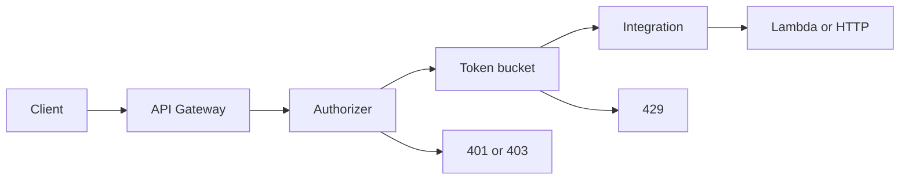

import { ConceptTemplate } from '@/features/kb/components/templates/ConceptTemplate'
import { Callout } from '@/features/kb/components/mdx/Callout'
import { ComparisonTable } from '@/features/kb/components/mdx/ComparisonTable'

export default function Layout({ children }) {
  return (
    <ConceptTemplate title="Amazon API Gateway">
      {children}
    </ConceptTemplate>
  )
}

Lambda has no public IP. Browsers and mobile apps need a stable HTTPS hostname, TLS, CORS, and a place to reject junk before you pay for compute. **API Gateway** is that reverse proxy: it terminates TLS, matches a route, runs an authorizer, applies a token-bucket throttle, optionally rewrites the body, then invokes Lambda, a VPC link, or an HTTP integration.

## 1. Deep Dive and Mechanics

**Products.** REST API is the older, feature-heavy product (usage plans, API keys, VTL mapping, request validators, WAF attach). HTTP API is cheaper and faster; it keeps JWT/IAM/Lambda authorizers and CORS, and drops most VTL. WebSocket APIs keep a connection id table so you can push to a client later.

**Stages.** A deploy is a snapshot of routes plus a stage name (prod, v1). Custom domains map a hostname and base path to a stage. Canary percent on REST lets you send a slice of traffic to a new deployment.

**Integrations.** Lambda proxy passes the whole event through. HTTP proxy is a pass-through to an ALB or any URL. AWS service integrations call DynamoDB or SQS without a Lambda glue function. VPC Link reaches private NLB or ALB targets.

<Callout icon="warning" title="Path parameters are not folders">
A route like GET /users/id is a pattern, not a filesystem. Mis-ordered greedy proxies steal traffic from more specific routes. Test the conflict matrix when you add a catch-all.
</Callout>

## 2. Mathematical / Theoretical Foundation

Throttling is a **token bucket**. Sustained rate R fills the bucket; burst B is capacity. A request consumes one token; empty bucket returns 429 and never invokes the backend. Account-level and stage-level buckets nest: the tighter one wins.

Authorizers cache an IAM policy for a TTL. Cache key is the identity source (bearer token, header). A 5-minute TTL on a revoked JWT is a correctness vs latency trade.

Edge-optimized REST fronts CloudFront anycast. Regional skips that hop. Private REST binds to a VPC endpoint so the API is not on the public internet.

<ComparisonTable
  headers={['Product', 'Cost / latency', 'Keep it for']}
  rows={[
    ['HTTP API', 'Lowest', 'JSON + JWT or IAM'],
    ['REST API', 'Higher', 'Usage plans, VTL, API keys'],
    ['WebSocket', 'Connection-minutes', 'Push / chat / notifications'],
    ['ALB + Lambda', 'Per LCU', 'VPC-native HTTP, no usage plans'],
  ]}
/>

## 3. Real-World Implementation

```python
import json
import boto3

apigw = boto3.client('apigatewayv2')

def create_http_api(name: str, lambda_arn: str) -> str:
    api = apigw.create_api(Name=name, ProtocolType='HTTP', Target=lambda_arn)
    return api['ApiId']
```

Prefer HTTP APIs unless you need REST-only features. Attach a JWT authorizer on the route, not a check inside every handler.

## 4. Visualizations



## 5. Interview Prep

**Q: REST API vs HTTP API?**
**A:** HTTP API is cheaper and faster for JWT/IAM JSON APIs. REST API still wins for usage plans, API keys, request validators, and VTL transforms.

**Q: How does auth stay off the hot path?**
**A:** IAM SigV4, Cognito/JWT verification, or a Lambda authorizer that returns an IAM policy. Gateway caches the policy so the business function never sees a failed login storm.

**Q: What stops a denial-of-wallet on Lambda?**
**A:** Stage and usage-plan throttles plus WAF. 429 at the edge is cheaper than unbounded concurrency.

## 6. Production Use Cases

- Public SaaS APIs with per-key quotas.
- Strangler facade: old paths to on-prem, new paths to Lambda.
- WebSocket fan-out for notifications with connection ids in DynamoDB.

<Callout icon="tip" title="Prefer HTTP APIs by default">
Start on HTTP API. Promote to REST only when a usage plan or mapping template is a hard requirement, not a habit.
</Callout>
