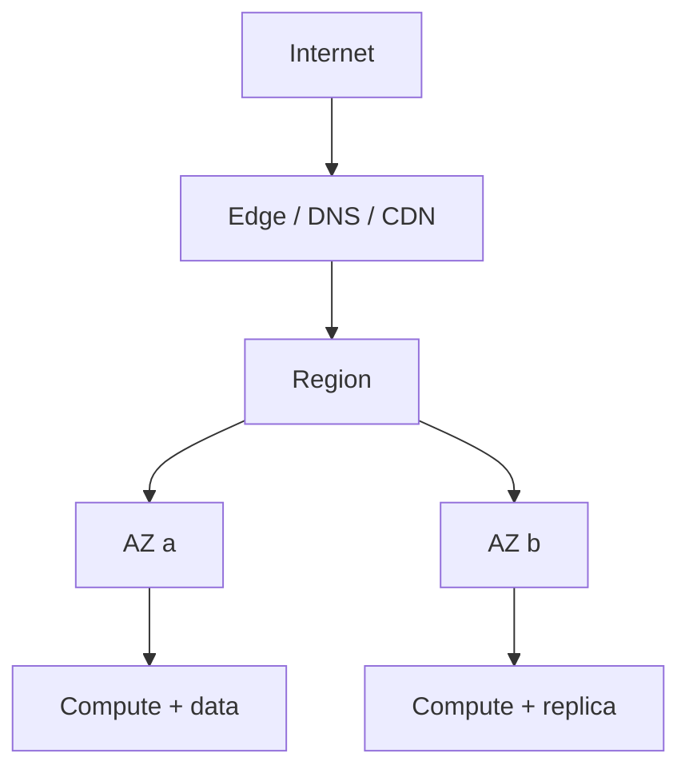

import { ConceptTemplate } from '@/features/kb/components/templates/ConceptTemplate'
import { Callout } from '@/features/kb/components/mdx/Callout'
import { ComparisonTable } from '@/features/kb/components/mdx/ComparisonTable'

export default function Layout({ children }) {
  return (
    <ConceptTemplate title="Amazon Web Services (AWS)">
      {children}
    </ConceptTemplate>
  )
}

AWS is a globally distributed set of data centers exposed as APIs. You do not buy a rack; you call RunInstances, PutObject, or CreateFunction and pay for seconds, requests, or gigabyte-months. The product catalog is huge, but the mental model is small: **regions**, **availability zones**, **IAM**, **VPC**, then a compute/storage/data service on top.

## 1. Deep Dive and Mechanics

**Region.** A geographic cluster (for example us-east-1) with its own control plane. Most resources do not stretch across regions. Data residency, latency, and blast radius start here.

**Availability Zone.** One or more data centers with independent power and networking, linked by private metro fiber. Multi-AZ is the default HA story: a building can die; the region should not.

**Control vs data plane.** The API you call (CreateBucket, RunInstances) is the control plane. The packets your users send to an ALB or S3 endpoint are the data plane. Control-plane outages can block scaling even when existing data-plane traffic still works.

**Account.** Isolation and billing boundary. Organizations and Control Tower turn one account into a landing zone of many.

<Callout icon="error" title="Shared responsibility">
AWS secures the facilities, hypervisor, and managed control planes. You secure IAM, encryption, security groups, and the bits you put on the disk. An open 3306 to the world is your incident, not theirs.
</Callout>

## 2. Mathematical / Theoretical Foundation

**Elasticity.** Capacity C(t) tracks load L(t) instead of being fixed at max(L). You pay integral of C(t), not a capital peak. The risk flips from idle hardware to **runaway scale** and surprise bills.

**Failure domains.** Independent AZ failure probability p; n AZs with sync replication give residual risk on the order of p^n if failures are independent — they are not fully independent (control plane, fiber cuts), so you still need backups and a region story for the worst days.

**Consistency vs partition.** Cross-region is high latency. AWS services pick a point on CAP: S3 is strongly consistent per object in a region; DynamoDB lets you choose consistent reads; Route 53 is eventually consistent DNS.

<ComparisonTable
  headers={['Primitive', 'You manage', 'AWS manages']}
  rows={[
    ['EC2', 'OS, patches, scaling', 'Host, Nitro, facility'],
    ['ECS / EKS', 'Task or pod spec', 'Optionally the nodes'],
    ['Lambda', 'Code and config', 'MicroVM lifecycle'],
    ['S3 / DynamoDB', 'Keys, IAM, design', 'Disks, replication, fleet'],
  ]}
/>

## 3. Real-World Implementation

```python
import boto3

ec2 = boto3.client('ec2', region_name='us-east-1')
azs = ec2.describe_availability_zones(Filters=[
    {'Name': 'state', 'Values': ['available']},
])
print([z['ZoneName'] for z in azs['AvailabilityZones']])
```

Treat the region as a hard parameter. Multi-region is a product decision, not a default checkbox.

## 4. Visualizations



## 5. Interview Prep

**Q: Region vs AZ vs edge location?**
**A:** Region is the API and data-residency boundary. AZs are isolated buildings inside it. Edge locations (CloudFront, Route 53 anycast) sit closer to users and are not a substitute for multi-AZ compute.

**Q: Why can the control plane fail while the site still serves?**
**A:** Existing ENIs, load balancers, and objects keep forwarding. New deploys, scale-outs, and IAM changes need the control plane.

**Q: What is the Well-Architected set of lenses?**
**A:** Operational excellence, security, reliability, performance, cost, and sustainability. Interviews often want a failure-mode story under reliability plus an IAM least-privilege story under security.

## 6. Production Use Cases

- Elastic web fleets that scale on CPU or request count.
- Multi-account landing zones for regulated enterprises.
- Global consumer apps that fail over DNS between regions.

<Callout icon="tip" title="Design for AZ loss first">
If your architecture cannot lose one AZ cleanly, a multi-region runbook will not save you. Get multi-AZ boring before you buy a second region.
</Callout>
