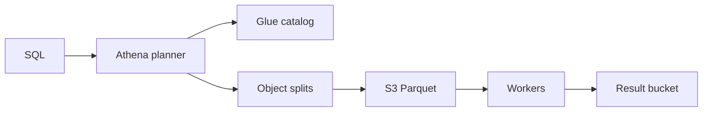

import { ConceptTemplate } from '@/features/kb/components/templates/ConceptTemplate'
import { Callout } from '@/features/kb/components/mdx/Callout'
import { ComparisonTable } from '@/features/kb/components/mdx/ComparisonTable'

export default function Layout({ children }) {
  return (
    <ConceptTemplate title="Amazon Athena">
      {children}
    </ConceptTemplate>
  )
}

**Athena** is Presto/Trino as a service. You register a schema in the Glue Data Catalog (or inline), write ANSI-ish SQL, and Athena farms workers that read objects from S3. There is no cluster to resize. The bill is mostly **bytes scanned**, which makes file layout the real performance knob.

## 1. Deep Dive and Mechanics

**Engine.** Athena engine v3 is Trino-based. Queries compile to a distributed plan: splits over objects, predicate pushdown into Parquet/ORC footers, and optional partition pruning from Hive-style prefixes or Iceberg metadata.

**Catalog.** Glue tables describe format, SerDe, columns, and partition keys. Partition projection can invent partitions from the key pattern so you do not have to MSCK REPAIR after every write.

**Workgroups.** Isolate cost, enforce output location, and cut off queries that scan too much. Query results land in an S3 result bucket (and can be reused if the same SQL hits a warm result).

**ACID tables.** Iceberg, Hudi, and Delta (with caveats) give snapshots, time travel, and safer concurrent writes than raw Hive partitions.

<Callout icon="warning" title="JSON in S3 is a tax">
Row-oriented JSON or CSV forces a full object read. Convert to partitioned Parquet with a narrow column set or you will pay to scan the same gigabytes every dashboard refresh.
</Callout>

## 2. Mathematical / Theoretical Foundation

Cost ≈ price_per_TB × bytes_scanned after compression and column projection. A query that selects two columns from a 100-column Parquet file should read on the order of 2/100 of the file plus footer overhead — if statistics allow skip. Partition selectivity multiplies: if you have 365 day partitions and filter one day, you aim for about 1/365 of the lake, not 1/365 of each file.

Predicate pushdown uses min/max row-group stats. Poor clustering (random keys) makes those stats useless and you scan every row group.

<ComparisonTable
  headers={['Tool', 'Model', 'Best fit']}
  rows={[
    ['Athena', 'Pay per scan', 'Ad-hoc, ELT, infrequent SQL'],
    ['Redshift', 'Provisioned or Serverless RU', 'Repeated BI, complex joins'],
    ['EMR / Spark', 'Cluster or serverless', 'Heavy transforms, ML feature jobs'],
    ['S3 Select', 'Per object', 'Single-file projection, not SQL joins'],
  ]}
/>

## 3. Real-World Implementation

```sql
CREATE EXTERNAL TABLE events (
  user_id string,
  event_type string,
  ts timestamp
)
PARTITIONED BY (dt string)
STORED AS PARQUET
LOCATION 's3://lake/events/'
TBLPROPERTIES ('projection.enabled'='true');

SELECT event_type, count(*)
FROM events
WHERE dt = '2026-09-06'
GROUP BY 1;
```

Always constrain the partition column. A missing filter is a full-lake scan.

## 4. Visualizations



## 5. Interview Prep

**Q: Why is my Athena bill huge?**
**A:** Wide scans: no partition filter, JSON/CSV, SELECT star, or tiny files that kill parallelism. Fix layout first, not the SQL dialect.

**Q: Athena vs Redshift Spectrum vs Redshift?**
**A:** Athena is standalone serverless SQL on the lake. Spectrum lets a Redshift cluster reach S3. A warehouse wins when the same cubes are queried all day and you want local storage and materialized results.

**Q: How do you get ACID on S3?**
**A:** Table formats (Iceberg) with a catalog, not raw overwrite of Hive partitions.

## 6. Production Use Cases

- Analyst SQL on a data lake without a standing cluster.
- ELT CTAS into curated Parquet from raw dumps.
- Security and ops log hunting over CloudTrail or VPC flow logs in S3.

<Callout icon="tip" title="Workgroup scanned-bytes cap">
Set a per-query data limit in the workgroup. One unbounded JOIN should fail, not invoice the month.
</Callout>
