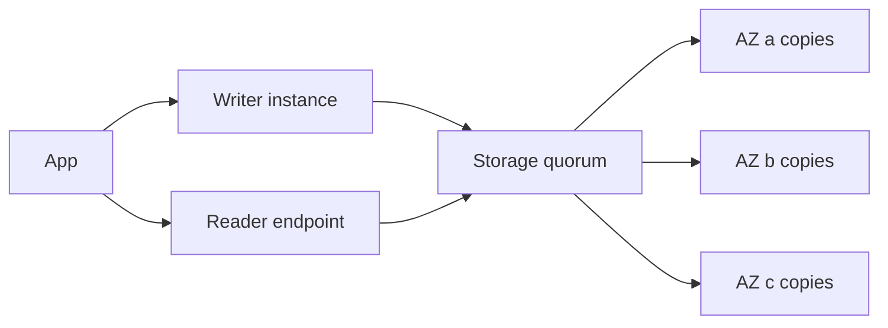

import { ConceptTemplate } from '@/features/kb/components/templates/ConceptTemplate'
import { Callout } from '@/features/kb/components/mdx/Callout'
import { ComparisonTable } from '@/features/kb/components/mdx/ComparisonTable'

export default function Layout({ children }) {
  return (
    <ConceptTemplate title="Amazon Aurora">
      {children}
    </ConceptTemplate>
  )
}

**Aurora** looks like RDS MySQL or PostgreSQL on the wire. Underneath, the database instance is compute-only: it writes a log to a multi-AZ storage service that six-ways the data. Replicas attach to the same storage, so promotion is not a disk restore — it is a new writer claiming the log.

## 1. Deep Dive and Mechanics

**Log as the database.** The writer ships redo records, not dirty pages, to the storage fleet. Storage applies, gossips, and acknowledges a quorum. Page cache on the instance is still local; a crash rebuilds from the log.

**Replicas.** Up to 15 Aurora replicas share storage. Replication lag is apply/cache lag, not shipping a binary log across a second EBS volume. Readers can be auto-added for read scaling.

**Endpoints.** Cluster endpoint always points at the current writer. Reader endpoint load-balances replicas. Custom endpoints pin app tiers to instance classes.

**Serverless v2.** Capacity is ACUs that scale in fine increments. Good for spiky or mixed-tenant loads; still has a floor cost if you set a min ACU.

**Global Database.** Secondary regions get a physical replica of the storage log for low-RPO disaster recovery and local reads.

<Callout icon="warning" title="Compatibility is not identity">
Aurora MySQL and Aurora PostgreSQL track community versions with a lag and a fork. Extensions, GTID assumptions, and some storage engines do not map 1:1. Test upgrades on a clone, not on folklore.
</Callout>

## 2. Mathematical / Theoretical Foundation

Storage uses a **quorum**: 6 copies across 3 AZs, write ack when a majority of voting copies persist. Durability survives losing an AZ plus one more copy in another AZ, under the usual independence assumptions.

Failover time is dominated by crash recovery and DNS/endpoint flip, not by restoring a snapshot. RPO for a single-region cluster is typically near-zero for committed transactions that reached storage quorum.

Serverless v2 cost is roughly ACU-hours × price. Min ACU × 730 hours is the idle floor.

<ComparisonTable
  headers={['Service', 'Storage model', 'Replica story']}
  rows={[
    ['RDS MySQL/PG', 'EBS per instance', 'Binlog / streaming, extra storage'],
    ['Aurora', 'Shared log-structured', 'Replicas attach to same volume'],
    ['Aurora Serverless v2', 'Same storage', 'ACU scale, mixed writer/reader'],
    ['DynamoDB', 'Partitioned KV', 'Not SQL; different consistency'],
  ]}
/>

## 3. Real-World Implementation

```python
import boto3

rds = boto3.client('rds')
rds.create_db_cluster(
    DBClusterIdentifier='app-aurora',
    Engine='aurora-postgresql',
    EngineMode='provisioned',
    MasterUsername='dba',
    MasterUserPassword='rotate-me',
    StorageEncrypted=True,
    BackupRetentionPeriod=7,
)
```

Create instances in the cluster after the cluster exists. Point apps at the cluster endpoint, never at a single instance id.

## 4. Visualizations



## 5. Interview Prep

**Q: Why is Aurora failover faster than classic RDS Multi-AZ?**
**A:** Standby does not replay a hidden EBS mirror into a cold buffer pool in the same way. Replicas already share storage; promotion is leadership plus cache warm-up.

**Q: When do you still pick RDS PostgreSQL over Aurora?**
**A:** Extension needs, version pinning, cost at small size, or features Aurora has not absorbed yet.

**Q: What does Aurora Global give you?**
**A:** Cross-region physical replication with a secondary you can promote. Reads can be local; writes still go to the primary region until failover.

## 6. Production Use Cases

- OLTP SaaS with bursty reads and a single writer.
- Multi-AZ relational HA without managing Postgres replicas by hand.
- Regional DR with Aurora Global for regulated apps.

<Callout icon="tip" title="Clone before you migrate">
Aurora clone is copy-on-write. Use it for migration dry-runs and query experiments so you do not snapshot-and-wait a multi-terabyte copy.
</Callout>
