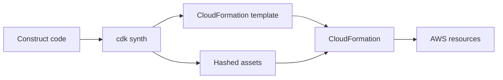

import { ConceptTemplate } from '@/features/kb/components/templates/ConceptTemplate'
import { Callout } from '@/features/kb/components/mdx/Callout'
import { ComparisonTable } from '@/features/kb/components/mdx/ComparisonTable'

export default function Layout({ children }) {
  return (
    <ConceptTemplate title="AWS CDK">
      {children}
    </ConceptTemplate>
  )
}

**CDK** is a compiler. You write an object graph of constructs in a general-purpose language. `cdk synth` emits a CloudFormation template (plus assets). `cdk deploy` uploads assets and starts a CloudFormation change set. The source of truth at apply time is still CloudFormation — CDK is the authoring UX and the construct library.

## 1. Deep Dive and Mechanics

**Construct tree.** App → Stack → constructs. L1 constructs (Cfn*) are 1:1 with CloudFormation resources. L2 add defaults, IAM grants, and convenience methods. L3 (patterns) bundle whole architectures (an ALB + Fargate service).

**Synthesis.** The app runs in Node (even for Python, via JSII). Tokens are lazy values that become Fn::Ref and GetAtt in the template. You cannot `console.log` a token and expect an account id at synth time unless you use context or lookups.

**Assets.** Lambda bundles, Docker images, and files hash into the cdk.out asset directory. The CDK toolkit bucket and ECR repo hold them. A code change that does not change the template still changes an asset hash and triggers a resource update.

**Aspects and escapes.** Aspects walk the tree (for example force encryption). Escape hatches let you set a raw CloudFormation property the L2 missed.

<Callout icon="warning" title="Synth is not deploy">
Unit-test the synthesized template. A construct that looks right can emit a circular dependency, a missing IAM action, or a replacement of a stateful resource. Read the diff before you apply.
</Callout>

## 2. Mathematical / Theoretical Foundation

CDK is a **term-rewriting** layer: high-level constructs expand to a larger resource graph. Complexity is hidden, not removed. The CloudFormation limit (resource count, template size) still binds you; nested stacks or multiple stacks are the usual split.

Determinism matters. If synth is not deterministic (wall-clock, unordered maps, network lookups without context cache), CI will fight itself. Freeze context (`cdk.context.json`) for VPC lookups.

<ComparisonTable
  headers={['Tool', 'Authoring', 'Engine']}
  rows={[
    ['CDK', 'TS / Python / Java / Go', 'CloudFormation'],
    ['CloudFormation', 'YAML / JSON', 'CloudFormation'],
    ['Terraform', 'HCL or CDKTF', 'Provider API'],
    ['Pulumi', 'Real languages', 'Pulumi + providers'],
  ]}
/>

## 3. Real-World Implementation

```typescript
import * as cdk from 'aws-cdk-lib';
import * as s3 from 'aws-cdk-lib/aws-s3';

export class DataStack extends cdk.Stack {
  constructor(scope: cdk.App, id: string, props?: cdk.StackProps) {
    super(scope, id, props);
    new s3.Bucket(this, 'Lake', {
      encryption: s3.BucketEncryption.S3_MANAGED,
      blockPublicAccess: s3.BlockPublicAccess.BLOCK_ALL,
      versioned: true,
    });
  }
}
```

Prefer L2 grants (`bucket.grantRead(fn)`) over handmade policies. They stay correct when the construct adds a KMS key later.

## 4. Visualizations



## 5. Interview Prep

**Q: Why not just write CloudFormation?**
**A:** Loops, types, tests, and shared constructs. The apply engine is the same; the authoring surface is a programming language.

**Q: L1 vs L2?**
**A:** L1 is the raw resource. L2 is opinionated and IAM-aware. Drop to L1 or an escape hatch when the L2 lags a new property.

**Q: What breaks multi-stack CDK apps?**
**A:** Cross-stack references that create implicit exports you cannot delete, and environment-sensitive lookups without locked context.

## 6. Production Use Cases

- Product teams shipping Lambda + API + DynamoDB as a reusable construct.
- Platform libraries that encode tagging, encryption, and VPC rules as aspects.
- Greenfield AWS apps where CloudFormation is acceptable as the runner.

<Callout icon="tip" title="Test the template">
Use assertions on the synthesized JSON in CI. Treat unexpected resource replacements as failed tests, especially for RDS, buckets, and tables.
</Callout>
