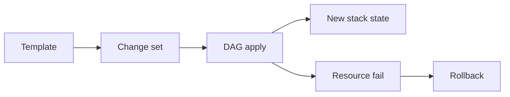

import { ConceptTemplate } from '@/features/kb/components/templates/ConceptTemplate'
import { Callout } from '@/features/kb/components/mdx/Callout'
import { ComparisonTable } from '@/features/kb/components/mdx/ComparisonTable'

export default function Layout({ children }) {
  return (
    <ConceptTemplate title="AWS CloudFormation">
      {children}
    </ConceptTemplate>
  )
}

**CloudFormation** is AWS-native infrastructure as code. A template lists resources, parameters, and outputs. A **stack** is a living instance of that template. Updates compute a change set, apply it in dependency order, and roll back if a resource fails. Drift detection compares live properties to the last applied template.

## 1. Deep Dive and Mechanics

**Resource graph.** Each resource has a type (AWS::S3::Bucket) and properties. `DependsOn` and implicit refs order creates. Updates are Update, Replace, or Delete — replacements are the dangerous ones on stateful types.

**Change sets.** Preview before execute. Still incomplete for some semantic effects (IAM blast radius, data loss on replacement). Read the replacement flag every time.

**Nested stacks and StackSets.** Nested stacks split templates under a parent. StackSets push the same template to many accounts and regions with operation preferences.

**Custom resources.** A Lambda-backed resource for APIs CloudFormation does not model. Failures hang the stack if the function does not signal SUCCESS/FAILED.

**Imports.** Adopt an existing resource into a stack when you outgrow click-ops, subject to resource type support.

<Callout icon="error" title="Replacement deletes data">
A property change that is not in-place (name, AZ, some encryption toggles) replaces the resource. A replaced database or bucket is an empty new one unless you set DeletionPolicy and thought through retain.
</Callout>

## 2. Mathematical / Theoretical Foundation

CloudFormation is a **desired-state reconciler** with a transactional flavor: create/update is a DAG walk; failure triggers compensating deletes or a rollback to the previous template snapshot. It is not a continuous controller like Kubernetes — nothing converges until you start another stack operation.

Intrinsic functions (Ref, GetAtt, Sub, If, ImportValue) are a small pure language evaluated at apply time. Circular Refs are rejected. Cross-stack ImportValue creates a hard edge you must break before delete.

<ComparisonTable
  headers={['Engine', 'State store', 'Drift']}
  rows={[
    ['CloudFormation', 'Stack in AWS', 'Detect, limited auto-fix'],
    ['Terraform', 'State file / cloud', 'Plan refresh each run'],
    ['Pulumi', 'State backend', 'Refresh + preview'],
    ['Click-ops', 'None', 'You are the drift'],
  ]}
/>

## 3. Real-World Implementation

```yaml
AWSTemplateFormatVersion: '2010-09-09'
Resources:
  Logs:
    Type: AWS::S3::Bucket
    Properties:
      BucketEncryption:
        ServerSideEncryptionConfiguration:
          - ServerSideEncryptionByDefault:
              SSEAlgorithm: AES256
      PublicAccessBlockConfiguration:
        BlockPublicAcls: true
        BlockPublicPolicy: true
        IgnorePublicAcls: true
        RestrictPublicBuckets: true
```

Keep secrets in parameters marked NoEcho or in Secrets Manager dynamic references — never in the template body in git.

## 4. Visualizations



## 5. Interview Prep

**Q: Update vs replace?**
**A:** In-place update mutates the same physical id. Replace creates a new physical resource and deletes the old one. Know which properties force replace for RDS, S3, and IAM.

**Q: How do you handle a stuck DELETE_FAILED?**
**A:** Often a non-empty bucket, an ENI, or a missing custom-resource signal. Retain the resource, empty dependencies, retry, or use continue-update-rollback.

**Q: CloudFormation vs CDK?**
**A:** CDK synthesizes CloudFormation. Interviews want you to know the engine, rollback, and replacement semantics — not only the TypeScript class names.

## 6. Production Use Cases

- Account baselines: CloudTrail, GuardDuty, config rules.
- Service teams that must stay on an AWS-supported IaC path.
- StackSets for the same control in every Organization account.

<Callout icon="tip" title="Always open the change set">
If a stateful resource shows Replacement, stop. Rename via a blue/green stack or a retain-and-import, not an in-place property flip.
</Callout>
