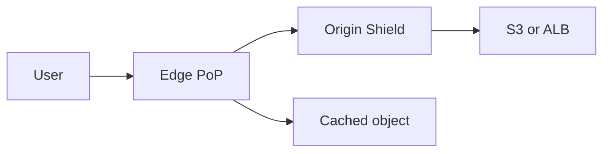

import { ConceptTemplate } from '@/features/kb/components/templates/ConceptTemplate'
import { Callout } from '@/features/kb/components/mdx/Callout'
import { ComparisonTable } from '@/features/kb/components/mdx/ComparisonTable'

export default function Layout({ children }) {
  return (
    <ConceptTemplate title="Amazon CloudFront">
      {children}
    </ConceptTemplate>
  )
}

**CloudFront** is a managed CDN. Users hit a distribution hostname (or your CNAME) at a nearby **edge location**. Cacheable GETs are served from the edge or a regional cache. Misses go to an origin: S3, an ALB, a custom URL, or another AWS service. You also get TLS, WAF attach, signed URLs, and HTTP/3 at the edge.

## 1. Deep Dive and Mechanics

**Cache key.** Default is the full URL path plus selected headers, cookies, and query strings. A cache policy that forwards all query strings fragments the cache. Origin request policies send extra headers to the origin without putting them in the cache key.

**Behaviors.** Path patterns map to origins and policies. `/api/*` often disables cache and forwards cookies; `/static/*` caches long and strips cookies.

**Origin Shield.** An extra regional cache layer in front of the origin so many edges collapse into one pull.

**Invalidation.** Path-based purge is eventual and costs after a free tier. Versioned object names (hash in the filename) are cheaper than purge-as-deploy.

**Functions vs Lambda@Edge.** CloudFront Functions run at viewer events, microseconds, limited runtime. Lambda@Edge runs at viewer or origin events with a fuller Node runtime and higher latency.

<Callout icon="warning" title="Cookies explode the cache">
Forwarding the session cookie on a static behavior means every user misses. Split API and asset behaviors. Never cache authenticated HTML unless the key includes the right vary inputs on purpose.
</Callout>

## 2. Mathematical / Theoretical Foundation

Hit ratio H = edge_hits / requests. Origin load scales as (1 − H) × QPS, plus revalidation. TTL and cache-key cardinality dominate H. If the key includes a high-cardinality header, effective working set is QPS × unique_keys × object_size and will not fit.

TTLs interact with `Cache-Control`. Origin headers can cap or raise the distribution TTL depending on policy. Stale-while-revalidate-style behavior is limited; plan for thundering herds on popular keys after expiry (Origin Shield and request collapsing help).

<ComparisonTable
  headers={['Layer', 'Where', 'Typical use']}
  rows={[
    ['CloudFront edge', 'PoPs worldwide', 'Static, media, TLS'],
    ['Origin Shield', 'One region', 'Collapse origin GETs'],
    ['ALB / origin', 'Your VPC or S3', 'Dynamic, writes'],
    ['API Gateway edge', 'API product', 'REST APIs, not a general CDN'],
  ]}
/>

## 3. Real-World Implementation

```python
import boto3

cf = boto3.client('cloudfront')
# CachePolicyId and OriginRequestPolicyId are AWS-managed ids in the account catalog.
print(cf.list_distributions()['DistributionList'])
```

In IaC, attach a cache policy that includes only the query strings the origin needs (for example `v` for assets) and an origin access control for S3 so the bucket is not public.

## 4. Visualizations



## 5. Interview Prep

**Q: How do you keep S3 private with CloudFront?**
**A:** Origin access control (OAC). The bucket policy allows only the distribution. Block public access stays on.

**Q: Cache policy vs origin request policy?**
**A:** Cache policy decides what makes two requests the same object. Origin request policy decides what the origin sees. You can send a header to the origin without caching on it.

**Q: CloudFront Functions or Lambda@Edge?**
**A:** Functions for cheap header rewrites and simple auth checks at viewer-request. Lambda@Edge when you need a real runtime, origin events, or heavier logic.

## 6. Production Use Cases

- SPA and static marketing sites on S3.
- Video and large-object download with signed cookies.
- Global API edge with WAF and short or zero TTL on `/api`.

<Callout icon="tip" title="Hash the filename">
Content-addressed assets make invalidations rare. Deploy a new hash, keep a long TTL, and let the old object age out.
</Callout>
