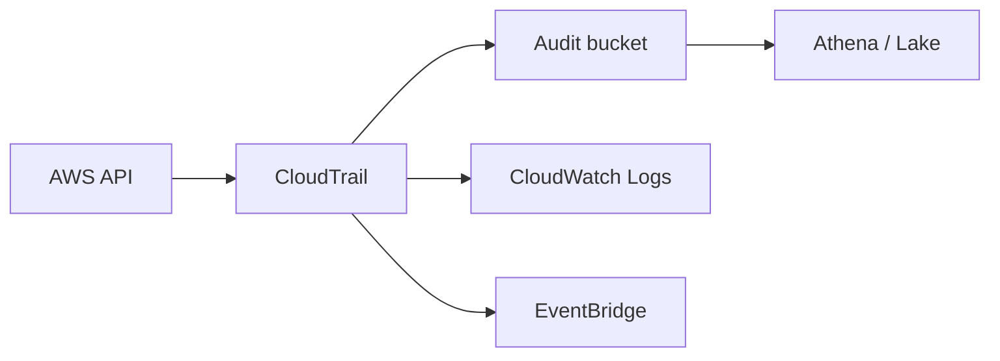

import { ConceptTemplate } from '@/features/kb/components/templates/ConceptTemplate'
import { Callout } from '@/features/kb/components/mdx/Callout'
import { ComparisonTable } from '@/features/kb/components/mdx/ComparisonTable'

export default function Layout({ children }) {
  return (
    <ConceptTemplate title="AWS CloudTrail">
      {children}
    </ConceptTemplate>
  )
}

**CloudTrail** records who did what, from where, against which resource. Management events cover control-plane APIs (RunInstances, PutBucketPolicy). Optional data events cover data-plane access (S3 object Get, Lambda Invoke) at much higher volume. A trail is the delivery pipe; Event history is a 90-day console view.

## 1. Deep Dive and Mechanics

**Organization trail.** One trail in the management or a delegated admin account, applied to every member. This is the landing-zone default so a compromised member cannot silently turn logging off for itself without the org noticing.

**Integrity.** Optional log-file validation writes a digest you can use to detect tampering in the destination bucket. The bucket policy should deny delete to everyone except a break-glass role.

**Insights.** ML-ish anomaly detection on write rates (for example a spike of console logins). Useful as a hint, not a SIEM.

**Lake.** CloudTrail Lake stores events in a queryable store with SQL, as an alternative to DIY Athena on the S3 trail.

**Latency.** Delivery is typically minutes, not milliseconds. Do not use CloudTrail as a synchronous authorization log for the hot path.

<Callout icon="error" title="No trail, no forensics">
Event history is short and incomplete for data events. If you only enable a trail after the incident, the interesting week is already gone.
</Callout>

## 2. Mathematical / Theoretical Foundation

Volume of data events scales with object and invoke QPS. Cost is event count × price plus S3 storage. Sample or scope data events (only sensitive buckets, only write APIs) or the trail becomes the largest line item.

A trail is an append-only stream. Detection quality depends on coverage (all regions, all accounts) times integrity (no one can DeleteObject the logs) times time-to-query (Athena partitions by date/account).

<ComparisonTable
  headers={['Signal', 'What it sees', 'Gap']}
  rows={[
    ['CloudTrail mgmt', 'Control plane', 'Not packet or OS audit'],
    ['CloudTrail data', 'Selected data APIs', 'Cost at high QPS'],
    ['VPC Flow Logs', '5-tuple accepts/denies', 'No IAM principal'],
    ['CloudWatch Logs', 'App and OS logs', 'You must emit them'],
  ]}
/>

## 3. Real-World Implementation

```python
import boto3

ct = boto3.client('cloudtrail')
ct.create_trail(
    Name='org-management',
    S3BucketName='audit-trail-bucket',
    IsMultiRegionTrail=True,
    EnableLogFileValidation=True,
    IncludeGlobalServiceEvents=True,
)
ct.start_logging(Name='org-management')
```

Lock the destination bucket with SCP + bucket policy. Encrypt with a KMS key the member accounts cannot disable.

## 4. Visualizations



## 5. Interview Prep

**Q: Management vs data events?**
**A:** Management is “who created the bucket.” Data is “who got this object.” Data events are optional because they are noisy and expensive.

**Q: Why multi-region and organization trails?**
**A:** Attackers create resources in unused regions. Member accounts hide activity if they own the only trail.

**Q: CloudTrail vs Config vs GuardDuty?**
**A:** Trail is the audit tape. Config is resource inventory and drift. GuardDuty is a detector that consumes trail and DNS/VPC signals.

## 6. Production Use Cases

- Mandatory audit for SOC2 and PCI.
- EventBridge rules that page on `ConsoleLogin` without MFA or on `StopLogging`.
- Athena hunts: who attached AdministratorAccess last night.

<Callout icon="tip" title="Alert on StopLogging">
A rule for StopLogging, DeleteTrail, and PutBucketPolicy on the audit bucket is worth more than a pretty dashboard.
</Callout>
