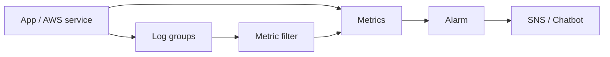

import { ConceptTemplate } from '@/features/kb/components/templates/ConceptTemplate'
import { Callout } from '@/features/kb/components/mdx/Callout'
import { ComparisonTable } from '@/features/kb/components/mdx/ComparisonTable'

export default function Layout({ children }) {
  return (
    <ConceptTemplate title="Amazon CloudWatch">
      {children}
    </ConceptTemplate>
  )
}

**CloudWatch** is several products under one name. **Metrics** are time series with namespaces and dimensions. **Logs** are streams you ingest, filter, and optionally metric-filter. **Alarms** watch a metric or an anomaly model and page SNS. **Dashboards** and Contributor Insights sit on top. X-Ray and Application Signals extend into traces; many teams still treat CloudWatch as metrics-plus-logs.

## 1. Deep Dive and Mechanics

**Standard vs high-resolution.** Standard metrics are 1-minute (sometimes 5). High-resolution custom metrics go to 1 second and cost more. Alarm periods must match the resolution you actually emit.

**Dimensions.** A metric identity is name + dimension set. `InstanceId` cardinality is fine; `userId` as a dimension is a cardinality bomb and a bill.

**Logs Insights.** A query language over log groups. Cheap if you time-bound; expensive if you scan weeks of verbose JSON.

**Metric filters and embedded metric format.** EMF lets an app print a JSON blob that becomes metrics without a separate PutMetricData flood.

**Alarms.** Threshold, anomaly detection, or composite. Missing data is a first-class setting: treat-missing-as-breaching is how you notice a silent publisher.

<Callout icon="warning" title="Cardinality is the cost model">
Custom metrics are priced per unique metric name and dimension tuple. A dimension per customer or per URL path will outrun the compute bill.
</Callout>

## 2. Mathematical / Theoretical Foundation

An alarm on average over period P with evaluation N datapoints is a low-pass filter. Short spikes vanish if P is 5 minutes. p99 needs percentiles CloudWatch can compute only if you publish a **histogram / percentile statistic** (or use EMF with values arrays), not a self-averaged mean.

SLI error rate ≈ bad / total. SLO burn-rate alerts (error budget) are usually implemented as two alarms (fast and slow windows), not a single static threshold.

<ComparisonTable
  headers={['Signal', 'CloudWatch tool', 'Watch-out']}
  rows={[
    ['Golden metrics', 'Metrics + alarms', 'Dimension explosion'],
    ['App logs', 'Logs + Insights', 'Ingest and scan cost'],
    ['Traces', 'X-Ray / App Signals', 'Sampling bias'],
    ['Synthetics', 'Canaries', 'They are not real users'],
  ]}
/>

## 3. Real-World Implementation

```python
import boto3

cw = boto3.client('cloudwatch')
cw.put_metric_data(
    Namespace='Checkout',
    MetricData=[{
        'MetricName': 'PaymentLatencyMs',
        'Value': 87.0,
        'Unit': 'Milliseconds',
        'StorageResolution': 60,
        'Dimensions': [{'Name': 'PaymentRail', 'Value': 'card'}],
    }],
)
```

Keep dimensions as a small enum (rail, region, class), not as an identifier space.

## 4. Visualizations



## 5. Interview Prep

**Q: Why is Average of CPU a bad sole alarm?**
**A:** It hides hot partitions and single-instance saturation. Alarm on p99 or max as well, and on per-instance dimensions when the fleet is small.

**Q: Logs vs metrics for SLOs?**
**A:** Metrics are cheap to alarm. Logs explain the breach. Do not derive production pages only from Insights queries that scan terabytes.

**Q: What is EMF?**
**A:** Embedded Metric Format: structured logs that CloudWatch extracts into metrics, batching PutMetricData for you.

## 6. Production Use Cases

- ASG and Lambda alarms wired to paging.
- Central log groups with subscription filters to OpenSearch or S3.
- Business KPIs (checkout success) next to infrastructure metrics on one dashboard.

<Callout icon="tip" title="Alarm on missing data">
A publisher that dies looks like a healthy flat line if missing data is ignored. Treat missing as breaching for heartbeat metrics.
</Callout>
