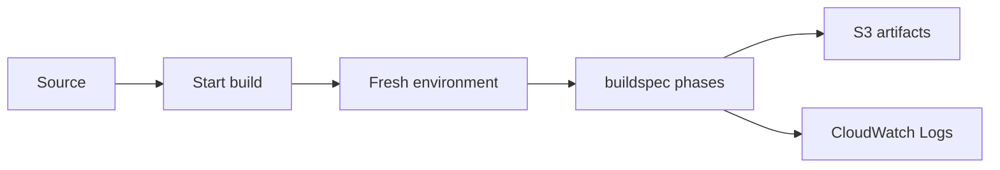

import { ConceptTemplate } from '@/features/kb/components/templates/ConceptTemplate'
import { Callout } from '@/features/kb/components/mdx/Callout'
import { ComparisonTable } from '@/features/kb/components/mdx/ComparisonTable'

export default function Layout({ children }) {
  return (
    <ConceptTemplate title="AWS CodeBuild">
      {children}
    </ConceptTemplate>
  )
}

**CodeBuild** is a job runner. A project points at a source (CodeCommit, GitHub, S3), a compute image, and a `buildspec.yml`. Each run starts a fresh container or EC2-backed environment, executes phases (install, pre_build, build, post_build), and dies. You pay for build-minutes, not idle agents.

## 1. Deep Dive and Mechanics

**buildspec.** YAML phases plus artifacts and cache. Commands are just shell. Artifacts upload to S3. Cache keys (npm, Maven, Go modules) live in S3 and restore at the start of the next run.

**Images.** AWS curated images, your ECR image, or a Lambda compute type for short jobs. Privileged mode is required for Docker-in-Docker image builds.

**VPC.** Builds can attach to a VPC to reach private package registries or RDS. That implies ENI provisioning latency and NAT for public registries.

**Batch and matrix.** Fan-out across environments. Reports (JUnit, coverage) show up in the console if you declare report groups.

**IAM.** The project service role is the identity of every command. A role that can `iam:PassRole` plus `*:*` is a pipeline-shaped admin hole.

<Callout icon="warning" title="Secrets in env vars leak">
Plaintext environment variables land in logs. Use Secrets Manager or Parameter Store references and mask. Assume every failed build log is public to anyone with console read.
</Callout>

## 2. Mathematical / Theoretical Foundation

Wall time T = queue + provision + cache_restore + work + upload. Provisioning dominates cold Docker layers. Cache hit rate H cuts work roughly by the download fraction of dependencies.

Cost ≈ minutes × instance_price. Parallelism reduces latency but not total minute-cost (it can increase it). A 4-way matrix that reruns the same lint is wasted spend.

<ComparisonTable
  headers={['CI runner', 'Model', 'Typical lock-in']}
  rows={[
    ['CodeBuild', 'Per-minute container', 'buildspec + IAM'],
    ['GitHub Actions', 'Hosted minutes / self-host', 'Actions YAML'],
    ['Jenkins', 'You own agents', 'Plugins, snowflakes'],
    ['GitLab Runner', 'You or SaaS', 'gitlab-ci.yml'],
  ]}
/>

## 3. Real-World Implementation

```yaml
version: 0.2
phases:
  install:
    commands:
      - npm ci
  build:
    commands:
      - npm test
      - npm run build
artifacts:
  files:
    - dist/**/*
cache:
  paths:
    - node_modules/**/*
```

Keep the spec in the repo so PRs change the pipeline with the code.

## 4. Visualizations



## 5. Interview Prep

**Q: Why is the first build slow?**
**A:** Image pull, no cache, and sometimes VPC ENI create. Warm caches and a slimmer custom image fix most of it.

**Q: How do you build Docker images safely?**
**A:** Privileged CodeBuild with Docker, or better, build with Kaniko/BuildKit in a non-privileged-ish flow and push to ECR. Pin the base digest.

**Q: CodeBuild vs CodePipeline vs Actions?**
**A:** CodeBuild is the worker. CodePipeline is the orchestrator. Many teams use Actions for git-native CI and CodeBuild only when they need VPC or AWS IAM-native jobs.

## 6. Production Use Cases

- Compile, unit test, and push images to ECR.
- Scheduled security scans of a repo.
- Worker stage inside CodePipeline after a source change.

<Callout icon="tip" title="Least-privilege project role">
Grant ecr:PutImage to one repo and s3:PutObject to one artifact prefix. Never reuse the admin role the platform team used on day one.
</Callout>
