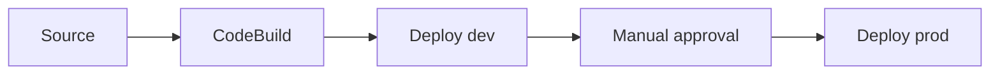

import { ConceptTemplate } from '@/features/kb/components/templates/ConceptTemplate'
import { Callout } from '@/features/kb/components/mdx/Callout'
import { ComparisonTable } from '@/features/kb/components/mdx/ComparisonTable'

export default function Layout({ children }) {
  return (
    <ConceptTemplate title="AWS CodePipeline">
      {children}
    </ConceptTemplate>
  )
}

**CodePipeline** is a release conveyor. A pipeline has stages; a stage has actions; actions consume and produce **artifacts** in an S3 bucket. A source change (git push, S3 put, ECR image) starts an execution. Failures stop the wave unless you designed otherwise. It does not replace a build system — it sequences them.

## 1. Deep Dive and Mechanics

**Artifacts.** Each action reads input artifacts and writes output artifacts. The pipeline bucket holds zips. Downstream deploys never rebuild from git unless you pass the source artifact through.

**Providers.** Source: CodeStar Connections (GitHub), CodeCommit, S3, ECR. Build: CodeBuild. Deploy: CloudFormation, CodeDeploy, ECS, Elastic Beanstalk, S3, Service Catalog. Invoke: Lambda, Step Functions. Approval: manual SNS.

**Triggers and detections.** Polling vs webhook-style detections depends on the source. V2 pipelines add better git triggers and variables.

**Parallel actions.** Actions in the same stage can run in parallel if their artifact deps allow. Stages are ordered.

**Cross-account.** A deploy action in a workload account assumes a role you pass. This is the usual org pattern: pipeline account owns the conveyor, workload accounts own the resources.

<Callout icon="warning" title="The artifact bucket is the supply chain">
Anyone who can write that bucket can poison a later deploy. Block public access, encrypt, and restrict PutObject to the pipeline roles.
</Callout>

## 2. Mathematical / Theoretical Foundation

A pipeline execution is a **token** moving through a staged DAG. Throughput is limited by the slowest mandatory stage. Lead time L = sum of stage times + approval wait. Approval wait often dominates L, which is a process problem, not a compute problem.

Rollback is not automatic unless the deploy provider supports it (CloudFormation rollback, CodeDeploy, ECS circuit breaker). CodePipeline itself just stops on failure.

<ComparisonTable
  headers={['Orchestrator', 'Native home', 'Strength']}
  rows={[
    ['CodePipeline', 'AWS APIs', 'IAM, CloudFormation, accounts'],
    ['GitHub Actions', 'GitHub', 'PR UX, marketplace'],
    ['Argo CD', 'Kubernetes', 'GitOps reconcile'],
    ['Jenkins', 'Anywhere', 'Plugins, you operate it'],
  ]}
/>

## 3. Real-World Implementation

```python
# Conceptual action chain — define the pipeline in CDK or CloudFormation.
stages = [
    ('Source', 'GitHub via CodeStar Connection'),
    ('Build', 'CodeBuild: test + synth'),
    ('DeployDev', 'CloudFormation execute change set'),
    ('Approve', 'Manual approval'),
    ('DeployProd', 'CloudFormation in prod account'),
]
```

Pass the synthesized template as an artifact. Do not re-synth in prod with different context.

## 4. Visualizations



## 5. Interview Prep

**Q: What lives in the artifact bucket?**
**A:** Source zips, build output, templates. It is part of the trusted computing base for production deploys.

**Q: How do you do cross-account deploys?**
**A:** Pipeline account starts the action; a role in the target account is assumed. The target role trusts only that pipeline.

**Q: CodePipeline vs all-in GitHub Actions?**
**A:** Actions is simpler for one-account apps. CodePipeline still shows up when deploy must use StackSets, org roles, or AWS-native deploy providers without exposing long-lived keys to a SaaS runner.

## 6. Production Use Cases

- Application release: image to ECS via CodeDeploy.
- Infra release: CDK synth artifact to CloudFormation.
- Multi-account promotions with a human gate before prod.

<Callout icon="tip" title="One pipeline per deployable">
A mega-pipeline that releases five unrelated services serializes teams. Split by service; share constructs, not a single stage list.
</Callout>
