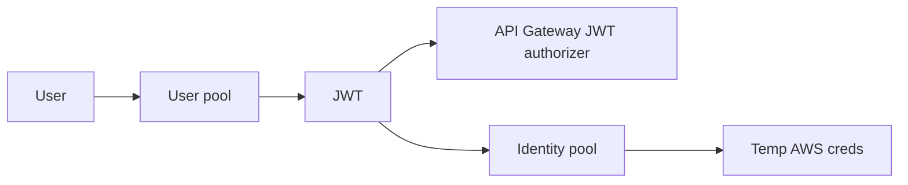

import { ConceptTemplate } from '@/features/kb/components/templates/ConceptTemplate'
import { Callout } from '@/features/kb/components/mdx/Callout'
import { ComparisonTable } from '@/features/kb/components/mdx/ComparisonTable'

export default function Layout({ children }) {
  return (
    <ConceptTemplate title="Amazon Cognito">
      {children}
    </ConceptTemplate>
  )
}

**Cognito** is two products that people mash together. A **user pool** is an IdP: users, passwords, MFA, hosted UI, and JWT access/id/refresh tokens. An **identity pool** (federated identities) vends temporary AWS credentials from STS, usually after a user-pool or social login. Most app auth needs only the user pool plus an API Gateway or ALB JWT check.

## 1. Deep Dive and Mechanics

**Tokens.** Id token is OIDC identity. Access token is for resource servers and custom scopes. Refresh token is long-lived and must be stored like a session secret. App clients are public (SPA, mobile) or confidential (server).

**Hosted UI vs custom.** Hosted UI/OAuth endpoints give you standards-compliant redirects. Custom UI uses the SDK and amplify-auth style APIs; you own XSS and password UX.

**Triggers.** Pre-signup, pre-token generation, migrate-user, and others are Lambda hooks. Pre-token is how you inject custom claims — and how you accidentally make every login depend on a cold Lambda.

**Federation.** User pools can broker SAML/OIDC to a workforce IdP. Identity pools can also take Facebook/Google tokens and map them to IAM roles.

**Advanced security.** Compromised-credential checks, risk-based MFA, adaptive auth — extra cost, extra lock-in.

<Callout icon="warning" title="Refresh tokens are the kingdom">
A leaked refresh token is a durable session. Rotate app clients, use token revocation, short refresh on SPAs, and never park tokens in localStorage if you can use tighter browser storage plus a BFF.
</Callout>

## 2. Mathematical / Theoretical Foundation

JWTs are signed (and optionally encrypted) claims. Verification is signature + iss + aud + exp — no network call if you cache JWKs. Revocation before expiry needs a denylist or short TTL plus refresh.

Identity-pool IAM is **GetCredentialsForIdentity**: a role assumption keyed by a mapping rule. The role trust must not be `*` with a weak identity. Confused-deputy here issues real AWS keys to the browser.

<ComparisonTable
  headers={['Piece', 'Issues', 'Consumers']}
  rows={[
    ['User pool', 'JWTs for users', 'API Gateway, ALB, your API'],
    ['Identity pool', 'STS keys', 'S3/DDB from the client'],
    ['IAM Identity Center', 'Workforce SSO', 'AWS console and CLI'],
    ['Cognito vs Auth0', 'AWS-native vs vendor', 'Triggers vs richer CX'],
  ]}
/>

## 3. Real-World Implementation

```python
import boto3

idp = boto3.client('cognito-idp')
resp = idp.admin_initiate_auth(
    UserPoolId='us-east-1_example',
    ClientId='app-client-id',
    AuthFlow='ADMIN_USER_PASSWORD_AUTH',
    AuthParameters={'USERNAME': 'ada', 'PASSWORD': 'not-in-source'},
)
print(resp['AuthenticationResult']['ExpiresIn'])
```

APIs should verify the JWT locally with the user-pool JWKS, not call AdminGetUser on every request.

## 4. Visualizations



## 5. Interview Prep

**Q: User pool vs identity pool?**
**A:** User pool authenticates humans and issues JWTs. Identity pool exchanges a proof of identity for IAM credentials. You can use the first without the second.

**Q: How does API Gateway check Cognito?**
**A:** A JWT authorizer (HTTP API) or a Cognito authorizer (REST) validates the access token. The Lambda never sees a password.

**Q: What belongs in a pre-token trigger?**
**A:** Small, cacheable claims (tenant id, role). Not a 200 ms database join on every refresh if you can store it on the user attribute.

## 6. Production Use Cases

- Consumer apps with email/password and social login.
- Machine-to-user APIs with Cognito as the JWT issuer.
- Mobile apps that upload to S3 via identity-pool scoped credentials.

<Callout icon="tip" title="Prefer HTTP API JWT authorizer">
Verify at the edge, cache JWKS, and keep custom claims tiny. The authorizer should not become your monolith.
</Callout>
