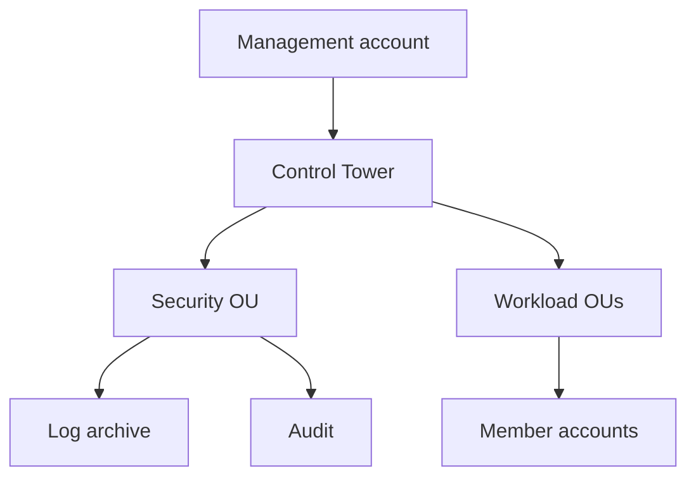

import { ConceptTemplate } from '@/features/kb/components/templates/ConceptTemplate'
import { Callout } from '@/features/kb/components/mdx/Callout'
import { ComparisonTable } from '@/features/kb/components/mdx/ComparisonTable'

export default function Layout({ children }) {
  return (
    <ConceptTemplate title="AWS Control Tower">
      {children}
    </ConceptTemplate>
  )
}

**Control Tower** is AWS’s opinionated landing zone. It sits on Organizations, IAM Identity Center, CloudTrail, Config, and a set of **controls** (guardrails). You get a management account, a log-archive account, an audit account, and an Account Factory to vend workload accounts into OUs. The point is consistency: the twentieth account looks like the second.

## 1. Deep Dive and Mechanics

**OUs.** Security OU holds log-archive and audit. Sandbox and workload OUs hold the rest. SCPs attach at OU boundaries. Moving an account changes its guardrail set.

**Controls.** Preventive (SCP, RCPs), detective (Config rules), and proactive (CloudFormation hooks / Control Catalog). Mandatory controls cannot be switched off if you want a registered OU. Strongly recommended and elective controls are how you ratchet a regulated estate.

**Account Factory.** Service Catalog (or AFC with AFT) provisions accounts from a blueprint: VPC-or-not, SSO mappings, baseline stacks.

**AFT.** Account Factory for Terraform is the escape hatch when you want Terraform pipelines to customize each vended account after Control Tower registers it.

**Drift.** If someone detaches a trail or disables Config in a member, Control Tower reports drift. Repair is not always one click.

<Callout icon="warning" title="The management account is radioactive">
Do not run workloads there. Billing, Organizations, and Control Tower APIs concentrate privilege. A leaked management role is a company-wide incident.
</Callout>

## 2. Mathematical / Theoretical Foundation

A landing zone is a **policy lattice**: OU path × control set × IAM Identity Center permission sets. Effective permission is the intersection of identity policy, resource policy, SCP, permission boundary, and session policies. Preventive controls work by making the API fail; detective controls work by measuring after the fact. Completeness of detection is Config recorder coverage × rule coverage × delivery health.

<ComparisonTable
  headers={['Approach', 'Who operates', 'When']}
  rows={[
    ['Control Tower', 'AWS + you', 'Standard AWS multi-account'],
    ['Landing Zone Accelerator', 'You on AWS samples', 'Heavier regulated custom'],
    ['Home-grown Orgs + SCPs', 'You', 'Small estates, special needs'],
    ['Single account', 'Nobody', 'Never for a company'],
  ]}
/>

## 3. Real-World Implementation

```python
# Control Tower is mostly console / CfCT / AFT.
# After an account is vended, tag and enroll it in your pipeline.
account_baseline = {
    'cloudtrail': 'organization-trail',
    'config': 'all-regions',
    'sso': 'permission-sets-by-ou',
    'vpc': 'optional-central-egress',
}
```

Decide once whether workload accounts get a VPC by default. Retrofitting networking is harder than vending it.

## 4. Visualizations



## 5. Interview Prep

**Q: What does Control Tower actually create?**
**A:** Organization structure, shared accounts, Identity Center integration, organization CloudTrail/Config baselines, and a catalog of controls. It is not a substitute for app IAM.

**Q: SCP vs IAM policy?**
**A:** SCP is a max-permission ceiling on an account or OU. It cannot grant. IAM still must allow.

**Q: Control Tower vs Organizations alone?**
**A:** Organizations is the primitive. Control Tower is the productized baseline and Account Factory on top.

## 6. Production Use Cases

- Enterprise landing zones with dozens to thousands of accounts.
- Regulated estates that need evidence of mandatory detective controls.
- Self-service account vending for product teams.

<Callout icon="tip" title="OU design is the real architecture">
Put blast-radius and data-classification into OU names. Guardrails follow the tree; a flat OU list makes every exception global.
</Callout>
