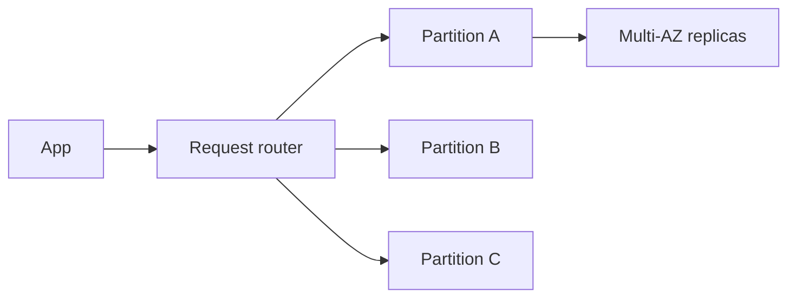

import { ConceptTemplate } from '@/features/kb/components/templates/ConceptTemplate'
import { Callout } from '@/features/kb/components/mdx/Callout'
import { ComparisonTable } from '@/features/kb/components/mdx/ComparisonTable'

export default function Layout({ children }) {
  return (
    <ConceptTemplate title="Amazon DynamoDB">
      {children}
    </ConceptTemplate>
  )
}

**DynamoDB** is a partitioned key-value / document store. You pick a partition key (and optional sort key). AWS splits the table into partitions that independently take load. There is no JOIN, no cross-partition transaction without limits, and no hiding a bad key design behind a bigger instance type.

## 1. Deep Dive and Mechanics

**Item.** Up to 400 KB. Attributes are typed. Primary key is PK or PK+SK. GSIs and LSIs are extra access paths; a GSI is a new table AWS maintains for you with its own capacity and eventual consistency by default.

**Capacity.** Provisioned WCU/RCU or on-demand. Adaptive capacity can borrow across partitions, but a single hot key still hits a per-partition ceiling.

**Consistency.** GetItem can be strongly consistent in-region. Queries on GSIs are eventually consistent. Global tables are multi-active with last-writer-wins at item level unless you add your own conflict story.

**Streams and TTL.** Streams feed Lambda for CDC. TTL expires items asynchronously — not a realtime delete SLA.

**Transactions.** TransactWrite up to 100 items, all or nothing, with a capacity premium. Not a replacement for a relational unit of work across unbounded rows.

<Callout icon="error" title="Hot partitions">
If every write uses PK = GLOBAL or PK = today, you have one partition. On-demand will not save you. Shard the key or redesign the access pattern.
</Callout>

## 2. Mathematical / Theoretical Foundation

Partition count grows with data size and throughput. A partition has a finite request budget (historically on the order of 3000 RCU / 1000 WCU class limits; treat published limits as evolving). Throughput for a key is not “table capacity / 1” — it is min(table, that partition).

RCU: a strongly consistent 4 KB read is 1 RCU; eventually consistent is half. WCU: 1 KB write is 1 WCU. Transactions consume extra units.

Single-table design is a **denormalized** physical model: you store the query result shape, not 3NF. Write amplification and item size are the cost of cheap reads.

<ComparisonTable
  headers={['Access', 'API', 'Notes']}
  rows={[
    ['Point read', 'GetItem', 'O(1) if you have the key'],
    ['Range', 'Query', 'PK required, SK condition'],
    ['Scan', 'Scan', 'Touches every partition — last resort'],
    ['Secondary', 'GSI / LSI', 'GSI = new projection + lag'],
  ]}
/>

## 3. Real-World Implementation

```python
import boto3

table = boto3.resource('dynamodb').Table('orders')
table.put_item(Item={
    'pk': 'USER#42',
    'sk': 'ORDER#1001',
    'status': 'OPEN',
    'total_cents': 2599,
})
print(table.get_item(Key={'pk': 'USER#42', 'sk': 'ORDER#1001'})['Item'])
```

Model queries first. If you cannot write the Get/Query for a screen, the table is not designed yet.

## 4. Visualizations



## 5. Interview Prep

**Q: Why not Scan for the admin page?**
**A:** Scan is O(table). It pages, burns RCU, and gets worse as you succeed. Build a GSI for the admin access pattern.

**Q: Provisioned vs on-demand?**
**A:** On-demand for spiky or unknown load. Provisioned plus autoscaling for steady high volume if price wins. Neither fixes a hot key.

**Q: How do you do multi-item consistency?**
**A:** Transactions for small groups; or a single-item aggregate; or accept eventual consistency with a workflow. Do not pretend DynamoDB is Postgres.

## 6. Production Use Cases

- Session, profile, and shopping-cart stores.
- High-QPS metadata next to S3 objects.
- Event-sourced entities with SK = timestamp and GSIs for status.

<Callout icon="tip" title="Write the access patterns table">
A one-page matrix of PK, SK, and GSI for each screen prevents the “we will add a Scan” meeting six months later.
</Callout>
