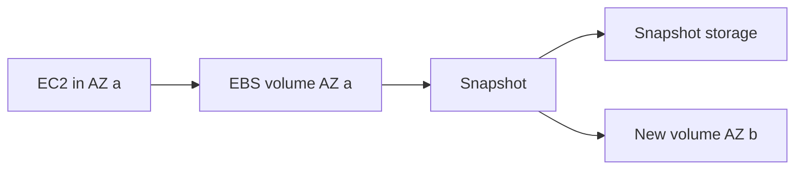

import { ConceptTemplate } from '@/features/kb/components/templates/ConceptTemplate'
import { Callout } from '@/features/kb/components/mdx/Callout'
import { ComparisonTable } from '@/features/kb/components/mdx/ComparisonTable'

export default function Layout({ children }) {
  return (
    <ConceptTemplate title="Amazon EBS">
      {children}
    </ConceptTemplate>
  )
}

**EBS** is a remote block device. You attach a volume to an instance in the **same AZ**, format it, and treat it like a disk. Latency is a network hop plus the storage fleet, not a local NVMe path (unless you use instance store). Snapshots are incremental copies into S3-backed snapshot storage, usable to clone volumes across AZs.

## 1. Deep Dive and Mechanics

**Types.** gp3 is the default SSD: you set IOPS and throughput independently of size. io2/io2 Block Express is provisioned IOPS for databases. st1/sc1 are HDD throughput volumes. Magnetic leftovers should not appear in new designs.

**AZ affinity.** A volume lives in one AZ. Multi-AZ HA is RAID-nothing: replicate at the application (Aurora, RDS Multi-AZ) or use EBS Multi-Attach only for clustered filesystems that can fence.

**Snapshots.** Crash-consistent if you freeze I/O or use application-aware snapshots (Windows VSS, database flush). Incremental: only changed blocks after the first. Sharing and Fast Snapshot Restore are extras.

**Encryption.** KMS at rest. Encryption-by-default at the account level avoids “we forgot.” Changing encryption on an existing volume is a snapshot-and-copy dance.

**Performance.** Burst credits on small gp2 (legacy). gp3 is explicit. Instance-to-EBS bandwidth is also capped by instance type — a huge io2 on a tiny instance is wasted.

<Callout icon="warning" title="Snapshot is not a backup plan by itself">
A snapshot of a dirty database volume can be unrestorable. Script freeze/flush, test restore in another AZ, and keep the AMI + volume recipe together.
</Callout>

## 2. Mathematical / Theoretical Foundation

IOPS and MiB/s are **provisioned budgets** with a per-volume and per-instance cap. Queue depth and IO size determine whether you hit IOPS or throughput first: large sequential reads exhaust MiB/s; tiny random reads exhaust IOPS.

Durability of EBS is high but not S3 eleven-nines marketing. Design assumes volume failure: RAID1 in-guest is rarely the right answer; restore-from-snapshot and multi-AZ databases are.

<ComparisonTable
  headers={['Storage', 'Semantics', 'Use']}
  rows={[
    ['EBS', 'Block, one AZ', 'OS, databases on EC2'],
    ['Instance store', 'Ephemeral local NVMe', 'Caches, scratch'],
    ['EFS', 'NFS multi-AZ', 'Shared files'],
    ['S3', 'Object', 'Blobs, lake, backups'],
  ]}
/>

## 3. Real-World Implementation

```python
import boto3

ec2 = boto3.client('ec2')
vol = ec2.create_volume(
    AvailabilityZone='us-east-1a',
    Size=100,
    VolumeType='gp3',
    Iops=4000,
    Throughput=250,
    Encrypted=True,
)
print(vol['VolumeId'])
```

Match AZ to the instance. ModifyVolume can raise size and gp3 IOPS online; still grow the filesystem inside the OS.

## 4. Visualizations



## 5. Interview Prep

**Q: Can I attach one EBS volume to two instances in different AZs?**
**A:** No. Multi-Attach is same-AZ, and only for cluster-aware filesystems. Cross-AZ is snapshot-copy or application replication.

**Q: gp3 vs io2?**
**A:** gp3 for most. io2 when you need higher durability/IOPS and consistent low latency for a database you insist on running yourself.

**Q: Why is my volume slow after restore?**
**A:** Lazy loading from snapshot. FSR or a fio pre-warm reduces first-read penalties.

## 6. Production Use Cases

- Root and data disks for EC2.
- RDS/Aurora under the hood (you do not manage those volumes directly).
- Golden AMIs built from snapshotted, baked volumes.

<Callout icon="tip" title="Encrypt by default">
Account-level EBS encryption plus a CMK you control beats a cleanup project after the first audit.
</Callout>
