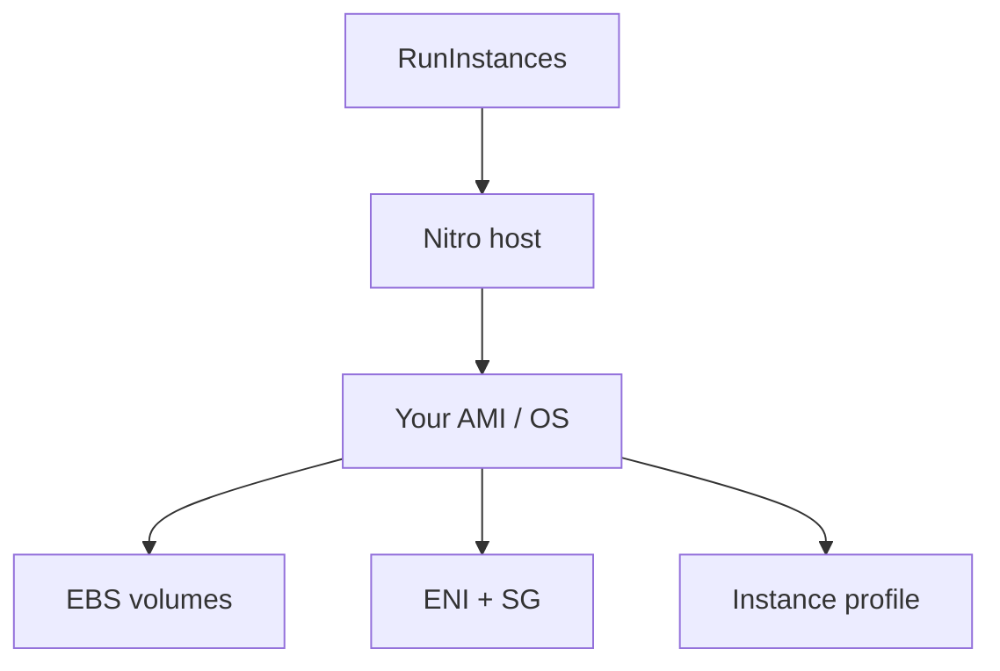

import { ConceptTemplate } from '@/features/kb/components/templates/ConceptTemplate'
import { Callout } from '@/features/kb/components/mdx/Callout'
import { ComparisonTable } from '@/features/kb/components/mdx/ComparisonTable'

export default function Layout({ children }) {
  return (
    <ConceptTemplate title="Amazon EC2">
      {children}
    </ConceptTemplate>
  )
}

**EC2** is a VM rental API. You choose an AMI, an instance type, a subnet, a security group, and optionally IAM instance profile, EBS maps, and user data. AWS places you on **Nitro**: hardware offload for network, storage, and security so most of the host CPU is yours. You still patch the OS.

## 1. Deep Dive and Mechanics

**Families.** C compute, M general, R memory, I storage, P/G/Inf accelerators, T burstable, Graviton (g) for ARM price/perf, metal for no hypervisor in the guest. Size in the name (large, 4xlarge) scales vCPU and RAM roughly together.

**Purchasing.** On-demand, Reserved/Savings Plans, Spot (reclaimable), Dedicated Hosts. Spot is a capacity market: you need interruption handling or a mix.

**AMI and user data.** AMI is the root disk snapshot plus metadata. User data runs at first boot (cloud-init). Immutable AMIs baked in a pipeline beat snowflake apt-get in user data.

**Networking.** ENIs, public IPs, Elastic IPs, enhanced networking. Security groups are stateful host firewalls; NACLs are stateless subnet filters.

**Nitro Enclaves and TPM.** Isolated compute for secrets; independent of “I have SSH.”

<Callout icon="warning" title="Instance store is not EBS">
Local NVMe dies with the instance. Great for caches and scratch. Fatal if you thought it was your database.
</Callout>

## 2. Mathematical / Theoretical Foundation

vCPU is a hyperthread or a full core depending on type. Burstable T instances spend **CPU credits**: average utilization under a baseline earns credits; above baseline spends them. Zero credits means throttle.

Spot interruption is a capacity signal, not a random crash. Bid/price is now simpler (you pay the prevailing Spot price) but capacity can still vanish in two minutes.

Placement groups: cluster (low latency, same rack-ish), spread (distinct hardware), partition (Hadoop-style). They trade availability for locality.

<ComparisonTable
  headers={['Compute', 'Unit you ship', 'Ops load']}
  rows={[
    ['EC2', 'VM', 'OS, agents, scaling'],
    ['ECS on EC2', 'Container on your VMs', 'Cluster + OS'],
    ['Fargate', 'Container', 'Task spec'],
    ['Lambda', 'Function', 'Code + config'],
  ]}
/>

## 3. Real-World Implementation

```python
import boto3

ec2 = boto3.client('ec2')
ec2.run_instances(
    ImageId='ami-123',
    InstanceType='m7g.large',
    MinCount=1,
    MaxCount=1,
    SubnetId='subnet-private',
    IamInstanceProfile={'Name': 'app-profile'},
    MetadataOptions={'HttpTokens': 'required'},
)
```

Require IMDSv2. A leaked SSRF without it is an instance-role theft.

## 4. Visualizations



## 5. Interview Prep

**Q: Security group vs NACL?**
**A:** SG is stateful, attached to ENIs, default deny inbound. NACL is stateless, attached to subnets, must allow ephemeral return ports. Use SGs as the real firewall.

**Q: How do you get high availability?**
**A:** An ASG (or equivalent) across at least two AZs behind a load balancer. One EC2 in one AZ is a maintenance window waiting to happen.

**Q: Graviton caveats?**
**A:** ARM binaries and language runtimes must be supported. Many managed AMIs already are; your C++ natives may not be.

## 6. Production Use Cases

- Legacy lift-and-shift VMs.
- GPU training boxes and Windows estates.
- ASG web tiers when containers are not worth the move yet.

<Callout icon="tip" title="Bake AMIs, do not snowflake">
A pipeline that produces a numbered AMI plus an ASG instance refresh is cheaper than SSH folklore and configuration drift.
</Callout>
