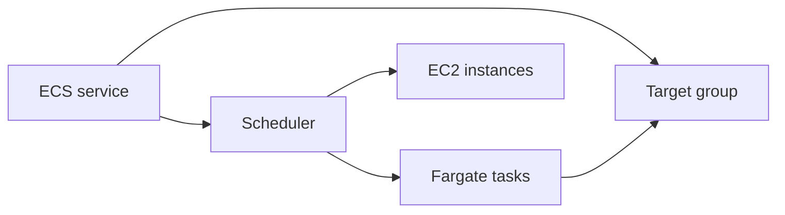

import { ConceptTemplate } from '@/features/kb/components/templates/ConceptTemplate'
import { Callout } from '@/features/kb/components/mdx/Callout'
import { ComparisonTable } from '@/features/kb/components/mdx/ComparisonTable'

export default function Layout({ children }) {
  return (
    <ConceptTemplate title="Amazon ECS">
      {children}
    </ConceptTemplate>
  )
}

**ECS** schedules containers. You register a **task definition** (image, CPU, memory, ports, IAM roles, logs). A **service** keeps N tasks healthy and optionally attached to a load balancer. The cluster is either your EC2 instances (with the ECS agent) or **Fargate** (task-sized isolation, no nodes to patch).

## 1. Deep Dive and Mechanics

**Task vs service vs cluster.** Task is a running pod-like group of containers that share a network namespace (awsvpc). Service is the desired-count controller plus deployments. Cluster is a namespace and capacity pool.

**Capacity.** EC2 capacity providers with managed ASGs, or Fargate / Fargate Spot. The scheduler bin-packs CPU and memory; it will fail to place if you ask for 4 vCPU on a drained cluster.

**Networking.** awsvpc gives each task an ENI and security groups — the model you should default to. Bridge/host on EC2 are legacy shapes.

**Deployments.** Rolling with min healthy percent, circuit breaker, and CodeDeploy blue/green for advanced cutovers. Failed tasks show up in stopped-reason, not in a kube event stream.

**Exec and Service Connect.** ECS Exec is SSM into a container. Service Connect / Cloud Map is AWS-native service discovery so tasks find each other without baking IPs.

<Callout icon="info" title="Two IAM roles">
Task execution role pulls images and writes logs. Task role is what the app uses for AWS APIs. Mixing them is how a leaked app gets ECR admin.
</Callout>

## 2. Mathematical / Theoretical Foundation

Placement is **bin packing** with constraints (AZ, attributes, daemon strategy). Utilization U = sum(reserved) / capacity. Reserved, not used: a task that asks for 2 vCPU and burns 0.1 still occupies 2.

Deployment safety is a sliding window: minHealthyPercent keeps old tasks until new ones pass health checks. Error budget during deploy is (100 − minHealthy) percent of desired count.

<ComparisonTable
  headers={['Orchestrator', 'Control plane', 'Best fit']}
  rows={[
    ['ECS + Fargate', 'AWS-managed', 'AWS-only containers, less YAML'],
    ['ECS + EC2', 'AWS + your nodes', 'GPUs, Windows, cost tuning'],
    ['EKS', 'Kubernetes', 'Portability, CRDs, ecosystem'],
    ['App Runner / Lightsail', 'Higher abstraction', 'Simple web apps'],
  ]}
/>

## 3. Real-World Implementation

```json
{
  "family": "web",
  "cpu": "512",
  "memory": "1024",
  "networkMode": "awsvpc",
  "containerDefinitions": [
    {
      "name": "nginx",
      "image": "111111111111.dkr.ecr.us-east-1.amazonaws.com/web:1.2.3",
      "portMappings": [{"containerPort": 8080}]
    }
  ]
}
```

Pin image tags to digests in production. `latest` is a race.

## 4. Visualizations



## 5. Interview Prep

**Q: ECS vs EKS?**
**A:** ECS is simpler and AWS-native. EKS if you need Kubernetes APIs, multi-cloud skills, or a large CNCF toolchain. Both can run Fargate.

**Q: What fails placement?**
**A:** Insufficient CPU/memory, ENI limits on the instance, AZ mismatch, or a missing capacity provider. Check stopped tasks, not only the service events.

**Q: How do you give a task AWS access?**
**A:** Task role via the agent and IMDSv2-like endpoint inside the task network. Do not bake keys.

## 6. Production Use Cases

- Stateless web and worker services on Fargate.
- Batch tasks (RunTask) from EventBridge or Step Functions.
- Mixed Windows/Linux container estates on EC2 capacity.

<Callout icon="tip" title="Turn on the circuit breaker">
A bad image should stop rolling by itself. Pair it with an ALB health check that actually hits a dependency, not only TCP 80.
</Callout>
