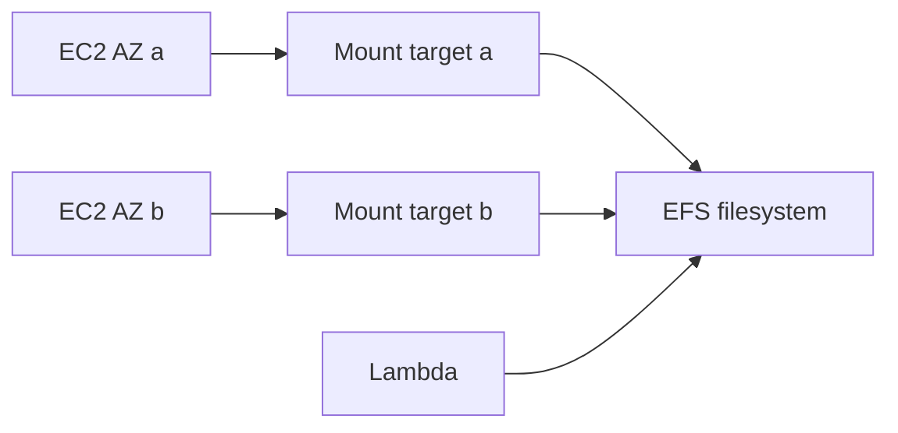

import { ConceptTemplate } from '@/features/kb/components/templates/ConceptTemplate'
import { Callout } from '@/features/kb/components/mdx/Callout'
import { ComparisonTable } from '@/features/kb/components/mdx/ComparisonTable'

export default function Layout({ children }) {
  return (
    <ConceptTemplate title="Amazon EFS">
      {children}
    </ConceptTemplate>
  )
}

**EFS** is a regional, elastic NFS service. You create a filesystem, put **mount targets** in subnets (typically one per AZ), and mount via NFSv4.1. Capacity grows and shrinks with your files. Many instances can write at once. It is not a block device and it is not S3.

## 1. Deep Dive and Mechanics

**Performance modes.** General Purpose is the default (low latency). Max I/O is the old scale-out mode for huge parallel workloads; most new designs stay on General Purpose plus the right throughput mode.

**Throughput.** Elastic throughput scales with load and is the usual choice. Provisioned is a floor you pay for. Bursting (legacy) ties credits to stored GiB — small filesystems starve.

**Storage classes.** Standard vs Infrequent Access vs Archive, with optional Intelligent-Tiering. First-byte latency jumps on IA; do not put a latency-sensitive home directory solely on Archive.

**Access points.** Enforce a root directory, POSIX uid/gid, and optional IAM. This is how you give two apps isolated trees on one filesystem.

**Replication and backup.** Cross-region replication and AWS Backup exist. EFS is regional HA (multi-AZ) but not a substitute for application-consistent backups of databases dumped onto it.

<Callout icon="warning" title="NFS is chatty">
Thousands of tiny files and metadata-heavy builds will look “slow” compared to local NVMe. Batch, pack, or use instance store for scratch and keep EFS for the shared tree.
</Callout>

## 2. Mathematical / Theoretical Foundation

POSIX NFS semantics mean **close-to-open** cache coherence, not a linearizable global memory. Concurrent writers to the same file need application locking (fcntl) or you will corrupt.

Throughput T scales with mode. Elastic aims to follow demand; very high T still needs parallel mounts and large I/O sizes. Small 4 KB sync writes serialize on metadata and will never look like gp3.

<ComparisonTable
  headers={['Store', 'Share', 'Semantics']}
  rows={[
    ['EFS', 'Many AZs, many mounts', 'POSIX NFS'],
    ['EBS', 'One AZ, one instance*', 'Block'],
    ['FSx', 'NetApp / Windows / Lustre', 'Vendor protocols'],
    ['S3', 'Worldwide HTTP', 'Object, no POSIX'],
  ]}
/>

## 3. Real-World Implementation

```bash
sudo yum install -y amazon-efs-utils
sudo mount -t efs -o tls fs-0123456789:/ /mnt/efs
```

Prefer the EFS mount helper with TLS. Security groups must allow NFS 2049 from the instance SG to the mount-target SG.

## 4. Visualizations



## 5. Interview Prep

**Q: EFS vs EBS vs S3?**
**A:** EBS is a disk for one instance (or clustered Multi-Attach). EFS is a shared filesystem. S3 is objects over HTTP. Pick by API and sharing, not by “storage.”

**Q: Why is my Lambda plus EFS cold?**
**A:** The first invoke adds ENI + NFS mount overhead. Provisioned concurrency and a persistent mount help; a huge tree walk on every invoke does not.

**Q: How do you isolate tenants?**
**A:** Access points plus IAM, not a single root mount with hope.

## 6. Production Use Cases

- Shared upload directories for a web fleet.
- Home dirs and CMS content for lift-and-shift.
- Lambda or Fargate jobs that need a POSIX scratch/share.

<Callout icon="tip" title="One mount target per AZ">
Cross-AZ NFS adds latency and data-transfer charges. Put a mount target in every AZ that runs compute.
</Callout>
