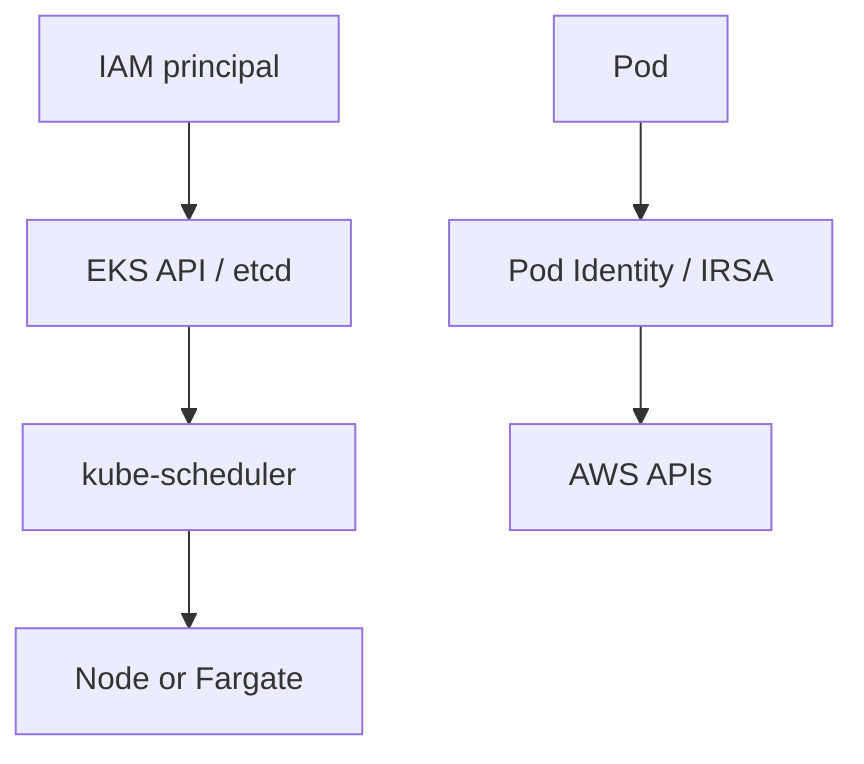

import { ConceptTemplate } from '@/features/kb/components/templates/ConceptTemplate'
import { Callout } from '@/features/kb/components/mdx/Callout'
import { ComparisonTable } from '@/features/kb/components/mdx/ComparisonTable'

export default function Layout({ children }) {
  return (
    <ConceptTemplate title="Amazon EKS">
      {children}
    </ConceptTemplate>
  )
}

**EKS** is Kubernetes with the control plane as a service. You get a regional API endpoint and managed etcd across AZs. Data plane is still yours: managed node groups, self-managed nodes, Karpenter, or EKS Fargate. Add-ons (CNI, kube-proxy, CoreDNS, EBS CSI) are where most outages hide.

## 1. Deep Dive and Mechanics

**Auth.** The AWS IAM Authenticator maps IAM principals to Kubernetes users/groups. Access entries (the newer API) replace the old aws-auth ConfigMap. IRSA or EKS Pod Identity binds an IAM role to a service account so pods do not share a node role.

**Networking.** The VPC CNI gives each pod an IP from the subnet (prefix delegation increases density). Security groups for pods exist but have ENI math. Load balancers come from the AWS Load Balancer Controller, not from hoping Service type LoadBalancer does the right thing.

**Upgrades.** Control plane first, then nodes, then add-ons. Skew is limited. Cluster insights tell you what will break; read them.

**Data plane choices.** Managed node groups are ASGs AWS helps upgrade. Karpenter provisions right-sized instances from a NodePool. Fargate removes nodes and also removes DaemonSets, privileged pods, and some CNI features.

<Callout icon="error" title="The node instance role is not the app role">
If every pod can assume the node role, a single SSRF is cluster admin on AWS. Use Pod Identity or IRSA and a minimal node role (pull images, send logs).
</Callout>

## 2. Mathematical / Theoretical Foundation

Pod density is min(CPU, memory, **IPs per ENI**, max-pods). Prefix mode multiplies IPs; small subnets still exhaust. Control-plane SLA is on the API server, not on your Deployments.

Scheduling is the usual Kubernetes predicate + score. Karpenter changes the economic model: it provisions for pending pods (bin-packing across instance SKUs) instead of packing onto a fixed ASG shape.

<ComparisonTable
  headers={['Mode', 'You patch', 'Give up']}
  rows={[
    ['Managed nodes', 'AMI via node group', 'Some instance flexibility'],
    ['Karpenter', 'AMIs / AMIFamily', 'Need disruption budgets'],
    ['EKS Fargate', 'Nothing on nodes', 'DaemonSets, GPUs, host PID'],
    ['ECS Fargate', 'No Kubernetes', 'K8s API and CRDs'],
  ]}
/>

## 3. Real-World Implementation

```bash
eksctl create cluster --name prod --region us-east-1 --version 1.31
kubectl annotate sa checkout \
  eks.amazonaws.com/role-arn=arn:aws:iam::111111111111:role/checkout
```

Prefer access entries and Pod Identity in new clusters. Keep kubeconfig issued via `aws eks get-token`, not a long-lived certificate.

## 4. Visualizations



## 5. Interview Prep

**Q: What does “managed” include?**
**A:** API servers, etcd, and some add-on helpers. Not your nodes, not your ingress, not your Cluster Autoscaler, not your YAML.

**Q: IRSA vs node role?**
**A:** IRSA / Pod Identity is per service account via OIDC or the Pod Identity agent. Node role is shared by every pod that can reach IMDS.

**Q: EKS vs ECS?**
**A:** EKS when you need Kubernetes. ECS when you do not. Both can be “just run containers on AWS.”

## 6. Production Use Cases

- Multi-team platforms with namespaces and CRDs.
- Hybrid/portability stories that already standardized on k8s.
- GPU training pools with device plugins and Karpenter.

<Callout icon="tip" title="Upgrade add-ons on purpose">
A control-plane bump with a stale VPC CNI is a weekend. Pin add-on versions and promote them like you promote the cluster version.
</Callout>
