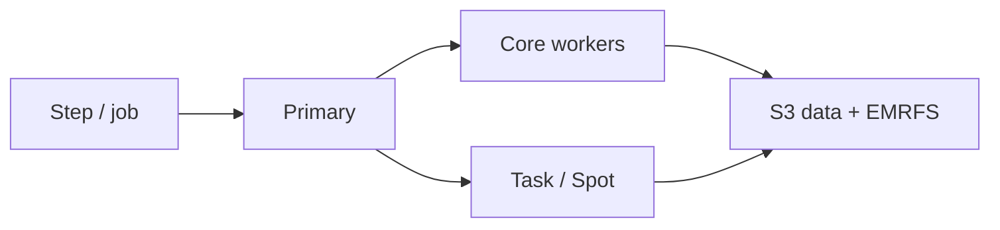

import { ConceptTemplate } from '@/features/kb/components/templates/ConceptTemplate'
import { Callout } from '@/features/kb/components/mdx/Callout'
import { ComparisonTable } from '@/features/kb/components/mdx/ComparisonTable'

export default function Layout({ children }) {
  return (
    <ConceptTemplate title="Amazon EMR">
      {children}
    </ConceptTemplate>
  )
}

**EMR** packages open-source data engines onto AWS compute. Classic EMR is a cluster of EC2 instances (primary + core + task) with EMRFS reading S3. **EMR on EKS** runs Spark executors as pods. **EMR Serverless** hides the cluster and bills for vCPU-hour and memory-hour of workers. The data should live in S3, not on HDFS, unless you have a reason.

## 1. Deep Dive and Mechanics

**EMRFS.** Objects in S3 look like HDFS paths. Consistency is S3’s strong consistency now; the old “eventual listing” folklore is stale, but listing millions of tiny files is still slow.

**Node roles.** Primary runs masters (YARN RM, Spark History). Core runs HDFS and persistent executors. Task is Spot-friendly compute with no HDFS. Instance fleets mix types and Spot.

**Bootstrap and steps.** Bootstrap actions mutate AMIs at launch. Steps are submitted jobs. A long-lived cluster with SSH bootstrap drift is how you get snowflake Hadoop.

**Security.** Kerberos, Lake Formation, runtime roles, in-transit encryption, and security groups that should not be 0.0.0.0/0 on 8088.

**Runtimes.** Spark is the default conversation. Hive, Presto/Trino, Flink, HBase still exist; pick one engine and do not enable the zoo “just in case.”

<Callout icon="warning" title="HDFS on core nodes is a trap">
If core Spot dies, you lose HDFS blocks. Keep durable data in S3. Use local disk as shuffle and cache only.
</Callout>

## 2. Mathematical / Theoretical Foundation

Spark job time is roughly scan + shuffle + compute. S3 scan is parallel by object/split. Shuffle to local disk (or EBS) is the usual bottleneck; tiny files increase task overhead as T ≈ n_files × launch_cost.

Serverless cost ≈ sum(worker_hours × price). An over-wide executor graph costs money even if wall time drops only a little. Right-size executor memory to avoid GC and waste.

<ComparisonTable
  headers={['Flavor', 'You manage', 'Fit']}
  rows={[
    ['EMR on EC2', 'Cluster lifecycle, AMIs', 'Custom daemons, HDFS, GPUs'],
    ['EMR on EKS', 'EKS + Spark operator bits', 'Shared k8s, bin-pack'],
    ['EMR Serverless', 'Job spec', 'Spiky Spark/Hive'],
    ['Athena / Glue', 'SQL or jobs', 'Less Spark control'],
  ]}
/>

## 3. Real-World Implementation

```python
import boto3

emr = boto3.client('emr')
emr.run_job_flow(
    Name='nightly-spark',
    ReleaseLabel='emr-7.5.0',
    Applications=[{'Name': 'Spark'}],
    ServiceRole='EMR_DefaultRole',
    JobFlowRole='EMR_EC2_DefaultRole',
    Instances={
        'InstanceFleets': [],
        'KeepJobFlowAliveWhenNoSteps': False,
    },
    LogUri='s3://emr-logs/nightly/',
)
```

Prefer transient clusters or Serverless: start, run steps, die. Persist state in S3 and the Glue catalog.

## 4. Visualizations



## 5. Interview Prep

**Q: Why S3 over HDFS on EMR?**
**A:** Decouple storage from cluster lifetime. You can kill the cluster every night. HDFS ties data to core-node durability.

**Q: EMR Serverless vs Athena?**
**A:** Athena is SQL on the lake with a Trino-like engine. EMR Serverless is “run this Spark job” with more control over jars and shuffles.

**Q: How do you keep Spot from failing the job?**
**A:** Task nodes as Spot, core as on-demand or instance-fleet diversification, and shuffle that can retrigger. Do not put HDFS on Spot.

## 6. Production Use Cases

- Nightly Spark ETL into a lakehouse.
- Heavyweight ML feature generation.
- Migration off on-prem Hadoop with EMRFS as the first landing.

<Callout icon="tip" title="Log to S3 and die">
A cluster that stays up “for the next ad-hoc” is an unpatched estate. Transient + notebooks on a small always-on or on EMR Studio is cleaner.
</Callout>
