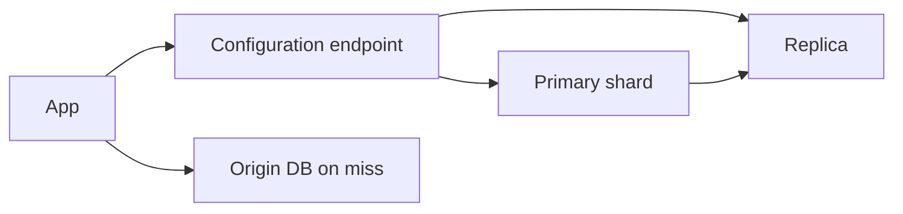

import { ConceptTemplate } from '@/features/kb/components/templates/ConceptTemplate'
import { Callout } from '@/features/kb/components/mdx/Callout'
import { ComparisonTable } from '@/features/kb/components/mdx/ComparisonTable'

export default function Layout({ children }) {
  return (
    <ConceptTemplate title="Amazon ElastiCache">
      {children}
    </ConceptTemplate>
  )
}

**ElastiCache** runs in-memory engines as a managed service. **Redis / Valkey** give you data structures, replication, and optional cluster mode. **Memcached** is a simpler distributed hash. Serverless ElastiCache removes node sizing for some workloads. The API is still Redis or Memcached — AWS operates failover, patching, and backups.

## 1. Deep Dive and Mechanics

**Cluster mode.** Redis Cluster shards by hash slot (16384 slots). Clients must be cluster-aware. Scaling out is a slot migration, not a bigger VM only.

**Replication.** A primary plus replicas. Failover updates DNS or the configuration endpoint. In-flight writes can vanish; this is not a disk-backed OLTP log unless you turned on AOF/RDB and accepted the trade.

**Placement.** Always in a VPC, private subnets, security group to app SG only. In-transit TLS and AUTH/RBAC are not optional in 2026 designs.

**Eviction.** maxmemory-policies (allkeys-lru, volatile-ttl, noeviction). noeviction plus a full dataset is a production incident.

**Global datastore.** Cross-region replica for read locality and disaster recovery, with lag.

<Callout icon="error" title="Cache-as-database">
If the only copy of the cart is in Redis and a node group fails failover poorly, you refund humans. Persist the source of truth; use ElastiCache as a speed layer.
</Callout>

## 2. Mathematical / Theoretical Foundation

Hit ratio H drives origin load: origin_qps ≈ (1 − H) × qps. Memory M must hold the working set plus fragmentation plus replicas. A working set larger than M with LRU is a designed miss rate, not a mystery.

Slot balance: keys should hash evenly. A hot key (one session, one leaderboard) cannot be split without application sharding (key suffixes).

p99 is dominated by network RTT + single-threaded command execution on Redis (I/O threads help some versions). Pipeline and avoid huge KEYS / SMEMBERS on big sets.

<ComparisonTable
  headers={['Engine', 'Shape', 'Use']}
  rows={[
    ['Redis / Valkey cluster', 'Sharded slots', 'Large datasets, scale-out'],
    ['Redis replication only', 'One primary', 'Simpler, vertical scale'],
    ['Memcached', 'Client-sharded', 'Dumb cache, no persistence'],
    ['DynamoDB DAX', 'DDB front cache', 'When Dynamo is the API'],
  ]}
/>

## 3. Real-World Implementation

```python
import redis

r = redis.Redis(host='clustercfg.example.cache.amazonaws.com', port=6379, ssl=True)
r.setex('session:42', 3600, '{"user": 42}')
print(r.get('session:42'))
```

Use the configuration endpoint, TLS, and a client that retries READONLY after failover. Do not hardcode a single node.

## 4. Visualizations



## 5. Interview Prep

**Q: Aside vs in-line cache?**
**A:** Aside: app reads cache, then DB, then fill. Inline/proxy: a layer sits on the path (DAX). Aside is explicit and easier to reason about stampedes (lock or probabilistic early expire).

**Q: Cluster mode vs not?**
**A:** Cluster mode when data or throughput exceeds one primary. It changes the client and Multi-key operations (only same slot).

**Q: What happens on failover?**
**A:** A replica is promoted; clients reconnect. A few seconds of errors are normal. Design retries with jitter, not a process restart.

## 6. Production Use Cases

- Session and feature-flag caches.
- Rate limiting and ephemeral locks.
- Leaderboards and pub/sub where loss is acceptable.

<Callout icon="tip" title="Size for the working set">
Watch evictions and memory fragmentation, not only CPU. An eviction storm is a latent DB DDOS.
</Callout>
