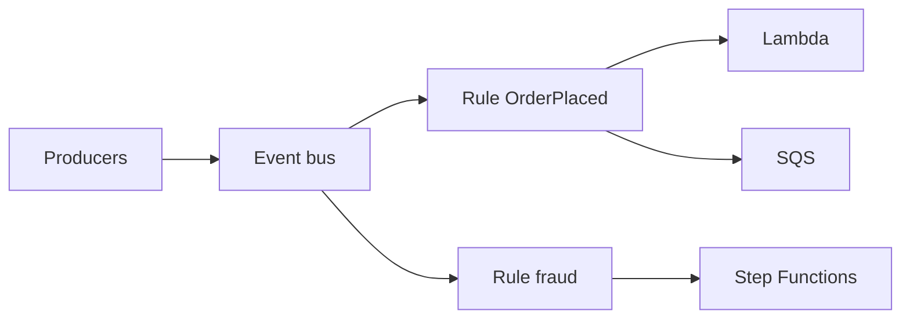

import { ConceptTemplate } from '@/features/kb/components/templates/ConceptTemplate'
import { Callout } from '@/features/kb/components/mdx/Callout'
import { ComparisonTable } from '@/features/kb/components/mdx/ComparisonTable'

export default function Layout({ children }) {
  return (
    <ConceptTemplate title="Amazon EventBridge">
      {children}
    </ConceptTemplate>
  )
}

**EventBridge** is a managed pub/sub router for JSON events. Producers PutEvents onto a **bus**. **Rules** match a pattern and invoke targets. AWS services already emit to the default bus (EC2 state, CodePipeline, CloudTrail via a trail). You add custom buses for product events and partner buses for SaaS.

## 1. Deep Dive and Mechanics

**Buses.** Default (AWS events), custom (your apps), partner (Salesforce, Auth0, and friends). Archive + replay live on a bus so you can re-drive after a bad consumer.

**Rules and patterns.** Content matching on fields (source, detail-type, nested detail). A rule can have many targets. Failed target invokes retry with a DLQ you should actually attach.

**Pipes.** Point-to-point: source (SQS, Dynamo stream, Kinesis) → optional filter/enrichment → target. Pipes are not a bus; they are a managed connector.

**Scheduler.** EventBridge Scheduler is the cron/rate replacement for many CloudWatch Events crons, with one-time and flexible time windows.

**Schema registry.** Infers schemas from events so producers and consumers can generate bindings. Optional, easy to ignore, useful when the org has more than three event types.

<Callout icon="warning" title="The default bus is noisy">
App events on the default bus mix with AWS chatter and make IAM and discoverability worse. Use a custom bus per bounded context.
</Callout>

## 2. Mathematical / Theoretical Foundation

Delivery is **at-least-once** to targets, with retries and exponential backoff. Consumers must be idempotent. Ordering is not a global bus property; if you need order, use a FIFO queue as the target or a single-shard stream.

Match cost is per event evaluated. Over-broad rules (match all) plus heavy targets multiply. Filter at the rule, not inside every Lambda.

<ComparisonTable
  headers={['Service', 'Model', 'Pick when']}
  rows={[
    ['EventBridge', 'Bus + rules', 'Many producers, content routing'],
    ['SNS', 'Topic fan-out', 'Simple pub/sub, SMS/email'],
    ['SQS', 'Queue', 'Buffer and compete consumers'],
    ['Kinesis / MSK', 'Stream', 'Ordered replay, high ingest'],
  ]}
/>

## 3. Real-World Implementation

```python
import boto3

eb = boto3.client('events')
eb.put_events(Entries=[{
    'Source': 'checkout.service',
    'DetailType': 'OrderPlaced',
    'Detail': '{"orderId":"1001","cents":2599}',
    'EventBusName': 'orders',
}])
```

Keep a version field in detail. Rules can match v1 while you introduce v2 consumers.

## 4. Visualizations



## 5. Interview Prep

**Q: EventBridge vs SNS vs SQS?**
**A:** EventBridge routes by content across many target types. SNS is a fan-out topic. SQS is a buffer. Common pattern: EventBridge rule → SQS → workers.

**Q: How do you replay?**
**A:** Enable archive on the bus, then replay a time window to the same or a new bus. Consumers must tolerate duplicates.

**Q: What is a Pipe?**
**A:** A managed integration from a source to a target with filter/enrich. No need to write the “stream to Lambda to SQS” glue.

## 6. Production Use Cases

- Domain events between microservices without a Kafka ops team.
- AWS ops automation: GuardDuty finding → ticket + isolate.
- SaaS partner events into your account.

<Callout icon="tip" title="Always set a DLQ">
Retries expire. Without a DLQ the event is gone and you will only notice in a customer ticket.
</Callout>
