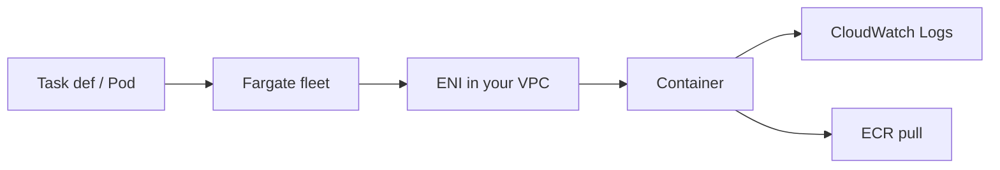

import { ConceptTemplate } from '@/features/kb/components/templates/ConceptTemplate'
import { Callout } from '@/features/kb/components/mdx/Callout'
import { ComparisonTable } from '@/features/kb/components/mdx/ComparisonTable'

export default function Layout({ children }) {
  return (
    <ConceptTemplate title="AWS Fargate">
      {children}
    </ConceptTemplate>
  )
}

**Fargate** is a data-plane mode, not a separate orchestrator. On **ECS**, you set `launchType = FARGATE` (or a Fargate capacity provider). On **EKS**, you create a Fargate profile that matches namespaces/labels and the pods skip nodes. You pay for the vCPU and memory you reserved for the task/pod duration.

## 1. Deep Dive and Mechanics

**Isolation.** Each task gets its own kernel-level isolation and an ENI in your subnet (awsvpc). Security groups attach to the task, not to a shared host.

**Sizing.** CPU and memory come in legal pairs (for example 1 vCPU with a memory band). Over-reserve and you burn money; under-reserve and the task is OOM-killed.

**Spot.** Fargate Spot is cheaper and interruptible. Use it for workers, not for a single-replica API.

**Limits vs EC2.** No privileged Docker-in-Docker the way people expect, no extra host volumes, no DaemonSets on EKS Fargate, no GPUs (use EC2/EKS nodes). Ephemeral storage is a fixed-size scratch that you can enlarge for a price.

**Platform versions.** ECS Fargate platform versions (LATEST, 1.4) change networking and storage behavior. Pin when you need reproducibility.

<Callout icon="info" title="ENI and IP math still applies">
Every task is an IP in your subnet plus a cold-start to attach the ENI. Tiny subnets and huge scale-out will fail placement for “no IPs,” not for “no CPUs.”
</Callout>

## 2. Mathematical / Theoretical Foundation

Cost ≈ (vCPU_price × vCPU + mem_price × GiB) × hours. Right-sizing is a utilization problem: measured CPU and RSS vs reserved. A 2 vCPU task at 10 percent is an expensive idle VM you cannot SSH into.

Scale latency is provision + image pull + app boot. Image size and layer cache at the Fargate fleet dominate. Small images beat “serverless” folklore.

<ComparisonTable
  headers={['Compute', 'Patch nodes?', 'Constraint']}
  rows={[
    ['Fargate', 'No', 'Size pairs, no GPU, ENI/IP'],
    ['ECS on EC2', 'Yes', 'Bin-pack, DaemonSets, GPU'],
    ['Lambda', 'No', '15 min, event payload'],
    ['EKS nodes', 'Yes', 'Full Kubernetes surface'],
  ]}
/>

## 3. Real-World Implementation

```python
# ECS RunTask on Fargate (shape of the API)
run_task = {
    'launchType': 'FARGATE',
    'networkConfiguration': {
        'awsvpcConfiguration': {
            'subnets': ['subnet-private-a', 'subnet-private-b'],
            'securityGroups': ['sg-app'],
            'assignPublicIp': 'DISABLED',
        }
    },
}
```

Private subnets plus a NAT or VPC endpoints for ECR and logs. Public IP on Fargate is a shortcut, not a design.

## 4. Visualizations



## 5. Interview Prep

**Q: Fargate vs Lambda?**
**A:** Fargate is a long-running container with a full image and no 15-minute cap. Lambda is a function with a managed runtime and event integration. APIs can use either; workers with fat images usually go Fargate.

**Q: Fargate vs EC2 capacity for ECS?**
**A:** Fargate wins on ops. EC2 wins on price at high utilization, GPUs, and host features.

**Q: Why did my EKS pod stay Pending?**
**A:** No matching Fargate profile, subnet tags, or the pod uses a feature Fargate rejects (DaemonSet, HostNetwork, privileged).

## 6. Production Use Cases

- Stateless ECS services behind an ALB.
- Nightly batch containers from Scheduler or Step Functions.
- EKS namespaces that should not share node IAM or bin-packing noise.

<Callout icon="tip" title="Measure, then cut reserved CPU">
Start slightly high, export Container Insights, then drop to the next legal pair. Most Fargate bills are reserved-but-idle.
</Callout>
