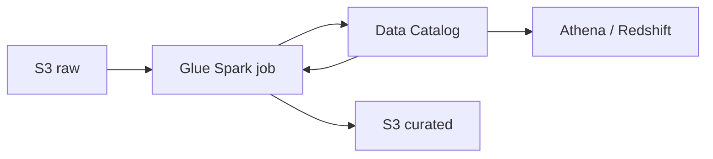

import { ConceptTemplate } from '@/features/kb/components/templates/ConceptTemplate'
import { Callout } from '@/features/kb/components/mdx/Callout'
import { ComparisonTable } from '@/features/kb/components/mdx/ComparisonTable'

export default function Layout({ children }) {
  return (
    <ConceptTemplate title="AWS Glue">
      {children}
    </ConceptTemplate>
  )
}

**Glue** is two things teams confuse. The **Data Catalog** is a Hive-compatible metastore (databases, tables, partitions) that Athena, Redshift Spectrum, and EMR can share. **Glue jobs** are Spark (or Python Shell / Ray) runners billed in DPUs. Crawlers infer schemas. Together they are AWS’s opinionated lake ETL.

## 1. Deep Dive and Mechanics

**Jobs.** Glue 4/5.x Spark on AWS-tuned images. You submit a script (Studio visual or notebook-generated). Job bookmarks remember what was processed for incremental sources. Flex vs standard execution trades price for start-time.

**Workers.** Worker types (G.1X, G.2X, G.4X, G.8X) are CPU/memory bundles. Auto scaling adds workers. Too many workers on a tiny file set is shuffle overhead.

**Connections.** JDBC to RDS, Redshift, VPC ENIs for private sources. The ENI + subnet + SG puzzle is the usual “job stuck STARTING” cause.

**Crawlers.** Convenient and also how you get a thousand badly named tables. Prefer explicit IaC table definitions or Iceberg register for anything you care about.

**Data Quality and Sensitive data.** Extra Glue products on top of jobs; useful, not magical.

<Callout icon="warning" title="Catalog drift">
A crawler that “fixes” types under Athena will break dashboards. Treat production tables as versioned contracts, not inferred guesses.
</Callout>

## 2. Mathematical / Theoretical Foundation

DPU-hours ≈ workers × time. Spark time is scan + shuffle + write. Partitioning and file size (aim for tens-to-hundreds of MB Parquet) dominate. Bookmarks are a high-water mark; late-arriving data needs a reconcilable key, not hope.

The catalog is metadata. Wrong SerDe or partition keys make engines scan the world (bytes_scanned ≫ useful bytes).

<ComparisonTable
  headers={['Tool', 'Engine', 'When']}
  rows={[
    ['Glue jobs', 'Managed Spark', 'AWS-native ETL, catalog-centric'],
    ['EMR / Serverless', 'You pick Spark/Hive', 'Custom runtimes, longer jobs'],
    ['Athena CTAS', 'Trino SQL', 'Simple SQL transforms'],
    ['Lambda', 'Functions', 'Tiny files, not terabyte shuffles'],
  ]}
/>

## 3. Real-World Implementation

```python
import sys
from awsglue.context import GlueContext
from pyspark.context import SparkContext

glue = GlueContext(SparkContext.getOrCreate())
dyf = glue.create_dynamic_frame.from_catalog(database='raw', table_name='events')
df = dyf.toDF().where('dt >= "2026-09-01"')
glue.write_dynamic_frame.from_options(
    frame=glue.create_dynamic_frame.from_rdd(df.rdd, 'c'),
    connection_type='s3',
    connection_options={'path': 's3://curated/events/'},
    format='parquet',
)
```

Prefer Iceberg writes with a documented partition spec over DynamicFrame mystery options when you can.

## 4. Visualizations



## 5. Interview Prep

**Q: Glue Catalog vs Glue job?**
**A:** Catalog is metadata. Jobs are compute. You can use the catalog with Athena and never run a Glue job.

**Q: Why is the job stuck STARTING?**
**A:** VPC connection, IP exhaustion, service role, or a cold capacity blip. Check ENIs in the connection subnet first.

**Q: Bookmarks vs Iceberg snapshots?**
**A:** Bookmarks are Glue-specific incremental processing. Iceberg is a table format with snapshots any engine can read. New lakes lean Iceberg.

## 6. Production Use Cases

- Nightly raw-to-curated Parquet pipelines.
- JDBC ingest from a vendor Postgres into S3.
- Shared catalog for Athena across teams.

<Callout icon="tip" title="Declare tables in IaC">
Crawlers for exploration. CloudFormation or CDK for production schemas. Your future self will not thank a guessed struct.
</Callout>
