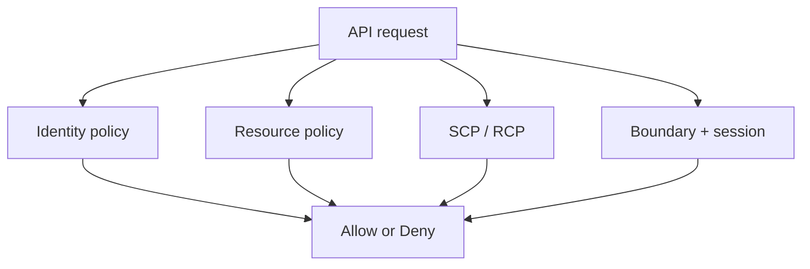

import { ConceptTemplate } from '@/features/kb/components/templates/ConceptTemplate'
import { Callout } from '@/features/kb/components/mdx/Callout'
import { ComparisonTable } from '@/features/kb/components/mdx/ComparisonTable'

export default function Layout({ children }) {
  return (
    <ConceptTemplate title="AWS IAM">
      {children}
    </ConceptTemplate>
  )
}

**IAM** answers one question: may this principal call this API on this resource now? Users, roles, and groups are identities. Policies are JSON documents of Effect, Action, Resource, and Condition. Almost every AWS outage-shaped breach is an IAM mistake: `*` on `*`, a confused deputy, or a long-lived access key in a repo.

## 1. Deep Dive and Mechanics

**Principals.** IAM users (password or keys), roles (assumed via STS), AWS services, and federated identities. Prefer roles. Users with access keys are a smell outside break-glass.

**Policy types.** Identity policies attach to user/role/group. Resource policies sit on the resource (S3, KMS, SQS). SCPs and RCPs are organization ceilings. Permission boundaries cap what a role can ever be granted. Session policies shrink a specific AssumeRole.

**Evaluation.** Default deny. Explicit deny wins. Then the request must be allowed by the intersection of identity + resource + boundary + SCP + session. Conditions (IpAddress, StringEquals, SourceAccount) are where real least privilege lives.

**STS.** AssumeRole, AssumeRoleWithWebIdentity, GetSessionToken. Temporary credentials expire. That is the point.

**IAM Access Analyzer and IAM Identity Center.** Analyzer finds external shares. Identity Center (SSO) is how humans should get roles, not IAM users per person.

<Callout icon="error" title="Star-star is not a prototype">
Action star with Resource star in a workload role will leak through every feature you add later. Start from the API list the app calls and expand with Access Advisor, not the other way around.
</Callout>

## 2. Mathematical / Theoretical Foundation

Authorization is a **policy lattice** evaluated on each request. Effective allow = allowed by some statement AND not denied AND inside every ceiling (SCP, boundary). Confused deputy is a resource policy that trusts a service without `aws:SourceAccount` or `aws:SourceArn`, so another account’s service can be used as a proxy.

Privilege escalation paths are graph reachability: PassRole + create-lambda, attach-policy, update-assume-role-policy. Analyzer and IAM Access Analyzer custom policy checks are incomplete; reviews still need a human.

<ComparisonTable
  headers={['Document', 'Attaches to', 'Can grant?']}
  rows={[
    ['Identity policy', 'User / role / group', 'Yes'],
    ['Resource policy', 'Bucket, key, queue…', 'Yes'],
    ['SCP / RCP', 'OU or account', 'No — ceiling only'],
    ['Permission boundary', 'Role / user', 'No — ceiling only'],
  ]}
/>

## 3. Real-World Implementation

```json
{
  "Version": "2012-10-17",
  "Statement": [
    {
      "Effect": "Allow",
      "Action": ["s3:GetObject"],
      "Resource": "arn:aws:s3:::invoices-prod/*",
      "Condition": {
        "StringEquals": {"aws:PrincipalTag/team": "billing"}
      }
    }
  ]
}
```

Use ABAC tags for scale. Test with policy simulator and a failing integration test that the role cannot ListBuckets on the whole account.

## 4. Visualizations



## 5. Interview Prep

**Q: User vs role?**
**A:** Users are standing identities. Roles are assumable and expire. Workloads and humans (via Identity Center) should be roles.

**Q: Why can an Allow still fail?**
**A:** SCP, permission boundary, resource policy deny, missing KMS grant, or a condition that does not match. IAM is not the only gate (WAF, SG, SCP).

**Q: What is PassRole?**
**A:** Permission to hand a role to a service (EC2, Lambda). Combined with a privileged role it is create-admin-anywhere.

## 6. Production Use Cases

- Workload roles for ECS/Lambda/EC2 with scoped S3 and DDB.
- Cross-account deploy roles trusted only by the pipeline account.
- Human access via Identity Center permission sets, not shared keys.

<Callout icon="tip" title="No long-lived keys on servers">
Instance profiles, task roles, and IRSA exist so you never bake AKIA in an AMI. If you find one, rotate and delete, do not “just restrict the policy.”
</Callout>
