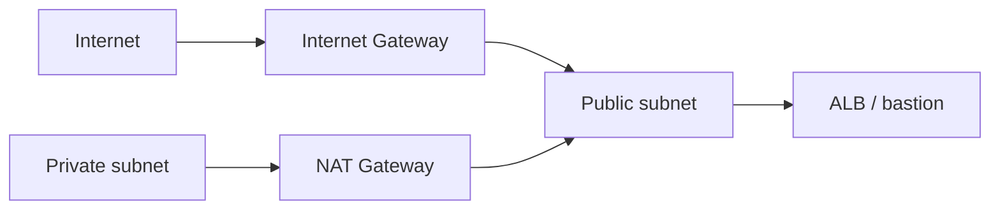

import { ConceptTemplate } from '@/features/kb/components/templates/ConceptTemplate'
import { Callout } from '@/features/kb/components/mdx/Callout'
import { ComparisonTable } from '@/features/kb/components/mdx/ComparisonTable'

export default function Layout({ children }) {
  return (
    <ConceptTemplate title="Internet Gateway">
      {children}
    </ConceptTemplate>
  )
}

An **Internet Gateway (IGW)** is a redundant, managed NAT/routing target that makes a VPC internet-facing. Attach one IGW per VPC. A subnet becomes **public** when its route table sends default IPv4 (and optionally IPv6) to the IGW **and** the ENI has a public or Elastic IP. Without both, packets do not complete.

## 1. Deep Dive and Mechanics

**Attachment.** `AttachInternetGateway` is per VPC. You do not pick AZs or size it. AWS scales it.

**1:1 NAT for IPv4.** Instances see private IPs. The IGW maps public IP ↔ private IP for traffic that uses the public address. Security groups still apply on the ENI.

**IPv6.** Egress and ingress can go via the IGW with global unicast addresses. Egress-only IGW is the IPv6 analog of NAT: outbound allowed, inbound from the internet not.

**Not a firewall.** An IGW does not filter. Security groups, NACLs, and WAF do. An IGW plus `0.0.0.0/0` on a private subnet is a misconfiguration if you expected isolation (it still needs public IPs to work, but the route is a smell).

**VPC endpoints.** Many AWS APIs should go via gateway or interface endpoints so private subnets never needed an IGW for S3 or DynamoDB.

<Callout icon="warning" title="Public subnet means public blast radius">
A default route to the IGW plus an auto-assigned public IP plus a wide SG is a host on the internet. Bastions and ALBs belong here; databases do not.
</Callout>

## 2. Mathematical / Theoretical Foundation

IPv4 public addressing is a scarce mapped pair: one public IP per ENI (plus secondary assignments). Connection tracking for the mapping is AWS-side. You do not manage connection tables the way you do on a NAT instance.

Routing is longest-prefix match in the subnet route table. A more specific prefix to a NAT, TGW, or endpoint wins over default to the IGW.

<ComparisonTable
  headers={['Door', 'Direction', 'Who uses it']}
  rows={[
    ['Internet Gateway', 'In and out', 'Public subnets, ALB, bastion'],
    ['NAT Gateway', 'IPv4 out only', 'Private subnets'],
    ['Egress-only IGW', 'IPv6 out only', 'Private IPv6'],
    ['VPC endpoint', 'To AWS APIs', 'Private without NAT'],
  ]}
/>

## 3. Real-World Implementation

```python
import boto3

ec2 = boto3.client('ec2')
igw = ec2.create_internet_gateway()
ec2.attach_internet_gateway(
    InternetGatewayId=igw['InternetGateway']['InternetGatewayId'],
    VpcId='vpc-abc',
)
```

Then add a route: destination `0.0.0.0/0` → that IGW on the **public** route table only.

## 4. Visualizations



## 5. Interview Prep

**Q: Why can’t my instance “ping the internet” in a public subnet?**
**A:** Missing public IP, missing IGW route, NACL missing ephemeral return, or SG deny. Walk those four before blaming DNS.

**Q: IGW vs NAT Gateway?**
**A:** IGW is bidirectional for resources that hold a public IP. NAT is outbound IPv4 for resources that do not.

**Q: Do I need an IGW for S3 from private subnets?**
**A:** No. A gateway endpoint for S3 keeps traffic on the AWS network and off NAT bills.

## 6. Production Use Cases

- Public ALB / NLB subnets.
- Controlled bastion or VPN concentrators.
- Dual-stack IPv6 via IGW plus IPv4 NAT for legacy.

<Callout icon="tip" title="One IGW, two route tables">
Share the IGW. Split route tables: public default to IGW, private default to NAT. Mixing them is how a “private” RDS gets a route you did not intend.
</Callout>
