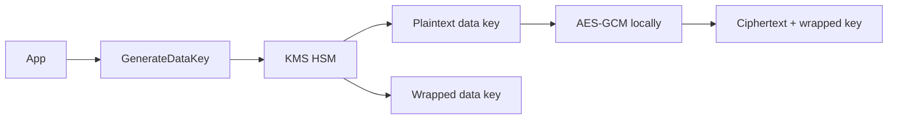

import { ConceptTemplate } from '@/features/kb/components/templates/ConceptTemplate'
import { Callout } from '@/features/kb/components/mdx/Callout'
import { ComparisonTable } from '@/features/kb/components/mdx/ComparisonTable'

export default function Layout({ children }) {
  return (
    <ConceptTemplate title="AWS KMS">
      {children}
    </ConceptTemplate>
  )
}

**KMS** stores **customer master keys** (CMKs / KMS keys) in HSMs and exposes encrypt, decrypt, sign, and GenerateDataKey. You rarely send megabytes to KMS. You ask for a data key, encrypt the payload with AES-GCM locally, and store the wrapped data key next to the ciphertext. That is **envelope encryption**.

## 1. Deep Dive and Mechanics

**Key types.** Symmetric AES for most AWS service integrations. Asymmetric RSA/ECC for signing and hybrid encrypt. HMAC keys for MAC. Custom key stores (CloudHSM) when a regulator wants the HSM in your account.

**Key policy.** Every KMS key has a resource policy. It is the root of who can use or administer the key. IAM allow is not enough if the key policy does not trust the principal.

**Grants.** Short-lived, programmatic permissions for services (RDS, EBS) to use the key without rewriting the policy for every instance.

**Rotation.** Automatic yearly rotation for symmetric keys creates new key material; old ciphertext still decrypts. You rotate aliases, not necessarily the key id in every object.

**Multi-Region keys.** Replicated key material and key id for DR. This is a deliberate sharing of crypto, not just a backup ARN.

<Callout icon="error" title="Deleting a key deletes the data">
A scheduled deletion of a CMK makes every envelope that used it permanently unreadable. Guard DeleteKey with SCP and a long pending window.
</Callout>

## 2. Mathematical / Theoretical Foundation

Envelope: C = Enc_data(M), W = Enc_cmk(data_key). Compromise of one data key is one object; the CMK never leaves the HSM. KMS request rate limits are why you cache data keys in memory for a bucket of objects, then discard.

Authorization is key policy ∩ IAM ∩ grants ∩ VPC/VPC-endpoint conditions. `kms:ViaService` and encryption context (AAD in GCM) bind a ciphertext to a reason (for example a bucket ARN). Wrong context = decrypt fail.

<ComparisonTable
  headers={['Key owner', 'Who controls policy', 'Use']}
  rows={[
    ['AWS-owned', 'AWS', 'Default SSE, least control'],
    ['AWS-managed', 'AWS + you use', 'sse-s3 style services'],
    ['Customer-managed', 'You', 'Audit, rotate, cross-account'],
    ['CloudHSM custom store', 'You + HSM', 'Stricter tenancy'],
  ]}
/>

## 3. Real-World Implementation

```python
import boto3
from cryptography.hazmat.primitives.ciphers.aead import AESGCM
import os

kms = boto3.client('kms')
out = kms.generate_data_key(KeyId='alias/app', KeySpec='AES_256')
aes = AESGCM(out['Plaintext'])
nonce = os.urandom(12)
blob = aes.encrypt(nonce, b'secret', b'ctx=v1')
# persist nonce + blob + out['CiphertextBlob']; forget Plaintext
```

Never log the plaintext data key. Prefer the Encryption SDK if you do not want to invent framing.

## 4. Visualizations



## 5. Interview Prep

**Q: Why not Encrypt the whole file with KMS?**
**A:** Size and rate limits. Envelope encryption scales; KMS is the root.

**Q: SSE-S3 vs SSE-KMS vs SSE-C?**
**A:** SSE-S3 uses AWS-managed S3 keys. SSE-KMS uses a CMK you can policy and audit in CloudTrail. SSE-C means you send a key per request — you become the KMS.

**Q: What is encryption context?**
**A:** Additional authenticated data. Decrypt must present the same context. Use it to bind ciphertext to a tenant or resource.

## 6. Production Use Cases

- Default encryption on S3, EBS, RDS, Secrets Manager.
- Application-level field encryption with envelope keys.
- Cross-account share: key policy allows another account’s role to Decrypt.

<Callout icon="tip" title="CloudTrail every Decrypt">
KMS is one of the few places you get a reliable crypto audit. Alert on Decrypt from unexpected principals or outside your VPC endpoint.
</Callout>
