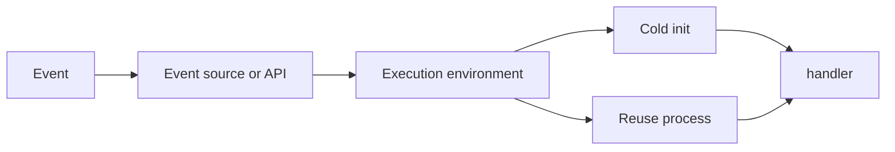

import { ConceptTemplate } from '@/features/kb/components/templates/ConceptTemplate'
import { Callout } from '@/features/kb/components/mdx/Callout'
import { ComparisonTable } from '@/features/kb/components/mdx/ComparisonTable'

export default function Layout({ children }) {
  return (
    <ConceptTemplate title="AWS Lambda">
      {children}
    </ConceptTemplate>
  )
}

**Lambda** runs a handler in a managed runtime (or a custom image) when an event arrives. There is no instance to SSH. Concurrency is the unit of scale: each in-flight invoke can be a separate execution environment. You pay duration × memory (GB-seconds) plus requests. Idle is free unless you buy provisioned concurrency.

## 1. Deep Dive and Mechanics

**Firecracker.** Environments are microVMs. A **cold start** creates a VM, downloads the package, starts the runtime, and runs init. A **warm** environment reuses the same process for later invokes — module globals persist. That is a feature for connection reuse and a bug if you store request state globally.

**Triggers.** API Gateway, ALB, SQS, SNS, EventBridge, S3, Dynamo streams, Function URLs. Event source mappings (SQS/streams) poll on your behalf.

**Limits.** 15-minute max, payload size caps, `/tmp` size, 10 GB image, regional concurrency quota. CPU scales with memory setting.

**VPC.** Today ENIs are reused more sanely than the old per-invoke ENI tax, but a function in a VPC still needs subnets, SGs, and endpoints or NAT to reach the internet and AWS APIs.

**Versions and aliases.** Publish immutable versions. Alias (live, canary) weighted to two versions is the native traffic-shift.

<Callout icon="warning" title="Reserved concurrency is a dual-use knob">
Set it to protect downstreams and to keep a function from eating the account pool. Set it to 0 and you have an off switch. Forget it and one recursive loop bills the month.
</Callout>

## 2. Mathematical / Theoretical Foundation

Billed duration is rounded (1 ms granularity on current pricing — treat docs as source). Cost ≈ invocations × price + GB-s × price. Doubling memory can cut wall time more than 2× if you were CPU-bound, lowering cost.

Cold-start latency is P(cold) × T_cold. Provisioned concurrency sets a floor of warm environments: you pay for idle warmth to buy a lower T_tail.

At-least-once is the default for most async sources. Exactly-once needs idempotency keys.

<ComparisonTable
  headers={['Compute', 'Max runtime', 'Scale unit']}
  rows={[
    ['Lambda', '15 minutes', 'Invoke / concurrency'],
    ['Fargate', 'Unbounded', 'Task'],
    ['EC2', 'Unbounded', 'Instance'],
    ['Step Functions + Lambda', 'Workflow days', 'State transitions'],
  ]}
/>

## 3. Real-World Implementation

```python
import json

_db = None

def handler(event, context):
    global _db
    if _db is None:
        _db = connect()  # reused on warm invokes
    return {
        'statusCode': 200,
        'body': json.dumps({'ok': True, 'req': context.aws_request_id}),
    }
```

Init outside the handler for clients. Keep packages small; a 200 MB unzipped tree is a cold-start choice.

## 4. Visualizations



## 5. Interview Prep

**Q: What is a cold start?**
**A:** Creating a new environment: Firecracker + download + runtime + init. Worse in VPC-with-NAT, huge images, and heavyweight runtimes (Java without snapstart).

**Q: Sync vs async invoke?**
**A:** Sync waits for the result (API Gateway). Async queues, retries twice, then DLQ/on-failure destination. Errors look different.

**Q: How do you limit blast radius?**
**A:** Reserved concurrency, batch windows on SQS, and a DLQ. Recursive S3→Lambda→S3 is a classic bill bomb.

## 6. Production Use Cases

- HTTP APIs behind API Gateway or Function URLs.
- SQS workers and S3 object pipelines.
- Glue between SaaS webhooks and internal APIs.

<Callout icon="tip" title="Idempotency keys">
Put a natural key in Dynamo or cache before side effects. Lambda retries will happen; your charge-card call should not.
</Callout>
