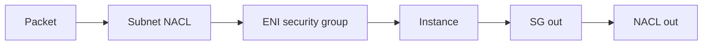

import { ConceptTemplate } from '@/features/kb/components/templates/ConceptTemplate'
import { Callout } from '@/features/kb/components/mdx/Callout'
import { ComparisonTable } from '@/features/kb/components/mdx/ComparisonTable'

export default function Layout({ children }) {
  return (
    <ConceptTemplate title="NACLs">
      {children}
    </ConceptTemplate>
  )
}

A **network ACL (NACL)** is a stateless packet filter attached to a subnet. Every ENI in that subnet is subject to the inbound list and the outbound list. Rules are numbered; the first match wins. Because it is stateless, a request you allow in does **not** automatically allow the response out — you must allow ephemeral ports on the return path.

## 1. Deep Dive and Mechanics

**Default NACL.** Allows all in and out. Custom NACLs start empty (deny all) until you add rules. Forgetting ephemeral outbound/inbound is the #1 “I added a NACL and the subnet died” story.

**Rule numbers.** Evaluate from lowest number. A catch-all deny at 32767 (or implicit deny) sits at the end. Leave gaps (100, 110, 120) so you can insert.

**Association.** One NACL per subnet. Many subnets can share a NACL. Changing a shared NACL changes every associated subnet at once.

**IPv4 and IPv6.** Separate rule spaces. Dual-stack means you maintain both.

**What they cannot see.** They do not understand TLS or IAM. They do not replace SGs. They do not attach to a single instance.

<Callout icon="warning" title="Ephemeral ports">
Clients pick a high source port (1024–65535, often 32768–65535). If you allow inbound 443 but forget inbound ephemeral on the return for a public subnet’s outbound, or the reverse, you have built a one-way street.
</Callout>

## 2. Mathematical / Theoretical Foundation

Stateless filter: each packet is classified independently. Connection tracker state is **not** stored (that is the SG). Capacity is rule-count × packet rate; keep lists short.

Defense in depth: SG (stateful, instance) ∩ NACL (stateless, subnet) ∩ routing. A deny in either SG or NACL drops the packet.

<ComparisonTable
  headers={['Control', 'State', 'Scope']}
  rows={[
    ['Security group', 'Stateful', 'ENI'],
    ['NACL', 'Stateless', 'Subnet'],
    ['WAF', 'HTTP layer', 'ALB / CloudFront / APIGW'],
    ['Route table', 'Not a firewall', 'Where packets go'],
  ]}
/>

## 3. Real-World Implementation

```python
# Allow HTTP in and ephemeral return — custom NACL sketch
inbound = [
    (100, 'tcp', 80, '0.0.0.0/0', 'allow'),
    (110, 'tcp', 443, '0.0.0.0/0', 'allow'),
    (120, 'tcp', '1024-65535', '0.0.0.0/0', 'allow'),
]
outbound = [
    (100, 'tcp', 80, '0.0.0.0/0', 'allow'),
    (110, 'tcp', 443, '0.0.0.0/0', 'allow'),
    (120, 'tcp', '1024-65535', '0.0.0.0/0', 'allow'),
]
```

Most modern designs keep NACLs wide (or default) and enforce with SGs. Use custom NACLs when you need an explicit subnet-level deny (known bad prefix, isolated quarantine subnet).

## 4. Visualizations



## 5. Interview Prep

**Q: Why do we even have NACLs if SGs exist?**
**A:** Subnet-wide denies, explicit deny (SGs are allow-only), and a second control for auditors. Day-to-day allow lists belong on SGs.

**Q: Can a NACL allow what an SG denies?**
**A:** No. Both must pass. NACL cannot punch a hole through an SG.

**Q: What breaks first when someone “locks down” a NACL?**
**A:** Return traffic and DNS (53) and NTP. Symptom: half-open connections and flaky package installs.

## 6. Production Use Cases

- Quarantine subnets with a deny-all except forensics.
- Explicit deny of a malicious CIDR at the subnet edge.
- Regulatory diagrams that want a subnet firewall in addition to SGs.

<Callout icon="tip" title="Default-allow NACLs, strict SGs">
If you do not have a specific subnet deny to implement, leave the default NACL alone. Inventing a parallel rule system is how you page yourself.
</Callout>
