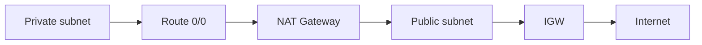

import { ConceptTemplate } from '@/features/kb/components/templates/ConceptTemplate'
import { Callout } from '@/features/kb/components/mdx/Callout'
import { ComparisonTable } from '@/features/kb/components/mdx/ComparisonTable'

export default function Layout({ children }) {
  return (
    <ConceptTemplate title="NAT Gateway">
      {children}
    </ConceptTemplate>
  )
}

A **NAT Gateway** is a zonal, managed source-NAT appliance. You place it in a **public** subnet (it needs an Elastic IP and a path to an IGW). Private subnet route tables send `0.0.0.0/0` to the NAT. Return traffic is connection-tracked. Inbound from the internet to private hosts is not translated in — that is the point.

## 1. Deep Dive and Mechanics

**Zonal.** A NAT GW lives in one AZ. For HA, put one per AZ and route each private subnet to the local NAT. A single NAT in AZ-a for all AZs works until AZ-a dies — then every private subnet loses egress.

**Throughput.** Scales automatically (up to documented Gbps-class limits). Connection rate and idle timeouts still exist; huge numbers of short connections can bite.

**Cost.** Hourly plus **data processing** per GB plus the EIP. Cross-AZ traffic to a remote NAT adds extra transfer. This is often a top-five bill line.

**IPv6.** NAT GW is IPv4. IPv6 uses an egress-only IGW, not NAT64 (unless you build that separately).

**Alternatives.** NAT instances (you operate), IPv6 egress-only, VPC endpoints for AWS APIs (avoid NAT for S3/ECR/Logs), and PrivateLink to SaaS.

<Callout icon="warning" title="Endpoints beat NAT for AWS APIs">
ECR pulls, CloudWatch Logs, and S3 through a NAT are a tax and a dependency. Gateway and interface endpoints keep that traffic private and cheaper at scale.
</Callout>

## 2. Mathematical / Theoretical Foundation

Source NAT rewrites (src_priv, port) → (EIP, ephemeral). Connection table size and timeout bound concurrent flows. Bytes_billed ≈ sum of payloads that traverse the NAT (plus TCP/UDP overhead). Cross-AZ: bytes × AZ_transfer_price on top if the instance and NAT differ in AZ.

Availability of egress ≈ 1 − P(NAT_AZ_down) if you have one NAT; with per-AZ NATs, egress survives a single AZ loss for the remaining AZs.

<ComparisonTable
  headers={['Egress path', 'Ops', 'Inbound from internet']}
  rows={[
    ['NAT Gateway', 'Managed, zonal', 'No'],
    ['NAT instance', 'You patch / HA', 'No (typical)'],
    ['IGW + public IP', 'Routes only', 'Yes if SG allows'],
    ['VPC endpoint', 'Per service', 'N/A — not the internet'],
  ]}
/>

## 3. Real-World Implementation

```python
import boto3

ec2 = boto3.client('ec2')
nat = ec2.create_nat_gateway(
    SubnetId='subnet-public-a',
    AllocationId='eipalloc-aaa',
    ConnectivityType='public',
)
# route table of private-a: 0.0.0.0/0 -> nat['NatGateway']['NatGatewayId']
```

Wait for available before you write the route. A blackhole route to a pending NAT is a silent outage.

## 4. Visualizations



## 5. Interview Prep

**Q: Why is NAT in a public subnet?**
**A:** It must send to the IGW using a public EIP. Private instances never get that EIP.

**Q: How do you HA NAT?**
**A:** One NAT per AZ, routes scoped to the AZ’s private subnets. Do not share one NAT “to save money” for production.

**Q: NAT vs proxy vs endpoints?**
**A:** NAT is dumb IP egress. A proxy adds inspect and auth. Endpoints are for AWS (and PrivateLink) APIs without the internet.

## 6. Production Use Cases

- Private app subnets that must call third-party HTTPS APIs.
- Patching and container pulls when endpoints are incomplete.
- Egress centralization in a hub VPC (with the bill attached).

<Callout icon="tip" title="Put a CloudWatch alarm on packets drop">
IdleTimeout and port allocation errors show up as random 3-way handshake deaths. Alarm before users call them “flaky APIs.”
</Callout>
