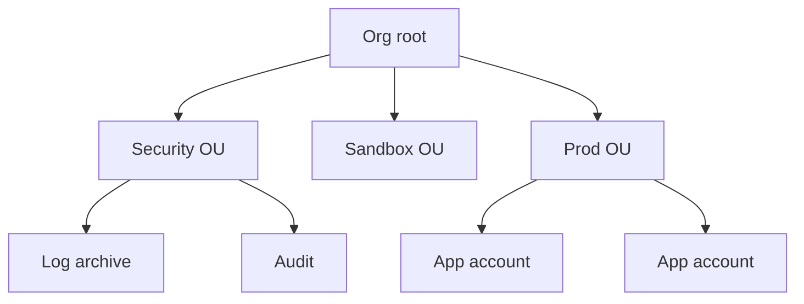

import { ConceptTemplate } from '@/features/kb/components/templates/ConceptTemplate'
import { Callout } from '@/features/kb/components/mdx/Callout'
import { ComparisonTable } from '@/features/kb/components/mdx/ComparisonTable'

export default function Layout({ children }) {
  return (
    <ConceptTemplate title="AWS Organizations">
      {children}
    </ConceptTemplate>
  )
}

**Organizations** groups AWS accounts under a management account. Member accounts sit in **organizational units (OUs)**. You attach **service control policies (SCPs)** and resource control policies (RCPs) to the root or to OUs. Billing can roll up. CloudTrail, Config, GuardDuty, and RAM all grow a second dimension: “apply to the org.”

## 1. Deep Dive and Mechanics

**Management account.** Pays the bill (if consolidated), owns the org, and is a high-value target. No workloads. Delegated administrators (Security Hub, GuardDuty, IAM Access Analyzer) move day-to-day security ops out of it.

**OUs.** Folders, not networks. A workload account’s blast radius and guardrails come from the OU path. Move account = change policy set.

**SCPs.** JSON like IAM but they only restrict. `FullAWSAccess` is the default allow-all ceiling. A deny of `iam:*` on a sandbox OU is how you keep experiments from creating users.

**Account vending.** `CreateAccount` plus a pipeline (AFT, Control Tower, custom). Email uniqueness and quota wait states are real.

**All-features vs consolidated billing.** You want all features. Billing-only is a half org.

<Callout icon="error" title="SCP cannot grant">
If a role has no IAM allow, an SCP cannot save it. If an SCP denies, no IAM allow can save it. People fail interviews by swapping those.
</Callout>

## 2. Mathematical / Theoretical Foundation

Effective permission is intersection: identity ∩ resource ∩ boundary ∩ **every SCP on the path from account to root** ∩ session. Adding an OU layer multiplies ceilings; a deny anywhere on the path wins.

Account count N is a blast-radius control. Cost of governance is roughly N × (baseline stacks + detections). Too few accounts (one shared prod) couples blast radius; too many without vending automation is spreadsheet ops.

<ComparisonTable
  headers={['Layer', 'Job', 'Typical owner']}
  rows={[
    ['Organizations', 'Accounts, SCPs, tree', 'Platform / CCoE'],
    ['Control Tower', 'Opinionated LZ on Orgs', 'Platform'],
    ['IAM Identity Center', 'Human roles', 'IAM / security'],
    ['RAM', 'Share subnets / catalogs', 'Network / platform'],
  ]}
/>

## 3. Real-World Implementation

```json
{
  "Version": "2012-10-17",
  "Statement": [
    {
      "Effect": "Deny",
      "Action": [
        "cloudtrail:StopLogging",
        "cloudtrail:DeleteTrail"
      ],
      "Resource": "*"
    }
  ]
}
```

Attach denies like this at the Workloads OU. Leave a break-glass exception only on a tiny Security Tools OU if you must.

## 4. Visualizations



## 5. Interview Prep

**Q: SCP vs IAM policy?**
**A:** SCP is a ceiling on an account/OU. IAM grants inside that ceiling. Both must allow (and not deny).

**Q: Why multiple accounts?**
**A:** Blast radius, billing tags that actually work, different SCP tightness, and quieter IAM. One account with 400 IAM roles is a maze.

**Q: What should never run in the management account?**
**A:** Applications, CI workers with admin, and day-to-day humans. Use delegated admin and member accounts.

## 6. Production Use Cases

- Corporate landing zones with sandbox / prod / security OUs.
- Consolidated billing and CUDOS-style cost data.
- Org-wide CloudTrail and GuardDuty delegated admin.

<Callout icon="tip" title="Name OUs after risk, not teams">
Teams change. Data classification and environment (prod, sandbox) do not. Attach SCPs to risk, map teams with Identity Center.
</Callout>
