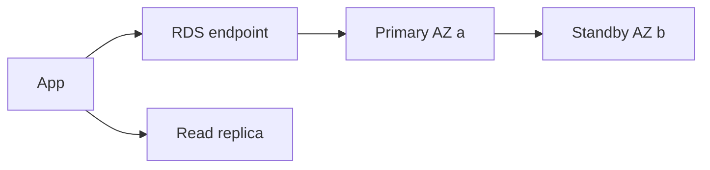

import { ConceptTemplate } from '@/features/kb/components/templates/ConceptTemplate'
import { Callout } from '@/features/kb/components/mdx/Callout'
import { ComparisonTable } from '@/features/kb/components/mdx/ComparisonTable'

export default function Layout({ children }) {
  return (
    <ConceptTemplate title="Amazon RDS">
      {children}
    </ConceptTemplate>
  )
}

**RDS** is a relational engine as a service. You pick the engine and version, instance class, storage, and subnet group. AWS runs the VM, EBS (or Aurora storage), backups, and optional Multi-AZ standby. You do not get SSH. You do get `psql` and the same SQL foot-guns as on-prem.

## 1. Deep Dive and Mechanics

**Multi-AZ.** A synchronous standby in another AZ. Failover is DNS (or a new primary) — typically tens of seconds to a couple of minutes, not zero. Read replicas are extra and usually asynchronous.

**Storage.** gp3 or io2 for RDS on EBS. Autoscaling storage grows; it does not shrink. Aurora is a different storage architecture (see the Aurora page).

**Maintenance.** You pick a window. Engine upgrades can be minor (usually in-place) or major (planning, replica promote, or blue/green).

**Auth.** Password in Secrets Manager, IAM database auth for MySQL/Postgres, Kerberos on some engines. Security group should allow only the app SG, never `0.0.0.0/0`.

**Proxies.** RDS Proxy pools connections so Lambda and bursty apps do not exhaust `max_connections`.

<Callout icon="warning" title="Multi-AZ is not a read replica">
The standby does not take your read traffic. Send reads to explicit replicas or you will be surprised in the outage you thought you were ready for.
</Callout>

## 2. Mathematical / Theoretical Foundation

RPO for automated backups is up to the backup window plus 5-minute incrementals (engine-dependent). Multi-AZ RPO is near-zero for committed sync writes. RTO is failover time + cache warm (buffer pool empty ⇒ p99 spike).

Connection count ≈ workers × pool_size. Serverless app patterns without a proxy create O(concurrency) connections and hit the engine ceiling.

<ComparisonTable
  headers={['Option', 'HA', 'Reads']}
  rows={[
    ['Single-AZ RDS', 'Backup restore', 'Primary only'],
    ['Multi-AZ', 'Sync standby', 'Still primary'],
    ['Read replicas', 'Async, promote-able', 'Scale reads'],
    ['Aurora', 'Shared storage', 'Replicas attach fast'],
  ]}
/>

## 3. Real-World Implementation

```python
import boto3

rds = boto3.client('rds')
rds.create_db_instance(
    DBInstanceIdentifier='app-pg',
    DBInstanceClass='db.r6g.large',
    Engine='postgres',
    AllocatedStorage=100,
    StorageType='gp3',
    StorageEncrypted=True,
    MultiAZ=True,
    VpcSecurityGroupIds=['sg-db'],
    DBSubnetGroupName='private-db',
    MasterUsername='dba',
    ManageMasterUserPassword=True,
)
```

Subnet group must span at least two AZs for Multi-AZ. PubliclyAccessible should stay false.

## 4. Visualizations



## 5. Interview Prep

**Q: RDS vs Aurora vs running Postgres on EC2?**
**A:** EC2 if you need exotic extensions or OS access. RDS for standard engines with less ops. Aurora when you want shared storage and many replicas.

**Q: What happens on Multi-AZ failover?**
**A:** Standby is promoted, endpoint CNAME flips, TCP connections drop. The app must reconnect. In-flight transactions abort.

**Q: How do you minimize upgrade risk?**
**A:** Blue/green deployments (RDS feature), replica-first major upgrades, and a tested parameter group. Never discover `max_connections` on a Monday.

## 6. Production Use Cases

- Classic three-tier apps that need SQL.
- Multi-AZ OLTP with nightly snapshots to another region.
- IAM-auth from ECS tasks without embedding passwords.

<Callout icon="tip" title="Restore the snapshot in anger-drills">
A backup you have never restored is a rumor. Time the restore to a new instance in another AZ quarterly.
</Callout>
