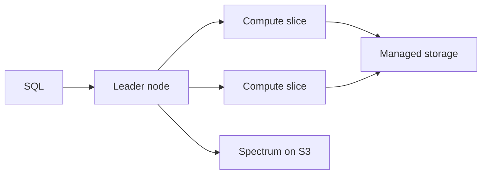

import { ConceptTemplate } from '@/features/kb/components/templates/ConceptTemplate'
import { Callout } from '@/features/kb/components/mdx/Callout'
import { ComparisonTable } from '@/features/kb/components/mdx/ComparisonTable'

export default function Layout({ children }) {
  return (
    <ConceptTemplate title="Amazon Redshift">
      {children}
    </ConceptTemplate>
  )
}

**Redshift** is a columnar MPP warehouse. A **leader** parses SQL and coordinates. **Compute nodes** store slices of tables and execute in parallel. RA3 nodes separate compute from **Redshift Managed Storage** (RMS) in S3-backed chunks. **Redshift Serverless** hides nodes behind RPUs. **Spectrum** lets a cluster SQL over Glue-cataloged S3 without loading.

## 1. Deep Dive and Mechanics

**Columnar + compression.** Each column is stored and compressed on its own. SELECT * is a self-inflicted scan tax. Sort keys and zone maps skip blocks.

**Distribution.** KEY, ALL, AUTO, EVEN. A bad dist key turns a join into a full shuffle across the network. AUTO is fine until a fact table grows and you measure.

**WLM and concurrency scaling.** Workload management queues isolate ETL vs BI. Concurrency scaling spins extra capacity when queues back up (and can surprise the bill).

**Copy and unload.** Parallel COPY from S3 is the ingest path. Row-by-row INSERT is how you make a warehouse look like a laptop.

**Zero-ETL and sharing.** Aurora/Dynamo zero-ETL and data sharing across clusters reduce copy jobs. Treat sharing as a product contract.

<Callout icon="warning" title="Warehouse is not OLTP">
High-QPS single-row lookups belong in Aurora or Dynamo. Redshift shines at scans, joins, and cubes — and looks broken as a checkout DB.
</Callout>

## 2. Mathematical / Theoretical Foundation

Scan cost ≈ rows_selected × width_of_projected_columns × (1 − skip_ratio). Sort keys and predicates on those keys raise skip_ratio. Dist-key co-location makes join cost local; otherwise shuffle bytes ≈ size of the smaller join input × (1 − colocated).

RPU or node-hours are the price of keeping the working set warm. Spectrum/lake scans add S3 bytes. A dashboard that hits raw Spectrum every refresh is an Athena-shaped bill with extra steps.

<ComparisonTable
  headers={['Engine', 'Model', 'Fit']}
  rows={[
    ['Redshift RA3 / Serverless', 'Warehouse', 'Repeated BI, complex SQL'],
    ['Athena', 'Pay per scan', 'Ad-hoc lake SQL'],
    ['EMR Spark', 'Job compute', 'Ugly transforms, ML'],
    ['Aurora', 'Row store', 'OLTP, not cubes'],
  ]}
/>

## 3. Real-World Implementation

```sql
COPY fact_orders
FROM 's3://lake/orders/'
IAM_ROLE 'arn:aws:iam::111111111111:role/RedshiftCopy'
FORMAT AS PARQUET;

SELECT date_trunc('day', ts), sum(cents)
FROM fact_orders
WHERE ts >= '2026-09-01'
GROUP BY 1;
```

COPY with IAM role, not keys. Analyze and vacuum-equivalent maintenance (AUTO is better than folklore VACUUM at 3am if you are on modern RA3).

## 4. Visualizations



## 5. Interview Prep

**Q: Dist key vs sort key?**
**A:** Dist key decides which node owns the row (join locality). Sort key decides on-disk order (scan skipping). They answer different questions.

**Q: Redshift vs Athena?**
**A:** Redshift wins when the same curated tables are queried all day and you want local caching, WLM, and materialized results. Athena wins for infrequent SQL on the lake.

**Q: What is a slice?**
**A:** A parallel unit of storage and CPU on a compute node. Table design that skews to one slice wastes the cluster.

## 6. Production Use Cases

- Enterprise BI with Looker/QuickSight on RA3.
- Nightly COPY from the lake plus dbt transforms.
- Cross-account data sharing to a data-science cluster.

<Callout icon="tip" title="Project columns in every BI tool">
A semantic layer that SELECT-stars a 200-column fact table will beat any node upgrade. Curate marts.
</Callout>
