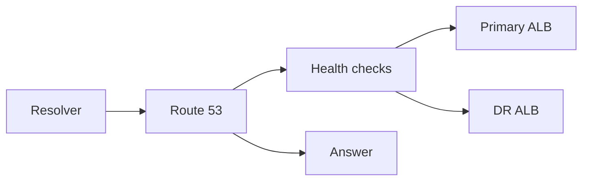

import { ConceptTemplate } from '@/features/kb/components/templates/ConceptTemplate'
import { Callout } from '@/features/kb/components/mdx/Callout'
import { ComparisonTable } from '@/features/kb/components/mdx/ComparisonTable'

export default function Layout({ children }) {
  return (
    <ConceptTemplate title="Amazon Route 53">
      {children}
    </ConceptTemplate>
  )
}

**Route 53** is AWS’s DNS service: hosted zones, records, health checks, and optional domain registration. It is anycast-served from edge locations. Apps treat it as “just DNS,” then discover that **alias records**, failover routing, and 60-second TTLs are an availability design, not plumbing.

## 1. Deep Dive and Mechanics

**Public vs private hosted zones.** Public answers the internet. Private answers from inside associated VPCs (and can overlap names). Split-horizon is two zones with the same name and different associations.

**Alias vs CNAME.** Alias is Route 53-specific, can sit at the zone apex, and is free to AWS targets (ALB, CloudFront, S3 website, another record). CNAME cannot be at the apex and incurs a lookup.

**Routing policies.** Simple, weighted, latency, failover, geolocation, geoproximity, multi-value. Health checks gate the answers. Traffic flow is the visual/policy layer on top.

**Health checks.** HTTP/TCP from multiple regions. They observe an endpoint, not “is my AZ happy.” Combine with failover records.

**Resolver.** Inbound/outbound endpoints plus rules send VPC DNS to on-prem or the other way. This is hybrid DNS, not a hosted zone feature people find by accident.

<Callout icon="warning" title="TTL is your fail-over floor">
A 300-second TTL means some clients hold a dead IP for five minutes after you flip. Health-check failover cannot beat resolver caches.
</Callout>

## 2. Mathematical / Theoretical Foundation

DNS is eventually consistent caching. Effective failover time ≈ health-check fail period + TTL remaining on clients. Multi-value returns several A records; clients pick — it is not a substitute for an ALB.

Latency routing uses measured edge-to-region RTT, not user GPS. Geolocation uses resolver IP (which can be a public resolver far from the user).

<ComparisonTable
  headers={['Policy', 'Picks by', 'Use']}
  rows={[
    ['Failover', 'Health check', 'Active / passive DR'],
    ['Weighted', 'Configured percents', 'Canary, gradual migrate'],
    ['Latency', 'Best AWS region RTT', 'Multi-region active'],
    ['Alias to ALB', 'One region target', 'Normal in-region HA'],
  ]}
/>

## 3. Real-World Implementation

```python
import boto3

r53 = boto3.client('route53')
r53.change_resource_record_sets(
    HostedZoneId='Z123',
    ChangeBatch={'Changes': [{
        'Action': 'UPSERT',
        'ResourceRecordSet': {
            'Name': 'app.example.com',
            'Type': 'A',
            'AliasTarget': {
                'HostedZoneId': 'Z35SXDOTRQ7X7K',
                'DNSName': 'dualstack.my-alb.us-east-1.elb.amazonaws.com',
                'EvaluateTargetHealth': True,
            },
        },
    }]},
)
```

Prefer alias to the ALB over a raw A record of an NLB IP that will change.

## 4. Visualizations



## 5. Interview Prep

**Q: Alias vs CNAME?**
**A:** Alias works at the apex, understands AWS targets, and can evaluate target health. CNAME is generic DNS and cannot be the zone root.

**Q: How do you fail away from a dead region?**
**A:** Failover or latency records plus health checks on something that dies with the region (a regional endpoint), and TTLs you can live with. Control-plane issues can also block record updates — pre-create the DR record.

**Q: Private hosted zone not resolving?**
**A:** VPC not associated, custom DHCP option set pointing elsewhere, or a Resolver rule stealing the name.

## 6. Production Use Cases

- Apex and www to CloudFront.
- Weighted canaries between two ALBs.
- Hybrid DNS with Resolver endpoints to on-prem AD.

<Callout icon="tip" title="Pre-create the DR record">
Do not rely on editing Route 53 during the outage that also hurts the console. Both sides of failover should already exist, gated by health.
</Callout>
