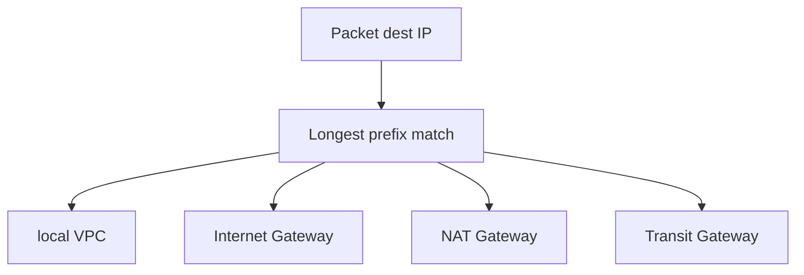

import { ConceptTemplate } from '@/features/kb/components/templates/ConceptTemplate'
import { Callout } from '@/features/kb/components/mdx/Callout'
import { ComparisonTable } from '@/features/kb/components/mdx/ComparisonTable'

export default function Layout({ children }) {
  return (
    <ConceptTemplate title="Route tables">
      {children}
    </ConceptTemplate>
  )
}

A **route table** is the VPC’s FIB. Each subnet is associated with exactly one table (or the implicit main table). Destinations are CIDRs (or prefix lists). Targets are `local`, an IGW, NAT gateway, peering, Transit Gateway, egress-only IGW, VPC endpoint, or instance ENI. Mis-associate a private subnet with a public table and you have not made it public — you have created confusion.

## 1. Deep Dive and Mechanics

**local.** Every table has a local route for the VPC CIDR (and extra CIDRs). That traffic stays in the VPC without a hop you configure.

**Main vs custom.** New subnets get the main table unless you associate another. Changing the main table changes every “I forgot to associate” subnet. Production VPCs should use explicit associations and a boring main.

**Longest prefix.** `10.0.1.0/24` to a TGW beats `10.0.0.0/8` to local if you did something adventurous with overlapping — usually you should not. More specific wins.

**Edge associations.** Gateway route tables on an IGW or VGW can implement ingress routing (appliance inspection). Different object, same idea.

**Propagated routes.** TGW and VPN can inject routes. A surprise more-specific from a spoke will steal traffic.

<Callout icon="error" title="Blackhole routes">
A route to a deleted NAT or a TGW attachment in blackhole drops packets with no SG log line. After every teardown, read the tables.
</Callout>

## 2. Mathematical / Theoretical Foundation

Forwarding is longest-prefix match (LPM) over the destination IP. Ties are not a thing you configure — prefixes differ. Combined with SG/NACL, reachability is routes ∩ filters.

Public vs private is **not a subnet attribute**. It is “does this table send default to IGW” plus “does the ENI have a public IP.” Interviews fail people who say the checkbox is on the subnet object alone.

<ComparisonTable
  headers={['Default route target', 'Subnet role', 'Typical residents']}
  rows={[
    ['IGW', 'Public', 'ALB, NAT, bastion'],
    ['NAT Gateway', 'Private egress', 'App, Lambda ENIs'],
    ['None / local only', 'Isolated', 'Data, sensitive'],
    ['TGW', 'Spoke / hub', 'Cross-VPC, on-prem'],
  ]}
/>

## 3. Real-World Implementation

```python
import boto3

ec2 = boto3.client('ec2')
ec2.create_route(
    RouteTableId='rtb-private-a',
    DestinationCidrBlock='0.0.0.0/0',
    NatGatewayId='nat-aaa',
)
ec2.associate_route_table(RouteTableId='rtb-private-a', SubnetId='subnet-private-a')
```

One table per tier per AZ if NAT is per-AZ; or one private table per AZ. Do not share a single default to one NAT across AZs in production.

## 4. Visualizations



## 5. Interview Prep

**Q: How many route tables can a subnet have?**
**A:** One association. Multiple subnets may share a table.

**Q: Why can’t instance A reach instance B in the same VPC?**
**A:** Usually SG, not routes (local should cover it). If you overrode VPC CIDR with a more specific wrong target, then it is routes. Check both.

**Q: What is the main route table?**
**A:** The default association for subnets you did not explicitly attach. Treat it as dangerous if it has an IGW default.

## 6. Production Use Cases

- Three-tier VPCs: public, private, isolated tables.
- Inspection VPCs with ingress routing to a firewall ENI.
- Hybrid: on-prem prefixes via TGW/VGW on spoke tables.

<Callout icon="tip" title="Dump tables in the runbook">
`describe-route-tables` during an outage beats guessing. Blackholes and stolen prefixes show up immediately.
</Callout>
