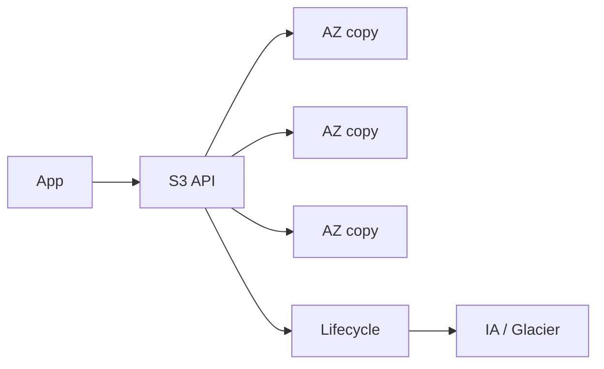

import { ConceptTemplate } from '@/features/kb/components/templates/ConceptTemplate'
import { Callout } from '@/features/kb/components/mdx/Callout'
import { ComparisonTable } from '@/features/kb/components/mdx/ComparisonTable'

export default function Layout({ children }) {
  return (
    <ConceptTemplate title="Amazon S3">
      {children}
    </ConceptTemplate>
  )
}

**S3** is an object store, not a disk. A bucket is a flat namespace of keys. The slash in `logs/2026/file.json` is part of the key, not a directory inode. You PUT/GET/DELETE objects over HTTPS. Durability is replication across AZs in the region (except the Single-AZ classes). Consistency for overwrite GET/LIST is strong in-region.

## 1. Deep Dive and Mechanics

**Keys and prefixes.** Throughput and listing scale with prefix parallelism. Old “hash the prefix” advice is less critical than it was, but millions of tiny objects in one prefix still hurt LIST and analytics.

**Classes.** Standard, Standard-IA, One Zone-IA, Glacier Instant/Flexible/Deep, Intelligent-Tiering. Transitions have minimum days and size. Restore from Glacier is not a GET.

**Security.** Block Public Access on. Bucket policy + IAM. SSE-S3 or SSE-KMS. Object Lock (WORM) for compliance. Access points and multi-region access points add extra hostnames and policies.

**Versioning + MFA delete + replication.** Versioning is how you survive `rm -rf`. CRR/SRR copy to another bucket. Lifecycle expires old versions or you pay forever.

**Performance.** Multipart upload, Transfer Acceleration, byte-range GETs, S3 Express One Zone for latency-sensitive caches.

<Callout icon="error" title="Public buckets still happen">
A bucket policy with Principal star and a disabled Block Public Access flag is a press incident. Account-level BPA plus Access Analyzer should be on before the first object.
</Callout>

## 2. Mathematical / Theoretical Foundation

Durability “11 nines” is an erasure/replication design target, not a backup. A bad IAM Delete plus no versioning beats any durability math. Availability SLO is separate (and lower).

Cost ≈ storage + requests + retrieval + replication + extra-region transfer. Request cost dominates for tiny objects (millions of 1 KB PUTs). Lifecycle to IA too early loses to minimum-duration charges.

<ComparisonTable
  headers={['Class', 'AZ model', 'Access']}
  rows={[
    ['Standard', 'Multi-AZ', 'Hot'],
    ['Intelligent-Tiering', 'Multi-AZ', 'Unknown pattern'],
    ['Standard-IA / Glacier Instant', 'Multi-AZ', 'Rare, needs ms GET'],
    ['Glacier Deep Archive', 'Multi-AZ', 'Hours, cheapest sleep'],
  ]}
/>

## 3. Real-World Implementation

```python
import boto3

s3 = boto3.client('s3')
s3.put_object(
    Bucket='lake-prod',
    Key='events/dt=2026-09-06/part-000.parquet',
    Body=open('part-000.parquet', 'rb'),
    ServerSideEncryption='aws:kms',
    SSEKMSKeyId='alias/lake',
)
```

Use the S3 Encryption / Transfer managers for large files. Prefer prefixes that match partition columns Athena will prune.

## 4. Visualizations



## 5. Interview Prep

**Q: EBS vs EFS vs S3?**
**A:** Block vs NFS vs object. S3 has no POSIX, infinite scale, and HTTP semantics. Do not mount S3 as a disk unless you like pain (and a gateway).

**Q: How do you make a bucket private but CDN-reachable?**
**A:** CloudFront OAC + bucket policy allow only the distribution. BPA stays on.

**Q: What is strong consistency here?**
**A:** After a successful write, subsequent reads and lists in the region reflect it. You still need your own concurrency control for read-modify-write.

## 6. Production Use Cases

- Data lakes and log archives.
- Static sites and assets behind CloudFront.
- Backup target with Object Lock for ransomware resistance.

<Callout icon="tip" title="Versioning plus lifecycle">
Turn versioning on, then expire noncurrent versions after N days. Undo without unbounded storage.
</Callout>
