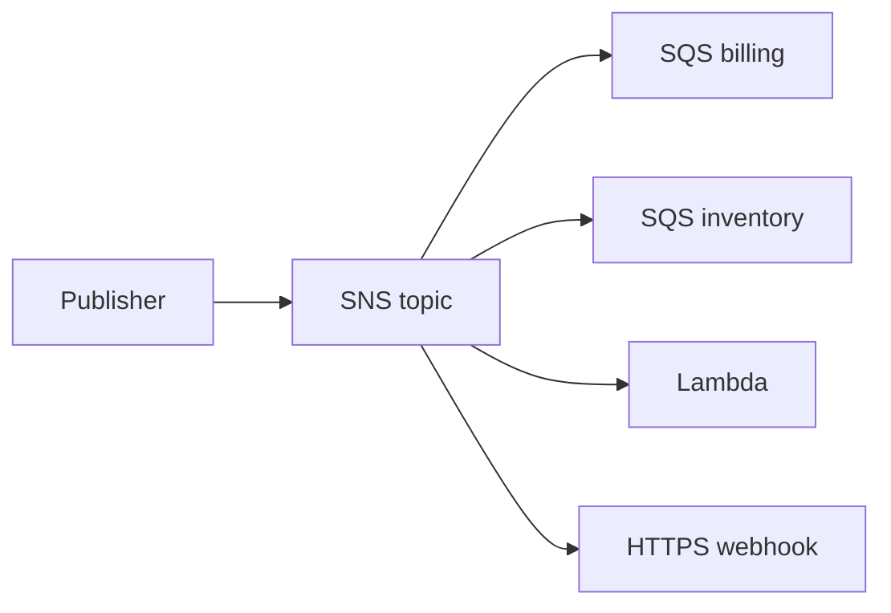

import { ConceptTemplate } from '@/features/kb/components/templates/ConceptTemplate'
import { Callout } from '@/features/kb/components/mdx/Callout'
import { ComparisonTable } from '@/features/kb/components/mdx/ComparisonTable'

export default function Layout({ children }) {
  return (
    <ConceptTemplate title="Amazon SNS">
      {children}
    </ConceptTemplate>
  )
}

**SNS** is a topic. Publishers call Publish. Subscribers (SQS queues, Lambda, HTTPS, email, SMS, mobile push) each get a delivery. You do not pull from SNS; you subscribe a target. Fan-out to many SQS queues is the workhorse pattern that keeps producers unaware of consumer count.

## 1. Deep Dive and Mechanics

**Standard vs FIFO.** Standard is best-effort order, at-least-once, huge throughput. FIFO topics require FIFO queues, preserve order per message group, and support dedupe (5-minute window). Throughput is lower.

**Filter policies.** Subscription-level JSON on message attributes (or payload). Filtering in SNS is cheaper than waking every Lambda.

**Delivery and retries.** Each protocol has a retry policy. SQS subscription is the reliable one (the queue buffers). HTTP endpoints need a DLQ on the subscription or you lose events after retries.

**Encryption and access.** SSE-KMS, topic policy for cross-account Publish, and `aws:SourceOwner` style conditions. A topic policy with Principal star is a gift.

**Application vs data messaging.** SMS/email are user notifications with spend limits. Application integration should be SQS/Lambda, not email.

<Callout icon="warning" title="Email is not a queue">
An operator inbox as the only subscriber will drop, delay, and unsub. Put SQS (and a worker) on the topic; email can be a second subscription.
</Callout>

## 2. Mathematical / Theoretical Foundation

Fan-out cost is O(subscribers) deliveries per publish. Filter policies cut that. Standard SNS does not give global FIFO; if two publishes race, consumers may see them swapped.

Dedupe on FIFO is hashing the body or an id you send. The window is finite — replay after six minutes is a new message.

<ComparisonTable
  headers={['Service', 'Pattern', 'Buffer']}
  rows={[
    ['SNS', 'Pub/sub fan-out', 'No (except via SQS)'],
    ['SQS', 'Compete consumers', 'Yes'],
    ['EventBridge', 'Content routing', 'Archive optional'],
    ['Kinesis', 'Replayable stream', 'Retention hours/days'],
  ]}
/>

## 3. Real-World Implementation

```python
import boto3

sns = boto3.client('sns')
sns.publish(
    TopicArn='arn:aws:sns:us-east-1:111111111111:orders',
    Message='{"orderId":"1001"}',
    MessageAttributes={
        'event': {'DataType': 'String', 'StringValue': 'placed'}
    },
)
```

Subscribe queues, not functions, when you need a backlog. Lambda can then consume SQS with batching and a DLQ.

## 4. Visualizations



## 5. Interview Prep

**Q: SNS vs SQS?**
**A:** SNS pushes to many subscribers. SQS holds messages for one consumer group. Together: SNS → many SQS.

**Q: SNS vs EventBridge?**
**A:** SNS is simpler topics and notifications (including SMS). EventBridge has richer matching, archives, SaaS partners, and many AWS targets. Overlap is real; pick one house style.

**Q: How do you stop a bad subscriber from hurting others?**
**A:** Independent subscriptions and retries. A slow HTTP target does not block SQS delivery. Still watch account-level publish limits.

## 6. Production Use Cases

- Fan-out domain events to per-team queues.
- Alarm actions from CloudWatch to Slack via Lambda or Chatbot.
- Mobile push and constrained SMS (with spend caps).

<Callout icon="tip" title="Filter on attributes">
Do not make every consumer parse and drop. A subscription filter policy is cheaper and keeps payloads out of the wrong account.
</Callout>
