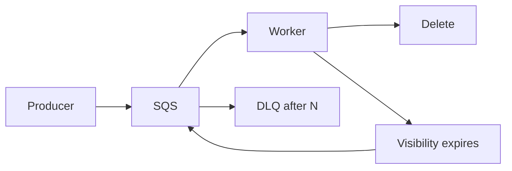

import { ConceptTemplate } from '@/features/kb/components/templates/ConceptTemplate'
import { Callout } from '@/features/kb/components/mdx/Callout'
import { ComparisonTable } from '@/features/kb/components/mdx/ComparisonTable'

export default function Layout({ children }) {
  return (
    <ConceptTemplate title="Amazon SQS">
      {children}
    </ConceptTemplate>
  )
}

**SQS** is a queue API: SendMessage, ReceiveMessage, DeleteMessage. Workers long-poll, process, then delete. If they crash before delete, the **visibility timeout** expires and the message reappears. That is at-least-once in one sentence. Standard queues scale hard; FIFO queues add order per group and exactly-once *processing* only if you also dedupe on the consumer.

## 1. Deep Dive and Mechanics

**Visibility timeout.** Hidden from other receives while you work. Too short: double processing. Too long: slow poison-pill recovery. ChangeMessageVisibility extends a long job.

**DLQ.** After `maxReceiveCount` receives, the message goes to a dead-letter queue. Without a DLQ, poison messages loop forever.

**Standard vs FIFO.** Standard: at-least-once, best-effort order, high TPS, content-based optional. FIFO: 300 TPS default (higher with high-throughput mode), `MessageGroupId` orders a stream, `MessageDeduplicationId` or content hash within 5 minutes.

**Event source mapping.** Lambda polls SQS, batches, and retries the batch on handler error — which can re-drive the whole batch. Partial batch failure reporting exists; use it.

**Encryption and access.** SSE-KMS, queue policy for cross-account send, and no public queues.

<Callout icon="warning" title="Delete is the commit">
If you delete before the side effect, a crash loses work. If you side-effect then crash before delete, you double. Design the worker for the second case.
</Callout>

## 2. Mathematical / Theoretical Foundation

In-flight messages ≈ consume_rate × processing_time. Visibility timeout should be comfortably above p99 processing, not the mean.

Backoff: a failing handler that returns quickly with a short visibility creates a tight retry loop (CPU + bill). Exponential visibility or a DLQ after N is mandatory.

FIFO throughput is per-queue (and per group for parallelism). Independent group ids = parallel consumers; one group id = one-at-a-time.

<ComparisonTable
  headers={['Queue', 'Order', 'Dedupe']}
  rows={[
    ['Standard', 'Best effort', 'You implement'],
    ['FIFO', 'Per group id', '5-minute id window'],
    ['SNS + SQS', 'Depends on queue', 'Fan-in from topic'],
    ['Kinesis', 'Per shard', 'Replay, not delete'],
  ]}
/>

## 3. Real-World Implementation

```python
import boto3

sqs = boto3.client('sqs')
url = 'https://sqs.us-east-1.amazonaws.com/111111111111/orders'
msgs = sqs.receive_message(QueueUrl=url, MaxNumberOfMessages=10, WaitTimeSeconds=20)
for m in msgs.get('Messages', []):
    handle(m['Body'])
    sqs.delete_message(QueueUrl=url, ReceiptHandle=m['ReceiptHandle'])
```

Long poll (WaitTimeSeconds 20) cuts empty receives. Never short-poll in a tight loop.

## 4. Visualizations



## 5. Interview Prep

**Q: Why did a message process twice?**
**A:** Visibility expired, or the delete failed, or Lambda retried the batch. Consumers must be idempotent.

**Q: Standard or FIFO?**
**A:** FIFO when a single-stream order or producer dedupe is a hard requirement. Standard for almost everything else.

**Q: SQS vs Kinesis vs SNS?**
**A:** SQS is compete-and-delete. Kinesis is replayable shards. SNS is fan-out. SQS is the default worker buffer.

## 6. Production Use Cases

- Async work behind an API (accept, enqueue, 202).
- Fan-out targets from SNS or EventBridge.
- Load leveling in front of a fussy downstream.

<Callout icon="tip" title="Alarm ApproximateAgeOfOldestMessage">
Depth can look fine while one poison message ages. Age plus DLQ depth is the health pair.
</Callout>
