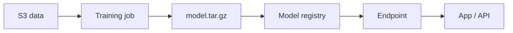

import { ConceptTemplate } from '@/features/kb/components/templates/ConceptTemplate'
import { Callout } from '@/features/kb/components/mdx/Callout'
import { ComparisonTable } from '@/features/kb/components/mdx/ComparisonTable'

export default function Layout({ children }) {
  return (
    <ConceptTemplate title="Amazon SageMaker">
      {children}
    </ConceptTemplate>
  )
}

**SageMaker** is a collection of managed jobs and endpoints around S3 artifacts. You train with an estimator (framework container or your image) on ephemeral instances. You deploy a **real-time endpoint**, a **serverless** endpoint, or **batch transform**. Studio is the IDE. Pipelines is the orchestrator. Feature Store, Model Registry, and Clarify sit on the side. You can ignore 80 percent of the brand names and still ship if train and serve are solid.

## 1. Deep Dive and Mechanics

**Training.** A job pulls data from S3 (or FSx/EFS), runs `train`, writes `model.tar.gz` to S3, and dies. Spot training needs checkpointing. Distributed (data parallel, SM DDP, Horovod) is extra networking and failure modes.

**Serving.** Real-time: an instance fleet + container that implements the SageMaker inference contract (or a Triton/DJL image). Autoscaling on InvocationsPerInstance. Multi-model endpoints pack many models per instance. Serverless endpoints trade cold start for idle cost.

**Pipelines.** Step DAGs that call training, processing, and register-model. This is CI for models, not a replacement for data quality.

**Network.** Studio and jobs in a VPC need subnets, SGs, and endpoints for S3/ECR/API or they hang on start. Disable internet when the security team asks — then actually add the endpoints.

<Callout icon="warning" title="An endpoint is a 24/7 bill">
A forgotten `ml.g5` endpoint is a monthly surprise. Scale-to-zero via serverless or a scheduled delete. Tag every endpoint with an owner.
</Callout>

## 2. Mathematical / Theoretical Foundation

Training cost ≈ instance_price × hours × node_count. GPU utilization U ≪ 1 usually means data pipeline starve, not “need more GPUs.” Throughput tokens/s or samples/s should be the first CloudWatch graph.

Endpoint cost ≈ instance_hours + (optionally) inference component packing. p99 latency is queueing + model + payload; autoscaling on CPU can be the wrong metric for GPU (use Invocations or a custom SM metric).

<ComparisonTable
  headers={['Serve mode', 'Idle cost', 'Fit']}
  rows={[
    ['Real-time endpoint', 'Always-on instances', 'Tight p99, steady QPS'],
    ['Serverless endpoint', 'Per-inference + cold', 'Spiky, modest models'],
    ['Batch transform', 'Job duration', 'Offline scores'],
    ['Self-serve on EKS', 'You operate', 'Custom mesh, multi-cloud'],
  ]}
/>

## 3. Real-World Implementation

```python
from sagemaker.sklearn import SKLearn

est = SKLearn(
    entry_point='train.py',
    role='arn:aws:iam::111111111111:role/sm-exec',
    instance_type='ml.m5.xlarge',
    instance_count=1,
    framework_version='1.2-1',
)
est.fit({'train': 's3://ml/train/'})
pred = est.deploy(initial_instance_count=1, instance_type='ml.m5.large')
```

The execution role needs S3 and ECR, not AdministratorAccess. Pin image versions.

## 4. Visualizations



## 5. Interview Prep

**Q: Processing job vs training job vs notebook?**
**A:** Processing is sklearn/spark-ish ETL. Training is the estimator contract and metrics. Notebooks are interactive and should not be the production trainer.

**Q: How do you blue/green a model?**
**A:** Production variants with traffic weights, or a new endpoint + alias flip, plus a Model Monitor baseline. Do not overwrite the only variant on Friday.

**Q: SageMaker vs just EC2 + FastAPI?**
**A:** SageMaker buys job lifecycle, IAM, and autoscaling conventions. EC2/EKS wins when the serving stack is already standard and the SageMaker contract is in the way.

## 6. Production Use Cases

- Tabular training on scheduled Pipelines into a registry.
- Real-time fraud scores behind an API Gateway.
- Batch scoring of a lake table every night.

<Callout icon="tip" title="Checkpoint to S3 on Spot">
Spot savings vanish if a 10-hour job cannot resume. Checkpoint every N steps or do not use Spot.
</Callout>
