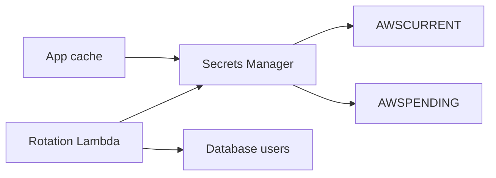

import { ConceptTemplate } from '@/features/kb/components/templates/ConceptTemplate'
import { Callout } from '@/features/kb/components/mdx/Callout'
import { ComparisonTable } from '@/features/kb/components/mdx/ComparisonTable'

export default function Layout({ children }) {
  return (
    <ConceptTemplate title="AWS Secrets Manager">
      {children}
    </ConceptTemplate>
  )
}

**Secrets Manager** holds a secret string or binary under an ARN. Apps call GetSecretValue with IAM, not with a shared file. Versions (`AWSCURRENT`, `AWSPENDING`) make **rotation** a two-step: create new creds, prove they work, then flip the stage. KMS encrypts at rest. CloudTrail records who read.

## 1. Deep Dive and Mechanics

**Rotation.** A Lambda (AWS-managed for RDS/Redshift/DocumentDB, or yours) implements a state machine: createSecret, setSecret, testSecret, finishSecret. Multi-user rotation (a clone user) avoids locking yourself out of a DB.

**Replica secrets.** Cross-region replicas for DR reads. The primary owns rotation.

**Resource policy.** Cross-account GetSecretValue plus KMS key policy — both must allow. A missing kms:Decrypt looks like an access-denied on the secret.

**Caching.** The AWS-provided client cache (or your own with TTL) avoids GetSecretValue on every HTTP request (rate limits and latency). Invalidate on rotation by version id.

**Alternative: SSM Parameter Store.** Cheaper, simpler, standard params. Secrets Manager wins on first-class rotation, random generation, and some compliance stories.

<Callout icon="error" title="A secret in Lambda env is still a secret in the console">
Inject at runtime via the SDK or a sidecar. Environment variables are visible to anyone with GetFunction and land in every dump.
</Callout>

## 2. Mathematical / Theoretical Foundation

Rotation period T vs leak window: expected exposure duration is ~T/2 if detection is absent. Shorter T needs consumers that refresh. Cache TTL should be ≪ T and ≥ a few minutes to absorb rate limits.

Authorization is secret resource policy ∩ IAM ∩ KMS. Replica reads need the replica region’s API and the same KMS story (multi-region key or a replica key).

<ComparisonTable
  headers={['Store', 'Rotation', 'Cost model']}
  rows={[
    ['Secrets Manager', 'First-class Lambda', 'Per secret per month + API'],
    ['SSM SecureString', 'You build it', 'Parameter + KMS'],
    ['S3 + KMS', 'DIY', 'Do not'],
    ['Git / AMI', 'Never', 'Incident'],
  ]}
/>

## 3. Real-World Implementation

```python
import json
import boto3

sm = boto3.client('secretsmanager')
payload = sm.get_secret_value(SecretId='prod/checkout/db')
creds = json.loads(payload['SecretString'])
# connect with creds['username'], creds['password']
```

Cache `creds` in process with a 5-minute TTL. On auth failures against the DB, force a refresh once (rotation race).

## 4. Visualizations



## 5. Interview Prep

**Q: Secrets Manager vs Parameter Store?**
**A:** Parameter Store for config and cheap SecureStrings. Secrets Manager when you want managed rotation, generate-password, and replica secrets.

**Q: Why do I need the KMS key policy too?**
**A:** The secret blob is encrypted with that key. IAM on secretsmanager:GetSecretValue is not a decrypt grant.

**Q: How does RDS rotation not break the app?**
**A:** Multi-user or a pending password both valid during the window, plus app retry and cache refresh. Single-user rotate can drop connections at flip.

## 6. Production Use Cases

- RDS master and app user passwords with managed rotation.
- Third-party API keys with a custom rotator.
- Cross-account reads for a shared vendor credential (tight resource policy).

<Callout icon="tip" title="Name secrets like ARNs">
`prod/checkout/db` beats `mysecret2`. Policies and least privilege scale with a prefix tree, not folklore names.
</Callout>
