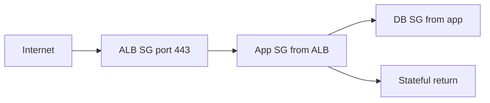

import { ConceptTemplate } from '@/features/kb/components/templates/ConceptTemplate'
import { Callout } from '@/features/kb/components/mdx/Callout'
import { ComparisonTable } from '@/features/kb/components/mdx/ComparisonTable'

export default function Layout({ children }) {
  return (
    <ConceptTemplate title="AWS Security Groups">
      {children}
    </ConceptTemplate>
  )
}

A **security group (SG)** is a stateful firewall attached to an elastic network interface, not to a subnet. Rules are allow-only. If you start a TCP session that matches an outbound rule, the reply is admitted without an inbound twin. The default SG allows all outbound and only inbound from itself — useful for instances that talk to each other, useless as a public web ACL.

## 1. Deep Dive and Mechanics

**Attachment.** One ENI can wear several SGs. The effective policy is the union of allows. Changing an SG updates every ENI that references it; that is how Auto Scaling stays reachable without rewriting IPs.

**Sources.** CIDR, prefix list, or another security group id. Referencing `sg-web` on `sg-db` port 5432 means “any ENI currently wearing sg-web,” including ones that do not exist yet. That is the elastic alternative to stuffing instance IPs into a database firewall.

**Stateful tracker.** AWS keeps connection state on the hypervisor (Nitro). Long-idle flows can drop from the table; applications that go quiet for tens of minutes should heartbeat or accept a reconnect. UDP still gets a timed mapping.

**Limits.** Rule count, SGs per ENI, and tracker capacity are real. Huge “allow the world on 0-65535” rules plus chatty microservices exhaust the tracker and look like random resets.

**IPv4 and IPv6.** Separate rule rows. Dual-stack instances need both or one family is a black hole.

<Callout icon="warning" title="SGs do not deny">
There is no deny rule. A packet is dropped only if no allow matches. For an explicit subnet-wide block, use a NACL. For HTTP path or bot logic, use a WAF in front of the ALB or CloudFront.
</Callout>

## 2. Mathematical / Theoretical Foundation

Evaluation is a first-match-any allow over the union of attached groups, then a connection tracker. Formally: admit if (5-tuple matches an allow) or (reverse 5-tuple is in the state table). NACLs are the opposite: numbered, stateless, allow and deny.

Defense in depth is the intersection SG ∩ NACL ∩ route. Opening an SG cannot create a route that does not exist.

<ComparisonTable
  headers={['Control', 'State', 'Attach to']}
  rows={[
    ['Security group', 'Stateful, allow-only', 'ENI'],
    ['NACL', 'Stateless, allow and deny', 'Subnet'],
    ['WAF', 'HTTP/S rules', 'ALB, CloudFront, API Gateway'],
    ['IAM', 'API authorization', 'Not packets'],
  ]}
/>

## 3. Real-World Implementation

```python
import boto3

ec2 = boto3.client('ec2')
ec2.authorize_security_group_ingress(
    GroupId='sg-db',
    IpPermissions=[{
        'IpProtocol': 'tcp',
        'FromPort': 5432,
        'ToPort': 5432,
        'UserIdGroupPairs': [{'GroupId': 'sg-app'}],
    }],
)
```

Prefer SG-to-SG over `0.0.0.0/0` except on the load balancer listener you actually intend to publish. Keep SSH behind SSM Session Manager, not port 22 to the internet.

## 4. Visualizations



## 5. Interview Prep

**Q: Security group vs NACL?**
**A:** SG is stateful and instance-scoped. NACL is stateless and subnet-scoped and can deny. Day-to-day allows live on SGs.

**Q: Why reference another SG instead of a CIDR?**
**A:** Autoscaled IPs change. The group id is a stable set of ENIs. You also avoid punching the whole subnet.

**Q: Can two SGs on one instance conflict?**
**A:** No deny, so they union. The tightest design is fewer groups with precise sources, not a pile of overlapping wide allows.

## 6. Production Use Cases

- Three-tier apps: public ALB SG, private app SG, private data SG chained by group id.
- Shared services VPC: allow only the client SGs, never the peered CIDR.
- EKS node and pod SGs when you need per-workload ports instead of a flat node SG.

<Callout icon="tip" title="Name groups by role, not by instance">
`app-prod` and `rds-prod` survive replacements. `alice-laptop-sg` becomes archaeology after the laptop is gone.
</Callout>
