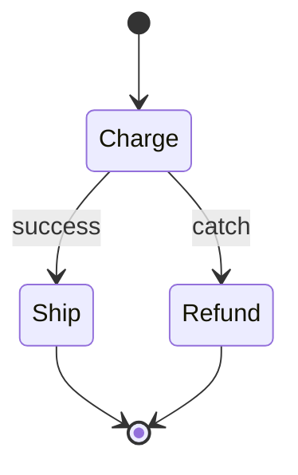

import { ConceptTemplate } from '@/features/kb/components/templates/ConceptTemplate'
import { Callout } from '@/features/kb/components/mdx/Callout'
import { ComparisonTable } from '@/features/kb/components/mdx/ComparisonTable'

export default function Layout({ children }) {
  return (
    <ConceptTemplate title="AWS Step Functions">
      {children}
    </ConceptTemplate>
  )
}

**Step Functions** run a state machine defined in Amazon States Language. Each state is a Task, Choice, Parallel, Map, Wait, Succeed, or Fail. The service holds the pointer, the payload, and the retry clock. Your functions stay short: do one thing, return JSON, let the machine decide what happens next.

## 1. Deep Dive and Mechanics

**Standard vs Express.** Standard executions last up to a year, are exactly-once at the workflow layer, and keep a full history you can inspect. Express is cheap and high-rate for short pipelines (IoT, streaming enrich), at-least-once, with logging instead of a clickable history.

**Service integrations.** Tasks can call Lambda, or hit DynamoDB, SQS, ECS, EMR, Glue, and hundreds of AWS APIs with optimized or SDK integrations. That removes “Lambda that only wraps PutItem.”

**Retry and Catch.** Retries with backoff live in ASL, not in your code. Catch routes named errors to a cleanup state. A Lambda that swallows errors hides them from the machine — throw or fail the task.

**Map and Distributed Map.** Map fans out over an array. Distributed Map can iterate millions of S3 objects with concurrency caps. Payload size is 256 KB; park large blobs in S3 and pass the pointer.

**Sync vs callback.** WaitForTaskToken parks the execution until an external worker calls SendTaskSuccess. That is how you include a human approval or an on-prem job.

<Callout icon="warning" title="Do not chain Lambdas">
A calling B calling C loses retries, timeouts, and a single trace. The caller also pays for wait time. Put the graph in Step Functions and keep functions leaf-shaped.
</Callout>

## 2. Mathematical / Theoretical Foundation

A state machine is a directed graph plus a durable program counter. Standard mode gives at-most-once effects only if your tasks are idempotent — the workflow is exactly-once, the downstream API may see retries.

Backoff is typically interval × multiplier^attempt, capped. Expected extra latency under failure rate p is the series of retry waits, not just the happy path.

Express vs Standard is a throughput/cost/semantics trade: high-rate at-least-once vs inspectable exactly-once orchestration.

<ComparisonTable
  headers={['Tool', 'Strength', 'Weakness']}
  rows={[
    ['Step Functions Standard', 'Long, visible, exactly-once workflow', 'Cost per transition'],
    ['Step Functions Express', 'High rate, cheap', 'At-least-once, weaker history'],
    ['SQS + workers', 'Simple queueing', 'You build the graph'],
    ['Airflow / Temporal', 'Rich programming model', 'You run the control plane'],
  ]}
/>

## 3. Real-World Implementation

```json
{
  "StartAt": "Charge",
  "States": {
    "Charge": {
      "Type": "Task",
      "Resource": "arn:aws:lambda:us-east-1:1:function:charge",
      "Retry": [{"ErrorEquals": ["States.TaskFailed"], "MaxAttempts": 3, "IntervalSeconds": 2, "BackoffRate": 2}],
      "Catch": [{"ErrorEquals": ["States.ALL"], "Next": "Refund"}],
      "Next": "Ship"
    },
    "Ship": {"Type": "Task", "Resource": "arn:aws:lambda:us-east-1:1:function:ship", "End": true},
    "Refund": {"Type": "Task", "Resource": "arn:aws:lambda:us-east-1:1:function:refund", "End": true}
  }
}
```

Keep InputPath / ResultPath tight so later states do not drown in prior payloads.

## 4. Visualizations



## 5. Interview Prep

**Q: Standard or Express?**
**A:** Standard for business processes you will debug in the console and that may wait hours. Express for high-volume, short, idempotent pipelines.

**Q: How do you handle a 256 KB payload limit?**
**A:** Store the body in S3 or DynamoDB and pass the key. Map over pointers, not files.

**Q: Why is a WaitForTaskToken better than a polling Lambda?**
**A:** The execution sleeps without compute cost. The worker reports done once. Polling burns invocations and still races.

## 6. Production Use Cases

- Order pipelines: pay, reserve stock, ship, with compensating refunds.
- ETL: Glue or EMR steps with a Choice on row counts.
- Human approval: callback token to Slack, resume on reaction.

<Callout icon="tip" title="Idempotency keys on every Task">
Standard executions retry. Charge APIs that are not idempotent will double-bill. Put a token derived from the execution name on every side effect.
</Callout>
