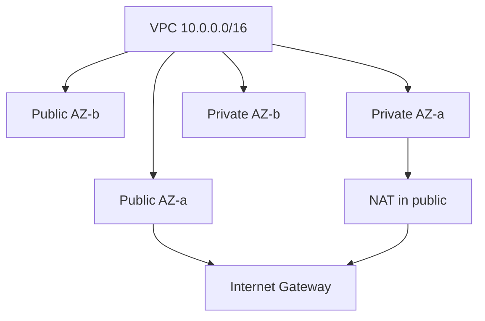

import { ConceptTemplate } from '@/features/kb/components/templates/ConceptTemplate'
import { Callout } from '@/features/kb/components/mdx/Callout'
import { ComparisonTable } from '@/features/kb/components/mdx/ComparisonTable'

export default function Layout({ children }) {
  return (
    <ConceptTemplate title="AWS Subnets">
      {children}
    </ConceptTemplate>
  )
}

A **subnet** is a contiguous CIDR carved from the VPC, pinned to exactly one Availability Zone. “Public” and “private” are not AWS checkboxes on the subnet object; they are route-table facts. A `0.0.0.0/0` route to an Internet Gateway plus a public IP makes instances reachable from the internet. A default route to a NAT Gateway makes them able to leave but not to be reached inbound.

## 1. Deep Dive and Mechanics

**CIDR carving.** A VPC `10.0.0.0/16` often becomes `/24` or `/20` slices per AZ and tier. AWS reserves five IPv4 addresses in every subnet: network, router, DNS, future use, and broadcast. A `/28` (16 addresses) yields 11 usable. Plan for ENIs, Lambda ENIs, and load-balancer nodes — they consume IPs.

**AZ pinning.** `us-east-1a` for you is not the same building as `us-east-1a` for another account. Spread tiers across at least two AZs. An ALB or NLB spans the subnets you attach.

**IPv6.** Dual-stack subnets get a `/64` from the VPC `/56`. IPv6 is often public-by-default; egress-only IGW replaces NAT for outbound-only IPv6.

**Special subnets.** Isolated (no `0.0.0.0/0`) for data. Dedicated subnets for VPC endpoints, Transit Gateway attachments, or firewall appliances. Local Zones and Wavelength have their own subnet types.

**IP exhaustion.** The silent killer of EKS and ASG growth. Monitor available addresses. Secondary CIDRs and extra subnets exist for a reason.

<Callout icon="error" title="A public IP is not a firewall">
Putting an instance in a private subnet is not encryption and not IAM. It only removes a route. SGs still apply. Do not confuse “no IGW route” with “safe.”
</Callout>

## 2. Mathematical / Theoretical Foundation

Usable IPv4 in a subnet is 2^(32-prefix) − 5. Capacity planning is max(ENIs, pods-with-IPs, LB nodes) over time, not day-one instance count.

High availability is a placement constraint: P(AZ failure) is independent enough that two subnets in two AZs beat one large subnet. Three AZs is the usual bar for stateful quorum (etcd, Kafka, RDS Multi-AZ).

<ComparisonTable
  headers={['Kind', 'Default route', 'Typical residents']}
  rows={[
    ['Public', 'IGW', 'ALB, NAT, bastion if you still have one'],
    ['Private', 'NAT Gateway', 'App instances, EKS nodes'],
    ['Isolated', 'None or TGW only', 'RDS, data, VPC endpoints'],
    ['Firewall / TGW', 'Appliance or TGW', 'Inspection hops'],
  ]}
/>

## 3. Real-World Implementation

```python
import boto3

ec2 = boto3.client('ec2')
ec2.create_subnet(
    VpcId='vpc-123',
    CidrBlock='10.0.10.0/24',
    AvailabilityZone='us-east-1a',
    TagSpecifications=[{
        'ResourceType': 'subnet',
        'Tags': [{'Key': 'Name', 'Value': 'app-private-a'}],
    }],
)
```

Associate the private route table (NAT) after create. Tag `kubernetes.io/role/internal-elb=1` on private subnets if EKS should place internal load balancers there.

## 4. Visualizations



## 5. Interview Prep

**Q: What makes a subnet public?**
**A:** A route to an IGW for `0.0.0.0/0` (and usually auto-assign public IPv4 or an EIP). The MapPublicIpOnLaunch flag alone is not sufficient without the route.

**Q: Why not one big subnet per VPC?**
**A:** One AZ, one failure domain, and no place to put a Multi-AZ load balancer or RDS.

**Q: How many IPs does EKS eat?**
**A:** Prefix delegation and some CNIs allocate chunks per node. A `/24` fills faster than instance count suggests. Count pods, not nodes.

## 6. Production Use Cases

- Classic six-pack: public/private/isolated × two or three AZs.
- Separate /22s for EKS so pods do not starve RDS.
- Dedicated /28s for VPC interface endpoints to keep them off app CIDRs.

<Callout icon="tip" title="Leave gaps in the CIDR plan">
Allocate `10.0.0.0/20` blocks per tier with unused /24s between them. Expanding a live subnet CIDR is not a thing; adding a subnet is.
</Callout>
