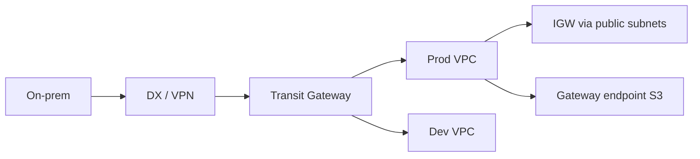

import { ConceptTemplate } from '@/features/kb/components/templates/ConceptTemplate'
import { Callout } from '@/features/kb/components/mdx/Callout'
import { ComparisonTable } from '@/features/kb/components/mdx/ComparisonTable'

export default function Layout({ children }) {
  return (
    <ConceptTemplate title="Amazon VPC">
      {children}
    </ConceptTemplate>
  )
}

A **VPC** is your isolated IPv4 (and optional IPv6) network inside one AWS Region. You pick a CIDR, slice subnets per AZ, attach route tables, and add gateways: Internet, NAT, Virtual Private, Transit, egress-only. Other accounts can reuse `10.0.0.0/16`; the hypervisor still will not mix your packets with theirs. Connectivity is always something you add — peering, TGW, PrivateLink, or the public internet.

## 1. Deep Dive and Mechanics

**Default vs custom.** New accounts still get a default VPC with public subnets. Production should be custom: no public IPs on workloads, explicit NAT, and VPC endpoints for S3 and STS so control-plane traffic stays on the Amazon network.

**Routing.** Each subnet has exactly one route table. Longest prefix wins. `local` always covers the VPC CIDR. Peering and TGW add more prefixes; overlapping CIDRs cannot peer.

**Connectivity menu.** Peering is one-to-one, non-transitive. Transit Gateway is the hub (and a bill). PrivateLink exposes a service as an ENI in the consumer VPC — no CIDR overlap problem. VPN and Direct Connect land on a VGW or TGW.

**DNS.** `enableDnsSupport` and `enableDnsHostnames` matter for Private DNS on interface endpoints. AmazonProvidedDNS lives at the reserved +2 address.

**Shared VPC.** RAM can share subnets to other accounts. The owner keeps the network; participants place ENIs. Agree who owns NACLs and SGs before you share.

<Callout icon="error" title="Overlapping CIDRs are forever">
A `10.0.0.0/8` VPC cannot peer cleanly with another `10.0.0.0/8`. Renaming a live CIDR means new VPC plus migration. Size for growth and acquisitions, not for the first three instances.
</Callout>

## 2. Mathematical / Theoretical Foundation

A VPC is a virtual L3 domain: forwarding is software isolation plus a route table, not a physical switch you own. Blast radius is regional; AZs are the failure partitions inside it.

Peering of n VPCs is O(n^2) connections if you mesh. A hub (TGW or a shared services VPC) is O(n) attachments. That is the only reason TGW exists at scale.

<ComparisonTable
  headers={['Join', 'Transitive', 'CIDR overlap']}
  rows={[
    ['VPC peering', 'No', 'Forbidden'],
    ['Transit Gateway', 'Yes, via TGW', 'Forbidden on attachments'],
    ['PrivateLink', 'N/A (ENI)', 'Allowed — no IP routing'],
    ['VPN / DX', 'Via your router', 'Your problem'],
  ]}
/>

## 3. Real-World Implementation

```python
import boto3

ec2 = boto3.client('ec2')
vpc = ec2.create_vpc(CidrBlock='10.20.0.0/16')
ec2.modify_vpc_attribute(VpcId=vpc['Vpc']['VpcId'], EnableDnsSupport={'Value': True})
ec2.modify_vpc_attribute(VpcId=vpc['Vpc']['VpcId'], EnableDnsHostnames={'Value': True})
```

Add a secondary CIDR later if you must grow. Prefer a planned `/16` per environment and a `/12` or `/10` company plan that leaves space for TGW and on-prem.

## 4. Visualizations



## 5. Interview Prep

**Q: Why is peering not transitive?**
**A:** A route in A to B does not imply A to C through B. AWS will not turn your VPC into a router. Use TGW or an appliance if you need a hub.

**Q: Peering vs PrivateLink?**
**A:** Peering joins two CIDR spaces for any port. PrivateLink publishes one service to consumers without joining networks — better for SaaS and overlapping CIDRs.

**Q: How many VPCs should an account have?**
**A:** Often one per environment per region, plus optional shared-services. Hundreds of tiny VPCs without TGW is how you invent a full-time routing job.

## 6. Production Use Cases

- Hub-and-spoke: shared services (DNS, auth, inspection) plus spoke app VPCs on a TGW.
- Isolated prod VPC with no peering to sandbox, only PrivateLink for a vendor.
- Multi-account Landing Zone: each workload account gets a VPC from a Network account share or its own CIDR from an IPAM pool.

<Callout icon="tip" title="Use IPAM before the second VPC">
Amazon VPC IPAM hands out non-overlapping CIDRs and shows utilization. Spreadsheets rot the first time someone creates a VPC in the console.
</Callout>
