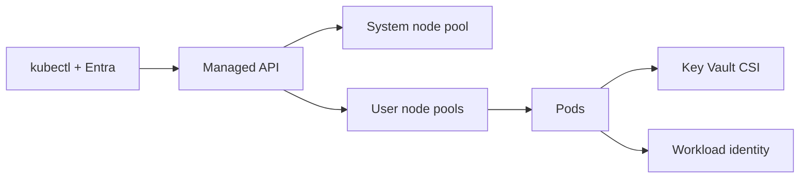

import { ConceptTemplate } from '@/features/kb/components/templates/ConceptTemplate'
import { Callout } from '@/features/kb/components/mdx/Callout'
import { ComparisonTable } from '@/features/kb/components/mdx/ComparisonTable'

export default function Layout({ children }) {
  return (
    <ConceptTemplate title="Azure Kubernetes Service">
      {children}
    </ConceptTemplate>
  )
}

**AKS** is Kubernetes where the API server and etcd are a Microsoft-managed pool. You pay for nodes (and for a paid SLA tier if you want an uptime contract). Identity is the product differentiator: Kubernetes RBAC can bind to Entra ID groups, so a leaver loses kubectl when their account is disabled.

## 1. Deep Dive and Mechanics

**Tiers.** Free is fine for labs. Standard adds an SLA and more control-plane headroom. Premium adds long-term support on older Kubernetes versions — useful when an app cannot jump every quarter.

**Node pools.** System pool for kube-system, user pools for apps. Mix VM SKUs, spot, GPU, and availability zones. The cluster autoscaler adds nodes; KEDA or HPA adds pods. They are not the same knob.

**Networking.** Kubenet (overlay, fewer VNet IPs), Azure CNI (pod IPs from the subnet — plan CIDRs), and Azure CNI Overlay (pods on a separate CIDR, nodes on the VNet). Network policies and Azure CNI Powered by Cilium change how you isolate workloads.

**Add-ons.** AGIC (Application Gateway Ingress), workload identity (pods as Entra apps — prefer this over aad-pod-identity), Key Vault CSI, Azure Policy (Gatekeeper), and Defender for Containers.

**Upgrades.** Surge nodes, drain, and a version skew limit. Pin a version, test in a second cluster, then upgrade. Auto-upgrade channels exist; they are not a substitute for a staging cluster.

<Callout icon="warning" title="CNI IP exhaustion">
Azure CNI without overlay allocates a pod CIDR from the subnet. A /24 dies under a few large node pools. Count max pods times nodes, then pick overlay or a much larger subnet.
</Callout>

## 2. Mathematical / Theoretical Foundation

The control plane is a quorum you do not operate; availability is Azure’s SLO plus your node-pool diversity. A single-AZ node pool makes the “managed masters” story irrelevant — pods still die with the zone.

Authorization is Entra token → API server → RBAC. Effective verbs are the intersection of Azure RBAC on the resource (who can get credentials) and Kubernetes RoleBindings (what they can do after).

<ComparisonTable
  headers={['Mode', 'Pod IPs', 'When']}
  rows={[
    ['Kubenet', 'Overlay NAT', 'Small clusters, tight VNet'],
    ['Azure CNI', 'VNet IPs', 'Need pods as first-class VNet peers'],
    ['CNI Overlay', 'Separate CIDR', 'Scale without eating the subnet'],
    ['Cilium data plane', 'eBPF policy', 'Network policy and observability'],
  ]}
/>

## 3. Real-World Implementation

```bash
az aks create -g prod -n shop \
  --enable-managed-identity \
  --enable-aad --aad-admin-group-object-ids 11111111-2222-3333-4444-555555555555 \
  --network-plugin azure --network-plugin-mode overlay \
  --enable-azure-rbac \
  --zones 1 2 3
```

Use `az aks get-credentials` with kubelogin. Workload identity federates a service account to an Entra app — no secrets in pods.

## 4. Visualizations



## 5. Interview Prep

**Q: AKS vs App Service vs Container Apps?**
**A:** AKS when you need Kubernetes APIs, custom controllers, or multi-team platforms. App Service for a web app. Container Apps for scale-to-zero containers without a cluster to own.

**Q: How does a developer lose cluster access on last day?**
**A:** Remove them from the Entra group bound to the ClusterRole. If you handed out static kubeconfigs with user certs, you did it wrong.

**Q: Why two node pools?**
**A:** System pool isolation: a runaway app Autoscaler should not evict CoreDNS. User pools can be spot or GPU without risking kube-system.

## 6. Production Use Cases

- Enterprise platforms that already live in Entra and Azure Policy.
- GPU training pools next to CPU serving pools in one cluster.
- AGIC fronting internal HTTP with WAF policy from a shared Application Gateway.

<Callout icon="tip" title="Treat add-ons as products">
Turn on only what you will patch. A forgotten AGIC or Policy addon is a second control plane you forgot you operate.
</Callout>
