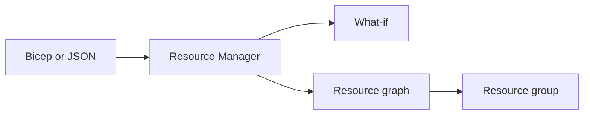

import { ConceptTemplate } from '@/features/kb/components/templates/ConceptTemplate'
import { Callout } from '@/features/kb/components/mdx/Callout'
import { ComparisonTable } from '@/features/kb/components/mdx/ComparisonTable'

export default function Layout({ children }) {
  return (
    <ConceptTemplate title="ARM Templates">
      {children}
    </ConceptTemplate>
  )
}

An **ARM template** is a JSON document that describes Azure resources, parameters, variables, and outputs. Resource Manager compares the desired graph to the subscription and creates, updates, or (in complete mode) deletes. Bicep and many portal “export template” buttons compile or emit this same contract. You can still write JSON by hand; you rarely should.

## 1. Deep Dive and Mechanics

**Deployment scopes.** Resource group (most common), subscription, management group, and tenant. Policy assignments and role assignments often live above the RG.

**Modes.** Incremental updates only what is in the template; leftover resources stay. Complete deletes resources in the group that are not in the template — powerful and how people wipe a production NIC.

**What-if.** A dry run that shows create/change/delete. It is imperfect on some resource types; still run it in CI before the real deploy.

**Nested and linked.** Large estates split into modules. Linked templates need a reachable URI (or use Bicep modules, which compile to nested deployments).

**Idempotency.** Repeat the same template. If a property is not specified, incremental mode may leave the old value — “set everything you care about” or you drift.

<Callout icon="error" title="Complete mode is a delete tool">
Complete mode means “this template is the whole group.” A missing resource is a delete. Use incremental unless you have a dedicated RG and a review of the what-if delete list.
</Callout>

## 2. Mathematical / Theoretical Foundation

ARM is a desired-state reconcile: observe current, compute a patch, apply. It is not a general workflow engine (no rich retries across two hours of custom script). DependsOn and implicit references form a DAG; cycles fail validation.

Export-template is a snapshot, not a module. It includes generated names and defaults that will fight the next deploy.

<ComparisonTable
  headers={['Tool', 'Authoring', 'Runtime']}
  rows={[
    ['ARM JSON', 'Verbose JSON', 'Native ARM'],
    ['Bicep', 'DSL → ARM', 'Native ARM'],
    ['Terraform', 'HCL, state file', 'AzureRM provider'],
    ['Pulumi', 'General language', 'Own state'],
  ]}
/>

## 3. Real-World Implementation

```json
{
  "$schema": "https://schema.management.azure.com/schemas/2019-04-01/deploymentTemplate.json#",
  "contentVersion": "1.0.0.0",
  "parameters": { "location": { "type": "string" } },
  "resources": [
    {
      "type": "Microsoft.Storage/storageAccounts",
      "apiVersion": "2023-01-01",
      "name": "[concat('st', uniqueString(resourceGroup().id))]",
      "location": "[parameters('location')]",
      "sku": { "name": "Standard_ZRS" },
      "kind": "StorageV2"
    }
  ]
}
```

Prefer Bicep `uniqueString` equivalents and named modules over copy-pasted JSON.

## 4. Visualizations



## 5. Interview Prep

**Q: Incremental vs complete?**
**A:** Incremental patches listed resources. Complete makes the template the exclusive contents of the group and deletes the rest.

**Q: Why does export template fail on redeploy?**
**A:** Secrets omitted, read-only properties included, and resource names that were unique the first time. Treat export as a learning aid, not a pipeline artifact.

**Q: ARM vs Terraform?**
**A:** ARM is native, no state file you own, weaker for multi-cloud. Terraform’s state is a second source of truth — better graph across vendors, worse when state and Azure disagree.

## 6. Production Use Cases

- Subscription-level deployments that create RGs and role assignments.
- Marketplace offers that must ship ARM.
- Debugging a Bicep compile by inspecting the generated JSON in CI.

<Callout icon="tip" title="Pin apiVersion">
Floating versions change defaults under you. Pin the apiVersion on every resource the way you pin an action SHA.
</Callout>
