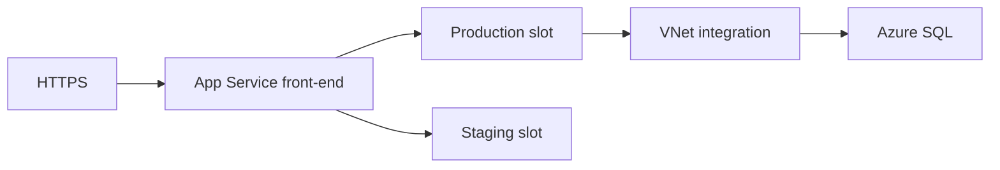

import { ConceptTemplate } from '@/features/kb/components/templates/ConceptTemplate'
import { Callout } from '@/features/kb/components/mdx/Callout'
import { ComparisonTable } from '@/features/kb/components/mdx/ComparisonTable'

export default function Layout({ children }) {
  return (
    <ConceptTemplate title="Azure App Service">
      {children}
    </ConceptTemplate>
  )
}

**App Service** runs web apps, APIs, and WebJobs on a shared or dedicated **App Service plan** (a VM scale unit). You deploy via zip, Git, GitHub Actions, or a container. You do not manage the guest OS patching story the way you do on a VM. The unit of isolation and bill is the plan, not the individual site — several apps can share one plan and one set of instances.

## 1. Deep Dive and Mechanics

**Plans.** Free/Shared are for toys. Basic/Standard/Premium are dedicated VMs. Isolated (ASE) puts the plan in your VNet for private inbound. SKU picks cores, RAM, stamp features (slots, autoscale, VNet integration).

**Deployment slots.** A staging slot is a second app with its own hostname and settings. Swap is a routing change plus setting swap rules. Warm the slot or the first requests after swap are cold.

**Networking.** VNet integration (outbound to private resources), private endpoints (inbound private), hybrid connections (to on-prem without a full VPN). Public inbound plus a private database is the usual shape.

**Auth and TLS.** Easy Auth sits in front of the app process (Entra, Google, etc.). Custom domains and managed certificates live on the site. ARR affinity is optional and usually a mistake for scale-out.

**Kudu / scm.** The Kudu site is a management sidecar. Lock it down; it can deploy and browse files.

<Callout icon="warning" title="The plan is the blast radius">
One noisy neighbor app on a shared plan starves the others. Isolate prod apps on their own Premium plan. Do not “save money” by stacking production and a crawler on the same instances.
</Callout>

## 2. Mathematical / Theoretical Foundation

Scale-out is N instances behind a load balancer; session state must be external (Redis, SQL) unless you pin affinity — which wrecks even load. Autoscale rules are threshold automata on CPU, HTTP queue, or custom metrics; they lag.

Slot swap is not a new VM image in the Kubernetes sense; it is hostname and setting remapping. In-flight requests and leftover background threads still exist.

<ComparisonTable
  headers={['Host', 'You manage', 'Fit']}
  rows={[
    ['App Service', 'App + plan SKU', 'HTTP APIs and sites'],
    ['Functions', 'Triggers + plan', 'Event-driven pieces'],
    ['Container Apps', 'Revisions + scale rules', 'Containers, scale to zero'],
    ['AKS', 'Cluster + charts', 'Platform teams'],
  ]}
/>

## 3. Real-World Implementation

```bicep
resource plan 'Microsoft.Web/serverfarms@2022-09-01' = {
  name: 'plan-web-prod'
  location: location
  sku: { name: 'P1v3', tier: 'PremiumV3' }
}

resource web 'Microsoft.Web/sites@2022-09-01' = {
  name: 'app-checkout-prod'
  location: location
  properties: {
    serverFarmId: plan.id
    httpsOnly: true
  }
}
```

Use app settings from Key Vault references, not pasted secrets. Run from package so the wwwroot is immutable per deploy.

## 4. Visualizations



## 5. Interview Prep

**Q: What is an App Service plan?**
**A:** The VM scale set that hosts one or more apps. CPU, RAM, and features are plan-level. Apps on the same plan share those instances.

**Q: How do you get zero-downtime deploys?**
**A:** Deploy to a slot, warm it, swap. Database migrations still need to be backward compatible across the swap window.

**Q: App Service vs a VM scale set?**
**A:** Choose App Service when the workload is HTTP and you want patches, TLS, and slots. Choose VMs when you need a custom kernel, UDP, or a sidecar story App Service will not run.

## 6. Production Use Cases

- Customer-facing APIs with Easy Auth and a private SQL backend.
- Internal line-of-business sites on Isolated/ASE.
- Slot-based nightlies that swap after smoke tests in the pipeline.

<Callout icon="tip" title="Always On for the first request">
On non-Free plans, turn Always On or a warmup ping. Otherwise the first customer after idle pays the process start.
</Callout>
