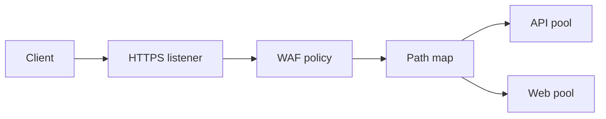

import { ConceptTemplate } from '@/features/kb/components/templates/ConceptTemplate'
import { Callout } from '@/features/kb/components/mdx/Callout'
import { ComparisonTable } from '@/features/kb/components/mdx/ComparisonTable'

export default function Layout({ children }) {
  return (
    <ConceptTemplate title="Azure Application Gateway">
      {children}
    </ConceptTemplate>
  )
}

**Application Gateway** is a regional HTTP(S) reverse proxy. Listeners bind hostnames and ports; rules send paths to backend pools; the optional WAF SKU runs OWASP-style rules before the app. It is not global — that is Front Door — and it is not L4 — that is Load Balancer.

## 1. Deep Dive and Mechanics

**SKU.** V1 is legacy. V2 (Standard_v2 / WAF_v2) autoscales, supports zone redundancy, and private front ends. You pay for capacity units: compute, persistent connections, and throughput.

**Routing.** Multi-site listeners (host headers), path maps, redirects, and URL rewrite. Backends can be NICs, VMSS, App Service, IPs, or FQDNs. Health probes must match a cheap 200 you actually implement.

**TLS.** Terminate on the gateway, re-encrypt to the backend, or pass through. Certificates live in Key Vault on v2. Mutual TLS is available when you need client certs.

**WAF.** Detection vs Prevention. Custom rules and managed rule sets. False positives are the job — tune before you flip Prevention on a login POST that looks like an attack.

**AGIC.** The AKS ingress controller programs this gateway from Ingress objects. One gateway can serve several clusters if you planned listeners.

<Callout icon="warning" title="Idle timeout and WebSockets">
Default idle timeouts drop long polls and SSE. Raise them on purpose or put those streams on a different front door. Also size capacity units for connection count, not just RPS.
</Callout>

## 2. Mathematical / Theoretical Foundation

L7 proxying is terminate-then-originate: each client connection maps to a backend connection with optional reuse. Capacity units are a max of utilization dimensions — the bill follows the hottest dimension.

WAF is a regular-language (plus signatures) filter on decoded HTTP. Encrypted payloads you do not terminate cannot be inspected.

<ComparisonTable
  headers={['Service', 'Layer', 'Scope']}
  rows={[
    ['Application Gateway', 'L7 + WAF', 'Regional'],
    ['Front Door', 'L7 + WAF', 'Global anycast'],
    ['Load Balancer', 'L4', 'Regional'],
    ['Traffic Manager', 'DNS', 'Global failover'],
  ]}
/>

## 3. Real-World Implementation

```bicep
resource agw 'Microsoft.Network/applicationGateways@2023-09-01' = {
  name: 'agw-prod'
  location: location
  properties: {
    sku: { name: 'WAF_v2', tier: 'WAF_v2' }
    autoscaleConfiguration: { minCapacity: 2, maxCapacity: 10 }
  }
}
```

Put the gateway in dedicated subnets (it needs a contiguous range). Do not share that subnet with VMs.

## 4. Visualizations



## 5. Interview Prep

**Q: Application Gateway vs Front Door?**
**A:** Gateway is regional, sits in your VNet, talks to private backends natively. Front Door is global anycast and TLS at the edge. A common pattern is Front Door → Application Gateway → AKS.

**Q: Why a dedicated subnet?**
**A:** The gateway scales by adding private IPs. A crowded subnet cannot grow and you will recreate the gateway.

**Q: Detection or Prevention?**
**A:** Start Detection, measure blocked good traffic, write exclusions, then Prevention. Flipping Prevention on day one is a self-inflicted outage.

## 6. Production Use Cases

- Path-based routing: `/api` to AKS, `/` to a static App Service.
- Internal WAF in front of an intranet on a private listener.
- AGIC as the cluster ingress so Network teams still own the WAF policy.

<Callout icon="tip" title="Probe the real ready path">
A probe that hits `/` on an API that only serves `/healthz` marks backends dead. Put a dedicated health endpoint on every pool member.
</Callout>
