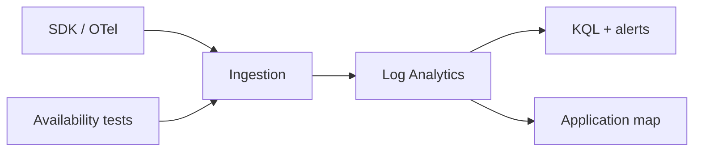

import { ConceptTemplate } from '@/features/kb/components/templates/ConceptTemplate'
import { Callout } from '@/features/kb/components/mdx/Callout'
import { ComparisonTable } from '@/features/kb/components/mdx/ComparisonTable'

export default function Layout({ children }) {
  return (
    <ConceptTemplate title="Azure Application Insights">
      {children}
    </ConceptTemplate>
  )
}

**Application Insights** is the APM face of Azure Monitor. An SDK or auto-instrumentation emits requests, dependency calls, exceptions, custom events, and traces. Data lives in a Log Analytics workspace (workspace-based resource). You query with KQL, pin workbooks, and alert on failures or duration.

## 1. Deep Dive and Mechanics

**Telemetry types.** Requests (inbound), dependencies (outbound HTTP/SQL), exceptions, traces, metrics, availability tests. Correlation uses `operation_Id` so a request and its SQL call stitch into one transaction.

**Sampling.** Ingestion sampling and adaptive sampling exist because chatty apps will bankrupt the workspace. Fixed-rate sampling is easier to reason about for SLOs; adaptive protects you from traffic spikes.

**Instrumentation.** Classic SDK connection string, OpenTelemetry exporters, and runtime injection on App Service. Prefer OpenTelemetry if you also speak to Grafana or another backend.

**Live Metrics** is a near-real-time stream, not the same store as KQL. Availability tests (URL ping, multi-step) run from Azure’s points of presence.

**Cost.** Ingestion volume and retention. Disable noisy dependency types you do not use. Set a daily cap in non-prod so a loop cannot print money.

<Callout icon="warning" title="PII in traces">
The SDK will capture URLs, SQL, and whatever you log. Turn off query collection if statements contain emails. Sampling does not equal redaction.
</Callout>

## 2. Mathematical / Theoretical Foundation

An SLO on request duration is estimated from a sample. If you sample at rate s, rare 500s have variance 1/s higher. Alerting on sampled failure rate needs a minimum count, not just a percentage.

Distributed tracing is a causal DAG of spans sharing a trace id. Missing a dependency instrumentation looks like a mysterious gap, not a failure.

<ComparisonTable
  headers={['Signal', 'Question it answers', 'Home']}
  rows={[
    ['App Insights', 'Why is this request slow?', 'Workspace tables'],
    ['Metrics', 'Is CPU high right now?', 'Azure Monitor metrics'],
    ['Log Analytics', 'What happened across resources?', 'Same workspace'],
    ['Availability test', 'Can a PoP reach the URL?', 'App Insights tests'],
  ]}
/>

## 3. Real-World Implementation

```csharp
builder.Services.AddOpenTelemetry()
    .WithTracing(t => t
        .AddAspNetCoreInstrumentation()
        .AddHttpClientInstrumentation()
        .AddAzureMonitorTraceExporter());
```

Map `cloud_RoleName` per service so the application map is not one blob named “unknown.”

## 4. Visualizations



## 5. Interview Prep

**Q: App Insights vs Log Analytics?**
**A:** App Insights is a data collection and APM UX. The store is a Log Analytics workspace. You can query `requests` and `dependencies` with the same KQL you use for VM logs.

**Q: Why did my application map go blank?**
**A:** Sampling plus missing `operation_Id` propagation on outbound HTTP. Instrument HttpClient and pass the trace context.

**Q: How do you keep cost predictable?**
**A:** Sample, cap, drop dependency types, short retention on verbose traces, and a separate workspace for dev.

## 6. Production Use Cases

- Failure + duration alerts on a checkout API with a dependency breakdown to SQL.
- Availability tests from multiple regions against a Front Door hostname.
- Workbooks for a weekly error budget review.

<Callout icon="tip" title="Alert on exceptions, not log text">
Structured `exceptions` plus a resultCode filter beats a full-text search for the word error. Text alerts are noisy and miss stack-only failures.
</Callout>
